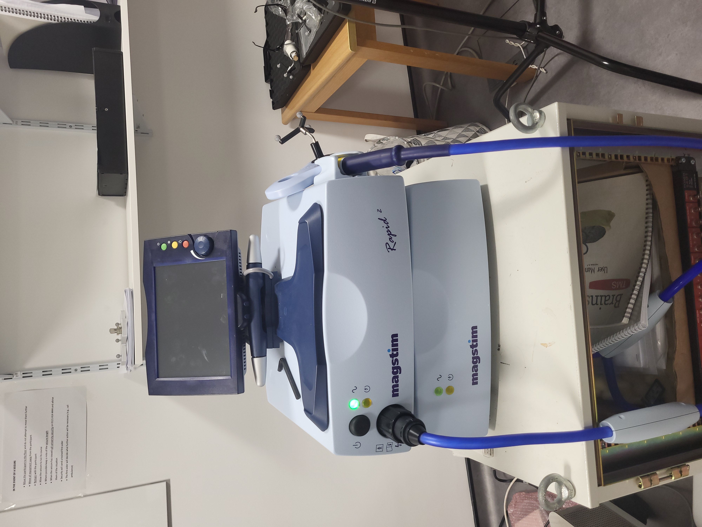
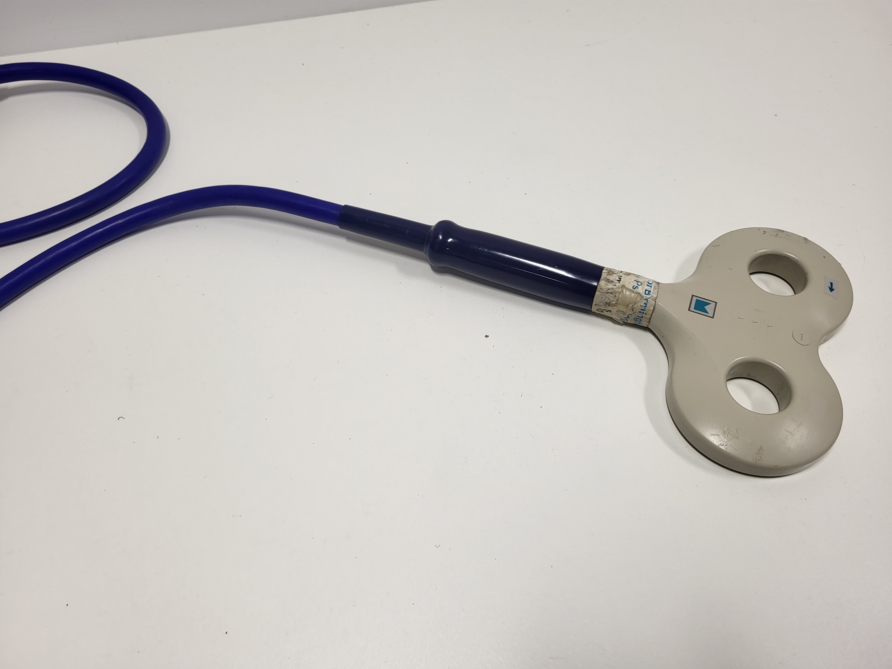
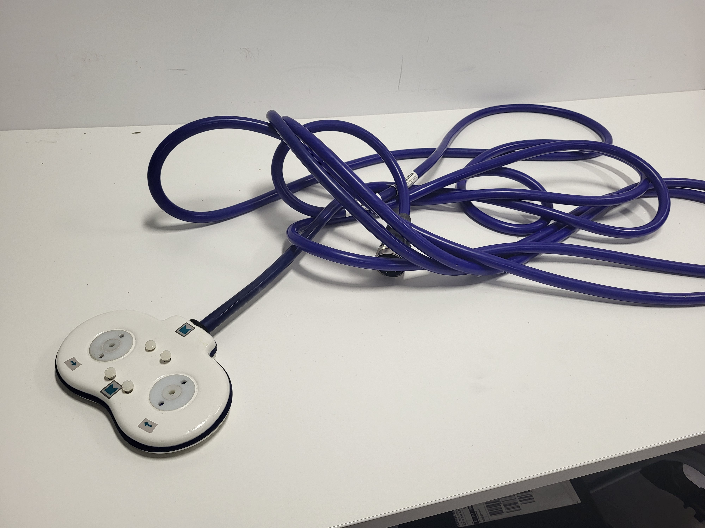

# Transcranial magnetic stimulation (TMS)

TMS can be used to measure brain activity levels (e.g., using EMG for studies of the motor system), to interfere with brain activity (e.g., in perceptual or cognitive studies), or to induce changes in the brain (e.g., in clinical interventions). A TMS study at minimum needs a stimulator and a coil. TMS can be used in conjunction with other stimulation and recording modalities such as EMG, eye-tracking, MRI or EEG.

## Guidance

The following international consensus statements and guidance are required reading for all new TMS researchers.

[Rossini et al. 2015: Non-invasive electrical and magnetic stimulation of the brain, spinal cord, roots and peripheral nerves: basic principles and procedures for routine clinical and research application](https://doi.org/10.1016/j.clinph.2015.02.001).

[Rossi et al. 2009: Safety and recommendations for TMS use in healthy subjects and patient populations, with updates on training, ethical and regulatory issues: expert guidelines](https://doi.org/10.1016/j.clinph.2020.10.003)

## Hardware

### Stimulator

Magstim Rapid [model number]

{width="200"}

The Rapid delivers biphasic pulses at up to [max] Hz. The intensity of stimulation will determine how long each train of stimulation can be applied for.

### Coils

- [diameter] mm figure-of-eight [model number]
- [diameter] mm figure-of-eight [model number]

{width="200"}
{width="200"}

 coils differ in focality and depth of stimulation. The smaller the coil, the more focal the stimulation, but the shallower the depth of stimulation.

### Interface devices

[D-type x pins] digital input-output port.

![image_of_back_of_TMS_here]

### Electromyography

- [do we have this?] 1401?

### Neuronavigation

Some studies (e.g., on the motor system) may not use neuronavigation to locate the stimulation target, because they can use body movement or EMG instead. For targeting other brain areas, neuronavigation may be important. For further details, see the main neuronavigation page.

## Software

TMS studies can be run in stand-alone mode, using only the software interface provided with the stimulator. Alternatively, the TMS can be controlled by an external device using 5V TTL pulses or a digital interface.

## TMSMultiLab

Set up by members of the University of Birmingham, [TMSMultiLab](https://github.com/TMSMultiLab/TMSMultiLab/wiki) is an international community of researchers using TMS that shares guidance, resources, code & data for TMS research. New members are always welcome. Contact [Nick Holmes](mailto:n.p.holmes@bham.ac.uk) for more details.
