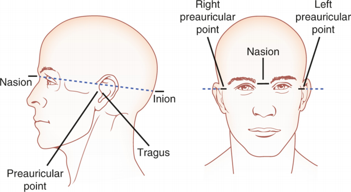

## Prior to Scanning

=== "Day Before"

    - [ ] Ensure both battery packs are fully charged
    - [ ] Ensure all three caps are clean and dry
    - [ ] Check consumables, e.g. electroconductive gel, cue tips, syringes.

=== "Before Participant Arrival"
    - [ ] Prepare MRI safety screening and ethics forms.
    - [ ] Prepare scrubs and MR-compatible glasses if needed.
    - [ ] Ensure AMP 1, AMP 2 and AUX AMP fibre optics are connected to the USB adapator.
    - [ ] Load up BrainVision Recorder and select the EEG-fMRI 64ch MR CAP workspace.
    - [ ] Prefill syringes with electroconductive gel in the EEG setup room.

=== "Participant Arrival"

    - [ ] Meet participant in reception waiting room and guide them to the MRI screening area.
    - [ ] Explain the experiment schedule to the participant.
    - [ ] Ask participant to complete the MRI safety screening form and the MRI ethics form.
    - [ ] Give participant scrubs, a set of ECG electrodes, and the physiological monitoring unit before asking them to get changed.

## Electrode Preperation
=== "ECG Preperation"

    - [ ] Ask participants to place the electrodes according to the diagram below, with three in a horizontal line under the left breast, and one to the top right of the sternum. 

    - [ ] Attach the cables to the corresponding electrodes based on the colours shown in the diagram below.

    

=== "EEG Cap Preperation"

    - [ ] Ask participant to take a seat and explain the EEG setup process, including the need to measure their head, the gel, and that they may experience minor discomfort from the cue tips and to let the operator know if this occurs.

    - [ ] Using a tape measure, measure from the participant's inion to the nasion and mark the half way point with a cue tip.

    - [ ] Whilst maintaining the position of the cue tip, measure from the participant's left preauricular (LPA) to the right preauricular (RPA). Adjust the cue tip such as that it is positioned centrally on the top of the head, half way between both the naision and inion, and LPA and RPA.

     

    !!! info "Locating the Inion"
        The inion is difficult to mark on a diagram due to the hair. Despite this it is easy to locate by gently feeling the back of the skull untill you find a small bony protusion. This protusion is the Inion, also known as the occipital pole.

    - [ ] Dip the soft end of the cue tip into the rubbing alcohol. Apply the rubbing the alcohol to the scalp underneath each electrode, rotating and applying mild pressure against the head to remove any oils and dirt. 
        !!! danger "Isopropyl Rubbing Alcohol Allergy"
            Though rare within the general population, some people may suffer from allergic contact dermatitis. This is an allergy to the isopropyl alcholol (IPA) used within the rubbing alcohol. Make sure to check that the participant is not allergic to IPA. 
    - [ ] Take the prefilled syringes and insert a small amount of gel to each electrode.
    - [ ] On BrainVision Recorder, select the impedence view
    - [ ] Aim to reduce the impedence to > 10kΩ. This can be achieved by using the cue tip to spread the gel evenly undernearth the electrode, as well as using the cue tip to lightly abrade the scalp to improve the conductance with the electrode.

        !!! Danger "Impedence and Voltage Overload"
            Open electrodes act as atennas during scanning, picking up RF energy from the $B_\text{1}$ field. This generates high power within the system, potentially overloading and damaging the amplifiers circuit board. All impedences must be kept below 100kΩ. No open channels can be present within the scanner. All electrodes must be attached to the participant. Disabling these elctrodes within the montage does not protect against voltage overload. If you do not wish to use the carbon wire loops, the terminator connector must be attached to the cap's connector to close the circuit. 

    - [ ] Repeat across all electrodes.
    - [ ] Switch back to raw data view in BrainVision Recorder. Look for any bad channels or artefacts.
   
## Equipment Room Setup

!!! Danger "Cold Head"
    Typically the coldhead will be turned off during EEG-fMRI acquisition. If you intend to turn off the coldhead, please speak to the operations team.

