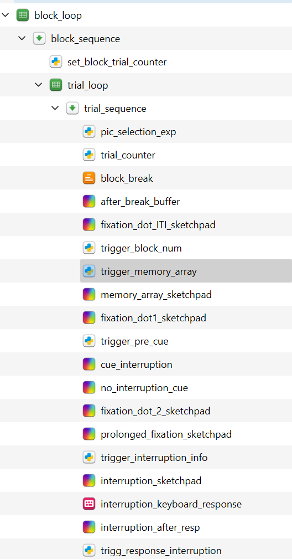

# Setting up your code to collect good EEG data

## sending triggers

For EEG timing is of the essence!
Even if you do not care about exact stimulus timing, you really should care about logging the time relevant events happen as accurately as possible!

[Documentation and code for how to send triggers with labjack](https://github.com/damiancruse/chbh_eeg_labjack)


     

        


=== "Example Code Matlab"

    Here's some example code for how to define and send triggers in Matlab. 
    For this to work, make sure you have downloaded the code for labjack to your task code folder and added the path (see example).
    !!! note
        Matlab example contributed by [Romy Froemer](https://github.com/froemero).

    ``` matlab
        %% setting EEG via console prompt at the start of the task
        novalidinput = 1;
        while  novalidinput==1
            expParams.isEEGsession = (input('Do EEG? y or n: ','s'));

            if isstrprop(p.isET, 'upper')
                expParams.isEEGsession = lower(expParams.isEEGsession);
            end

            if strcmp(expParams.isEEGsession, 'y')
                expParams.isEEGsession = 1;
                novalidinput = 0;
            elseif strcmp(expParams.isEEGsession, 'n')
                expParams.isEEGsession=0;
                novalidinput = 0;
            end
        end

        %% setting up the EEG
        if expParams.isEEGsession
            addpath('taskCode/EEG_code/'); % in this example, the labjack code lives in a folder called EEG_code within a folder called taskCode

            if expParams.isEEGsession

                try
                    L = lab_init_sa;
                    expParams.EEGpars.ext.L = L;
                    disp('EEG SUCCESSFULLY CONFUFURED!');
                    % here also define event codes
                    % 1x = stimulus onset, 2x = response onset; Confidence = trig +20
                    % x = phase: FAM = 1, RATE = 2, CHOICE = 0

                    % FAM triggers
                    expParams.EEGpars.trigs.FamStimCode = 11; % a task relevant stimulus comes on - Choice
                    expParams.EEGpars.trigs.FamRespCode = 21; % a response is given

                    % RATE Triggers
                    expParams.EEGpars.trigs.RateStimCode = 12;
                    expParams.EEGpars.trigs.RateRespCode = 22; % -  RATE
                    expParams.EEGpars.trigs.ConfPromptCode = 32;
                    expParams.EEGpars.trigs.ConfRespCode = 42;

                    % CHOICE Triggers
                    expParams.EEGpars.trigs.trialCode = 1;      % a trial begins (first item)
                    expParams.EEGpars.trigs.stimCode = 10;      % a task relevant stimulus comes on - Choice (all items after first)
                    expParams.EEGpars.trigs.respCode = 20;      % a response is given
                    expParams.EEGpars.trigs.fbCode = 30;        % show chosen
                    expParams.EEGpars.trigs.erCode = 40;        % error response code
                    expParams.EEGpars.trigs.NOrespCode = 99;    % trial ended without a response


                    expParams.EEGpars.trigs.runStartCode = 50;
                    expParams.EEGpars.trigs.runEndCode = 60;
                catch
                    disp('FAILED EEG CONFIGURATION!  :-(');
                end


                try
                    % Turn off all pins in the parallel port
                    lab_put_code_sa(expParams.EEGpars.ext.L,0); 
                    disp('EEG TRIGGER SUCCESSFUL!');
                catch
                    disp('FAILED EEG TRIGGER!  :-(');
                end


            end
        end

        %% Sending an actual trigger (example)


            % here's where stimuli are actually shown
            Screen(p.wPtr, 'Flip',0,1);  % don't clear!

            if expParams.isEEGsession && ~expParams.CHOICE.isPracticeNow
                lab_put_code_sa(expParams.EEGpars.ext.L,expParams.EEGpars.trigs.trialCode);
            end
    ```

=== "Example Code Python"

    Here's some example code for how to send triggers in python. 
    All following Python code snippets are from Python code elements run by Opensesame.

    1)	Import the labjackU3 module at the beginning of the experiment:  
        ```python
            import labjackU3

        ```
    
    2)	Insert a Python code element in the trial sequence at exactly the moment you want to sent the trigger and sent the trigger you want from that code element. In this example the trigger “99” is sent everytime the Python code element is executed within the trial sequence:
        ```python
            labjackU3.trigger(99) 

        ```
    The triggers can be either hard-coded as in the example above or soft-coded and defined somewhere else, as in the following example. Here the trigger with information about the memory array is defined somewhere else in the experiment (e.g. the run file) in a variable named “trigger_ma_info”:
        ```python
            labjackU3.trigger(trigger_ma_info)

        ```
    Example of a trial sequence in opensesame, to illustrate the placement of the python code snippets.
    
    

    Caveat: LabJack has a sleep time implemented this will influence the timing of your task, as the python code sending the trigger is paused after sending it, this could become relevant for experiments that need highly precise timing. The pause duration of LabJack can be changed with a line of code that is inserted after importing the LabJack module. In this example the pause time is reduced to 2.5ms.
        ```python
            labjackU3.DURATION = 0.025
        ```
    When triggers are sent closely after the LabJack pause might not be sufficient to prevent trigger overlap, so you can either increase the labjackU3.DURATION or you use the opensesesame module “time” to pause the experiment. To do that you need to import “time” at the beginning of the experiment and set it to sleep after sending a trigger. In this example, time is paused for 5ms.
        ```python
            import time

             time.sleep(0.05) 
        ```
    
    
    
    


## stimulus timing
