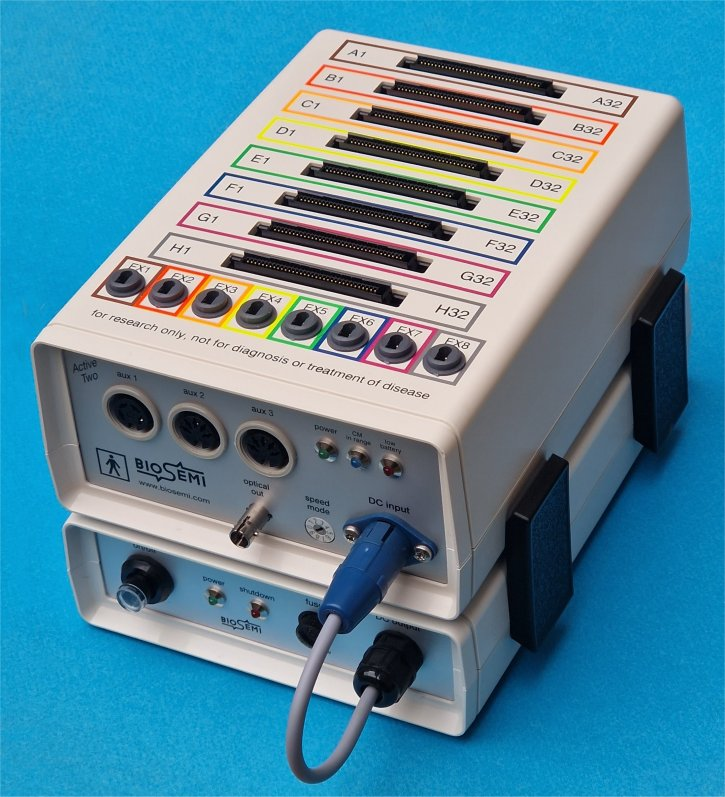
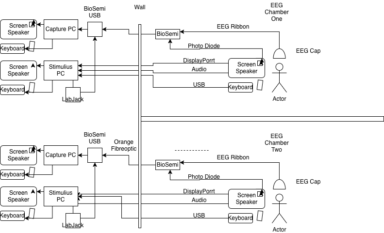
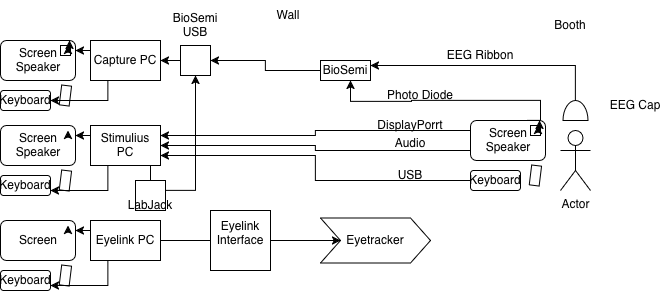

# EEG at CHBH

<b>EEG</b> (electroencephalogram) is a non-invasive technique where electrodes are placed on a person's scalp to record electrical activity in the brain.

- It does this by recording changes in potential difference. 

- EEG can capture hundreds of data points per second and therefore is a great tool for researching the chronology of mental processes. 

- EEG is completely safe and pain free for participants.

The CHBH has 3 BioSemi's Active 2/2.5s housed in 2 labs.

Two of the Biosemis are housed in the Gisbert Kapp N336, which features two separate capture rooms with a common control room. The third setup is in EEG lab in Room 421, in 52 Pritchatt's Rd. 

52PR 421 affords simultaneous eye-tracking. Ultimately it is hoped that all EEG labs will.

In addition to these stand-alone systems, we have an MR compatible Brain Vision system in the MRI, amn older system in the Sleep Labs and a built-in MEG compatible system.

We also have Polhemus Fastrak with Brainstorm to digitise EEG electrode positions and head shapes. 

