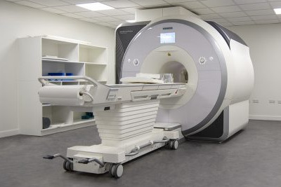
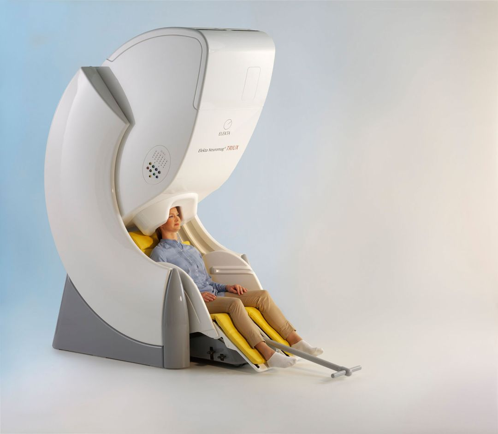

# Neuroimager's Guide to the CHBH

Welcome to the Neuroimager's Guide!

These pages contain practical information on data collection and analysis at the CHBH. We also extend the [BEAR Technical Documentation](https://docs.bear.bham.ac.uk/) pages to provide tutorials on neuroimaging quality control and data analyses using the University of Birmingham's Supercomputer - BlueBEAR.

The open information here is generated by CHBH users for CHBH users for the benefit of our whole research community.

We are always open for new contributions. This is a fantastic way to build your skills in documentation and `git` to learn about contributing to the scientific community. Take a look at our [Making a Contribution](making_a_contribution.md) pages for more information and the bottom of this page for the list of contributors so far!

!!! info "CHBH Sharepoint Pages"
    This website is intended for current staff and students at the [Centre for Human Brain Health](https://www.birmingham.ac.uk/research/centre-for-human-brain-health/index.aspx) and [University of Birmingham](https://www.birmingham.ac.uk/index.aspx). It may or may not be useful for anyone else.

    These pages contain user lead and public facing information at CHBH. For full details on CHBH facilities, processes, project codes, approvals, ethics, finances, bookings and administration please see the CHBH Sharepoint pages (UoB SSO login required).

### Click a modality to get started

- <a href="mri" class="card">__MRI__ { loading=lazy }</a>
- <a href="meg" class="card">__MEG__ { loading=lazy }</a>
- <a href="eeg" class="card">__EEG__ add image? { loading=lazy }</a>
- <a href="eeg-fmri" class="card">__EEG-fMRI__ add image? { loading=lazy }</a>
- <a href="sleep" class="card">__Sleep__ add image? { loading=lazy }</a>
- <a href="fnirs" class="card">__fNIRS__ add image? { loading=lazy }</a>
- <a href="behaviour" class="card">__Behaviour__ add image? { loading=lazy }</a>
- <a href="brainstim" class="card">__Brain Stimulation__ add image? { loading=lazy }</a>

## Contributors

Many thanks to our contributors!

<!-- ALL-CONTRIBUTORS-LIST:START - Do not remove or modify this section -->
<!-- prettier-ignore-start -->
<!-- markdownlint-disable -->
<table>
  <tbody>
    <tr>
      <td align="center" valign="top" width="14.28%"><a href="https://gitlab.com/ajquinn"> <b>ajquinn</b></a> <a href="#maintenance-ajquinn" title="Maintenance">🚧</a> <a href="#content-ajquinn" title="Content">🖋</a></td>
      <td align="center" valign="top" width="14.28%"><a href="https://github.com/orbsmiv"> <b>James Carpenter</b></a> <a href="#maintenance-orbsmiv" title="Maintenance">🚧</a> <a href="#content-orbsmiv" title="Content">🖋</a></td>
      <td align="center" valign="top" width="14.28%"><a href="https://github.com/Bingram22"> <b>Brandon Ingram</b></a> <a href="#content-Bingram22" title="Content">🖋</a></td>
      <td align="center" valign="top" width="14.28%"><a href="https://sites.google.com/site/arkadykonovalov/"> <b>Arkady Konovalov</b></a> <a href="#content-arkadykonovalov" title="Content">🖋</a></td>
      <td align="center" valign="top" width="14.28%"><a href="https://github.com/benjaminGriffiths"> <b>Ben Griffiths</b></a> <a href="#content-benjaminGriffiths" title="Content">🖋</a></td>
      <td align="center" valign="top" width="14.28%"><a href="https://github.com/tghafari"> <b>Tara</b></a> <a href="#content-tghafari" title="Content">🖋</a></td>
      <td align="center" valign="top" width="14.28%"><a href="https://github.com/dagmarfraser"> <b>Dagmar S Fraser</b></a> <a href="#content-dagmarfraser" title="Content">🖋</a></td>
    </tr>
    <tr>
      <td align="center" valign="top" width="14.28%"><a href="https://github.com/Wetiqe"> <b>Jianzhang Ni</b></a> <a href="#content-Wetiqe" title="Content">🖋</a></td>
      <td align="center" valign="top" width="14.28%"><a href="https://github.com/katduecker"> <b>Katharina</b></a> <a href="#content-katduecker" title="Content">🖋</a></td>
      <td align="center" valign="top" width="14.28%"><a href="https://github.com/TommyTeapot"> <b>Tommy Roberts</b></a> <a href="#content-TommyTeapot" title="Content">🖋</a></td>
      <td align="center" valign="top" width="14.28%"><a href="http://sohaamir.github.io"> <b>Aamir Sohail</b></a> <a href="#maintenance-sohaamir" title="Maintenance">🚧</a> <a href="#content-sohaamir" title="Content">🖋</a></td>
      <td align="center" valign="top" width="14.28%"><a href="https://scholar.google.com/citations?user=NL9m-2oAAAAJ&hl=en"> <b>Selma Lugtmeijer</b></a> <a href="#content-slugtmeijer" title="Content">🖋</a></td>
      <td align="center" valign="top" width="14.28%"><a href="https://github.com/TomRhysMarshall"> <b>TomRhysMarshall</b></a> <a href="#content-TomRhysMarshall" title="Content">🖋</a></td>
      <td align="center" valign="top" width="14.28%"><a href="https://neurobiography.info"> <b>Nicholas Paul Holmes</b></a> <a href="#content-TheHandLab" title="Content">🖋</a></td>
    </tr>
    <tr>
      <td align="center" valign="top" width="14.28%"><a href="http://wilsonlab.co.uk"> <b>Martin Wilson</b></a> <a href="#content-martin3141" title="Content">🖋</a></td>
      <td align="center" valign="top" width="14.28%"><a href="https://github.com/froemero"> <b>froemero</b></a> <a href="#content-froemero" title="Content">🖋</a></td>
      <td align="center" valign="top" width="14.28%"><a href="https://github.com/toddvogel1628"> <b>toddvogel1628</b></a> <a href="#content-toddvogel1628" title="Content">🖋</a></td>
    </tr>
  </tbody>
</table>

<!-- markdownlint-restore -->
<!-- prettier-ignore-end -->

<!-- ALL-CONTRIBUTORS-LIST:END -->

## Contributing

This page is a work-in-progress and contributions are very welcome! Please email Andrew or make some changes directly on the [CHBH-on-BEAR GitHub page](https://github.com/chbh-opensource/chbh-on-bear). See the ['Making a contribution'](making_a_contribution.md) page for more information on how to do so.
