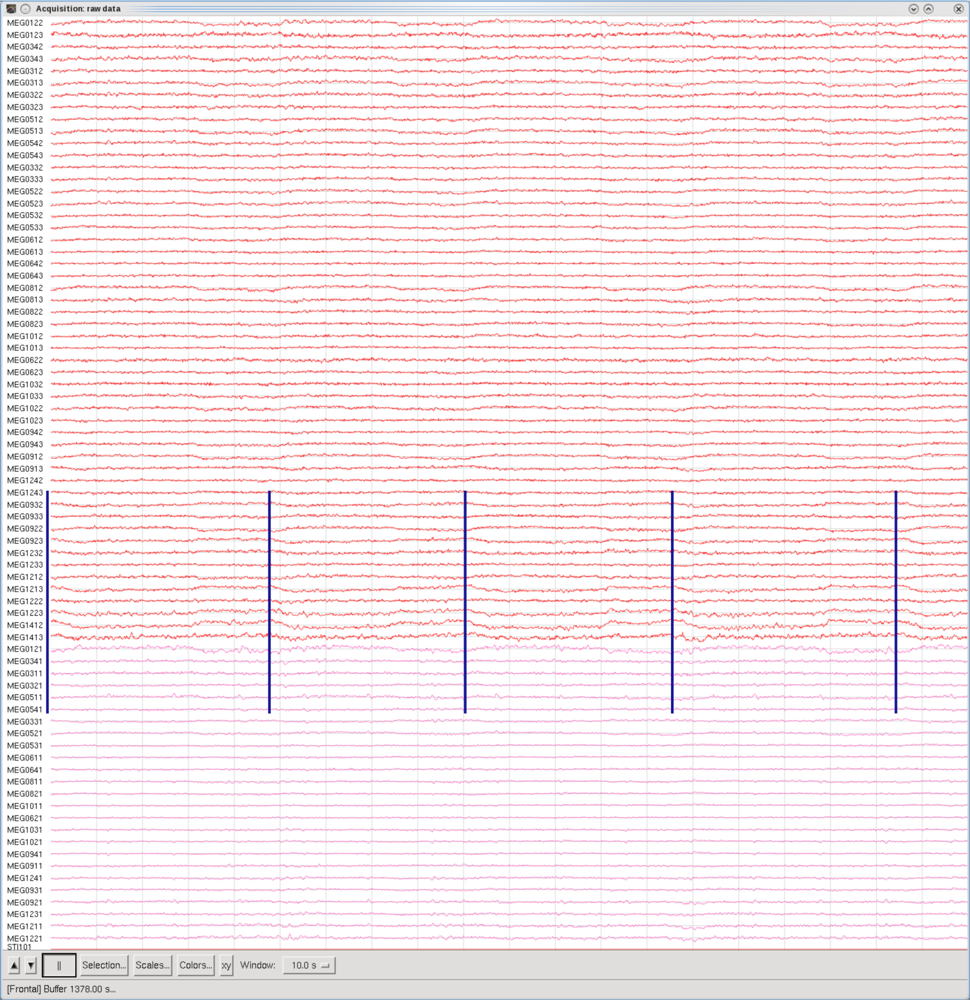
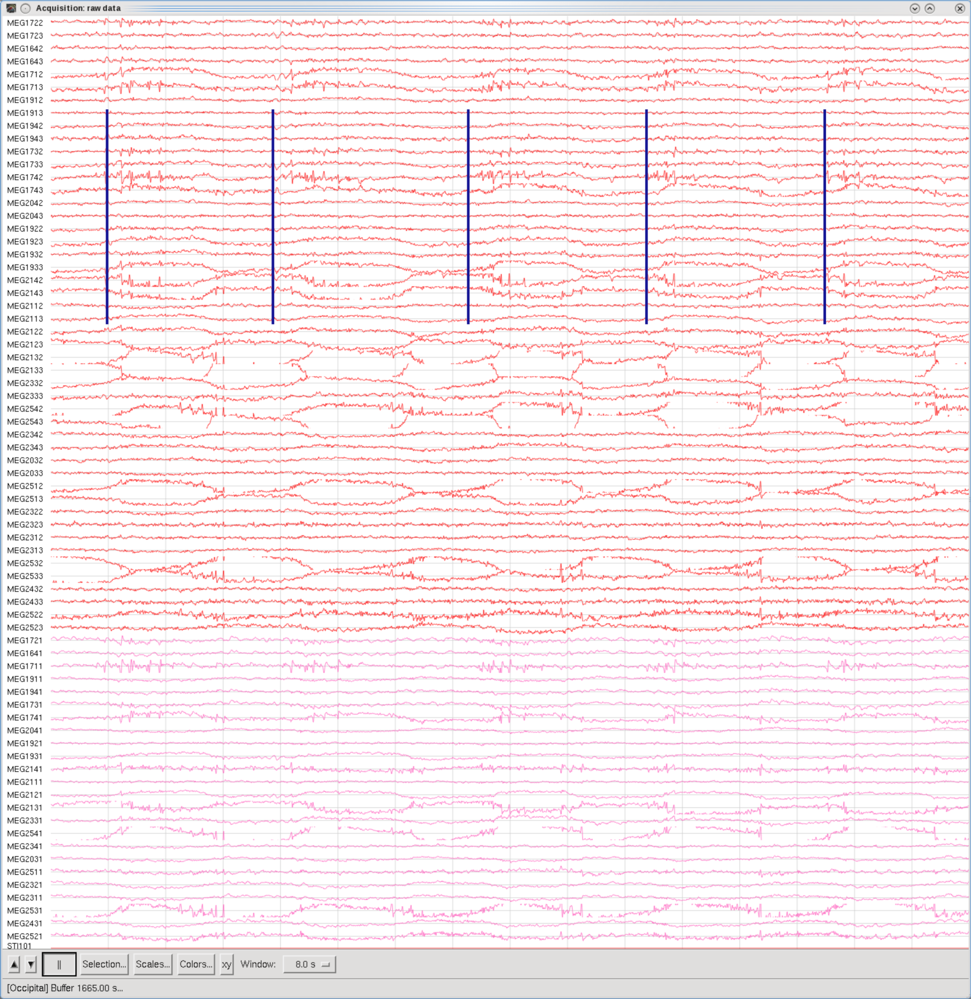
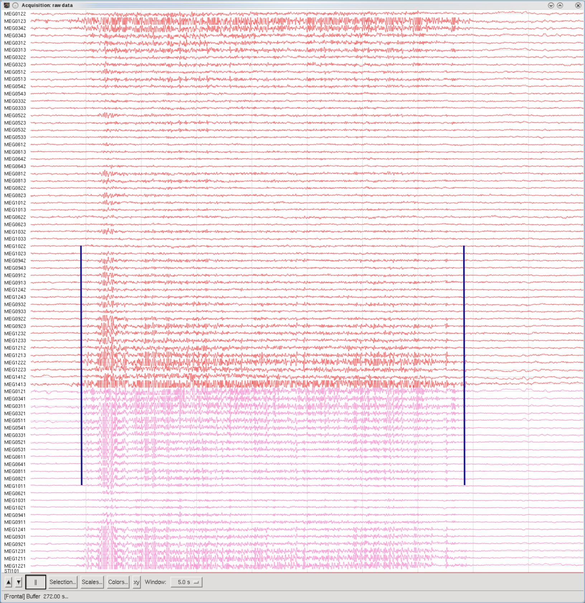
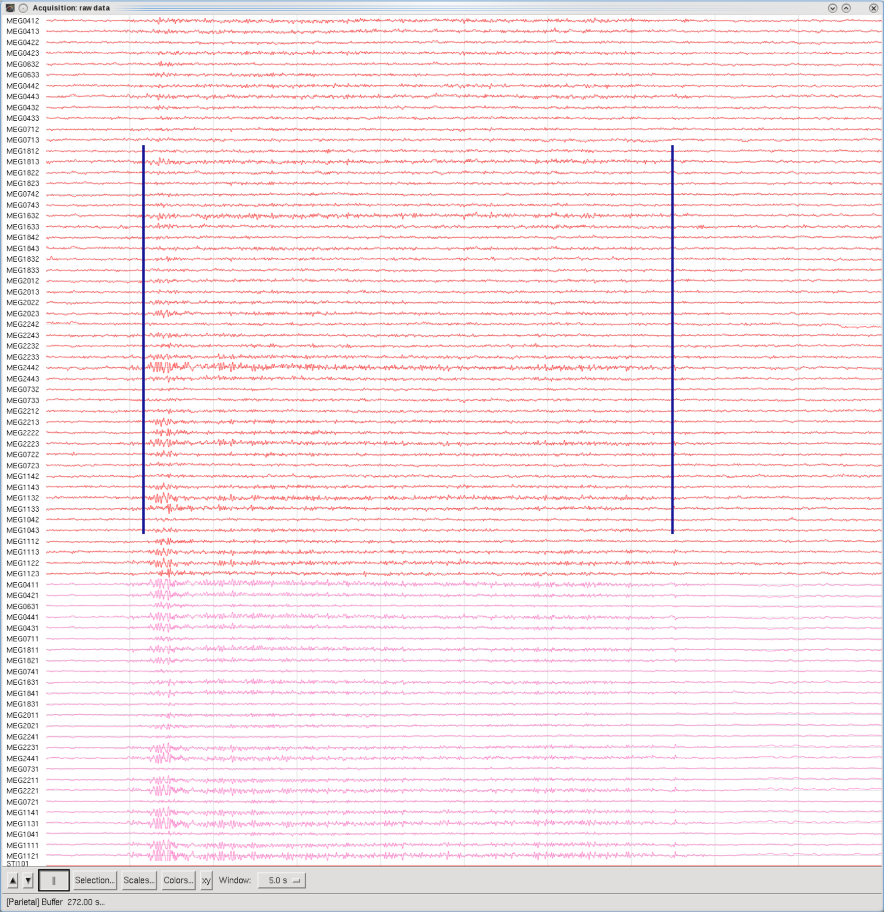
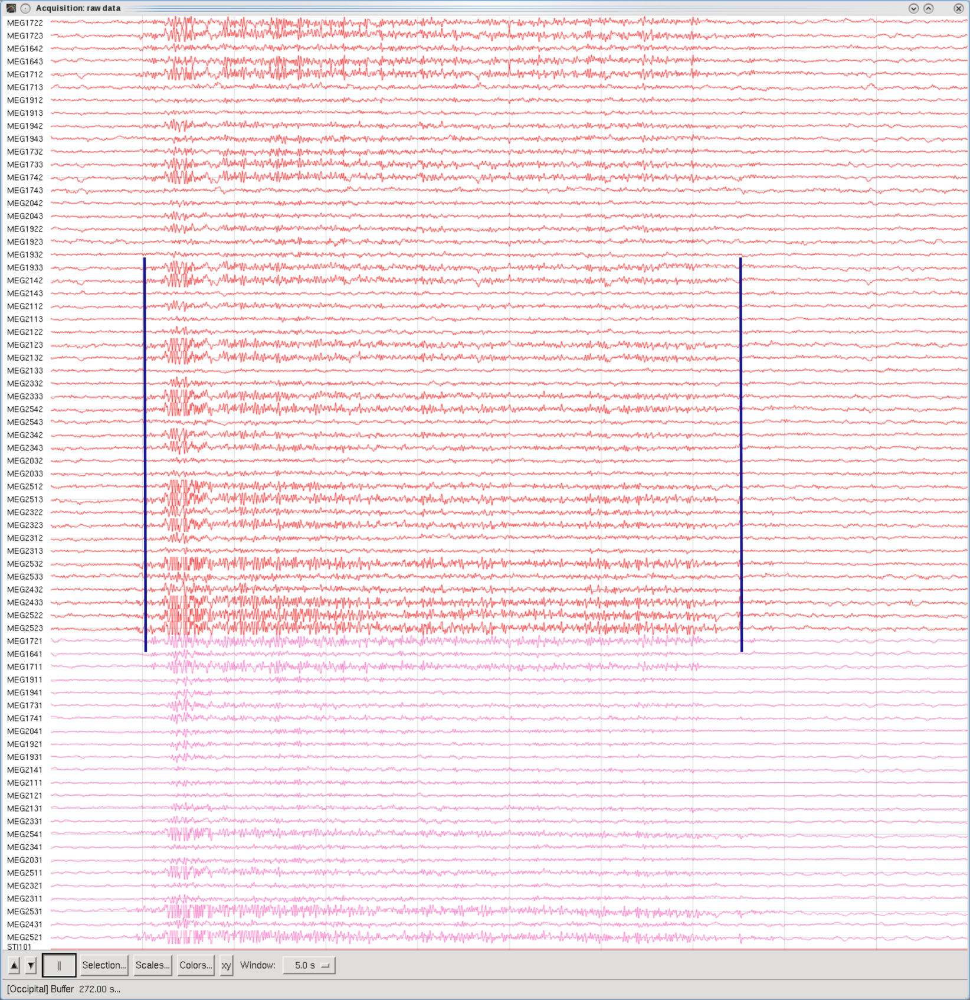

# Atypical MEG signals

"**Artifacts**" are **unwanted noise in the acquired data** that **may or may not interfere/mask the signal expected to be seen**.  
Any artifact found will **need to be removed from acquired data before any analysis is performed**, and obviously they are **needed to be identified** first. 
Artifacts can be **caused by the environment or by the participant**, and common examples are:

## **Pysiological**

- Eye blinks (**EOG**) - Electrooculogram.
- Heart beats (**ECG**) - Electrocardiogram.
- Muscle artifacts (**EMG**) - Electromyogram.
- Head movements (*will include neck EMG artifacts*).
- Dental artifacts (*large amalgam fillings, orthodontic applances*).

## **Environmental / System**

- Power line noise (**Mains 50Hz**).
- Squid Jumps.

## **Example FIF data**

{width=30% align=left}

- **Good Data**. 
An example of **good, clean, data**. Temporal set of sensors. Eyes open looking at a central cross on the projector screen.
**Even if the ECG hadn't been recorded, the heartbeat can still be detected in the acquired data**.
     

 

- **Squid Jumps** 
"***Squid jumps***" on channel **MEG1043**. Resetting the channel/warming the sensor had no effect, and its tuning curve was within normal parameters. Resetting the SSC card only caused a temporary respite for a few days.
At the time, the channel was **marked as "bad"**, and it was repaired during the PM Service Visit. 

 
{width=30% align=left}
{width=30% align=right}

- **Eye blinks**. 
Eye blinks from two sets of sensors, Frontal (left image) and Temporal (right image).
The Participant was asked to **blink their eyes every two seconds**, producing approximately five blinks in each ten-second window. It is **recommended to record EOG channels** in acquired data, to **help remove blink artifacts**.

  
{width=30% align=left}

- **Eyes side-to-side**. 
The Participant was asked to **move their eyes between two markers on either side of the projector screen, about once every second**. There are about eight movements collected in the eight-second window. There may also be some head movement/neck EMG artifact incorporated in the example image.
   

 
{width=30% align=left}

- **Head Movement**. 
The Participant was asked to make a **shaking their head "No!"** type movement, with each "shake" taking about two seconds to complete. There are about five movements in the eight-second window, so they were moving slightly faster than asked. There is probably some neck EMG involved, as well as some EOG as they kept their eyes fixated on the central cross as they shook their head. 
  

{width=30%}
{width=30%}

<align=full>

- **Shrug Shoulders**. 
The Participant was asked to **"shrug" their shoulders**, about once a second. Temporal (left image) and Occipital (right image). The majority of the artifact is probably muscle EMG; the Participant kept their head surprisingly still during the task.
  

{width=30%}
{width=30%}
{width=30%}

<align=full>

- **Clench Teeth**. 
The Participant was asked to **clench their teeth and then relax**. Frontal (left), Parietal (center) and Occipital (right). Majority of the artifact is jaw muscle EMG.

***With many thanks to Davd L. Winter.***
