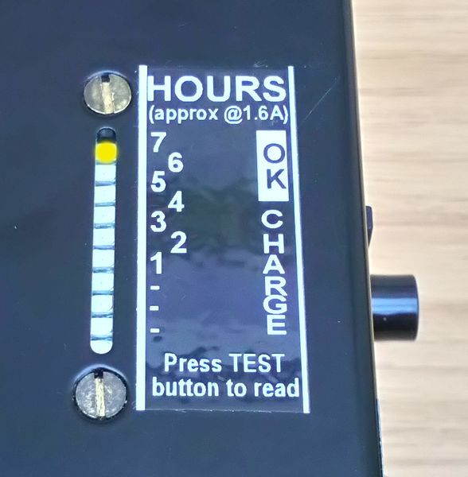
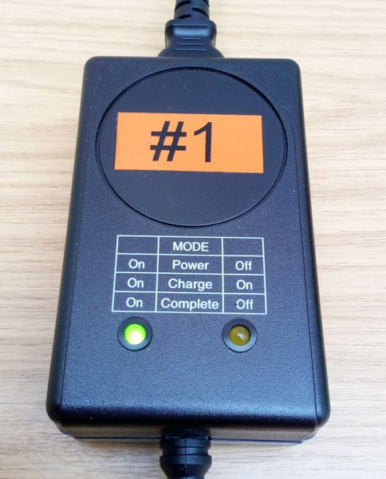
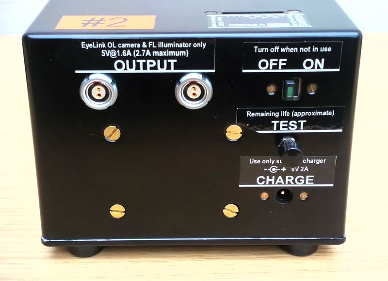
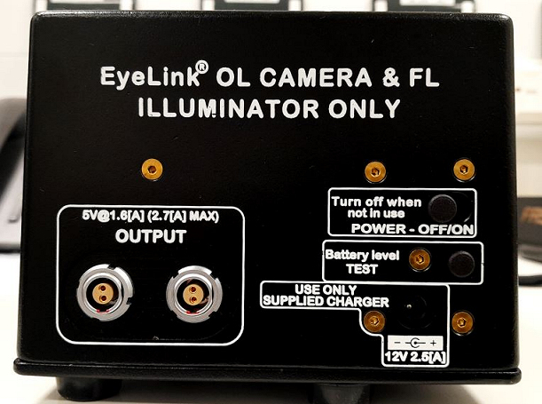
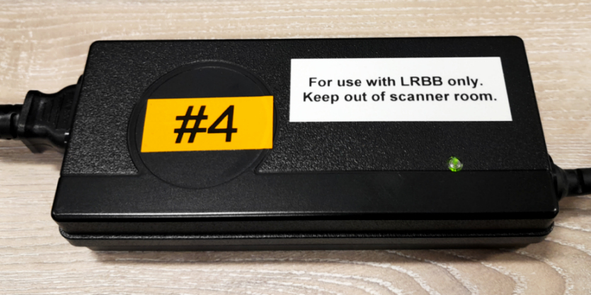

# Charging EyeLink batteries

## Original

Press **TEST** button to check the battery power level. If charging required ...

- Plug in **correct** battery charge lead (**#1** for **#1** etc).
- **GREEN** *Power* LED will light, also **ORANGE** *Charge* LED.
- *Charge* LED will **go out** when battery is fully charged / "**Complete**".

!!! Note
    Make sure the **battery is switched OFF when charging**. 
    **Unplug** the battery once fully charged. **Do not** leave attached to the charger. 
    **Do not** leave a battery on charge overnight. 
		- **Add a piece of *Micropore* tape to the battery front, to indicate the battery needs charging next day.**

- **Use a fully-charged battery** for an acquisition session (if possible).
- **Swap to a new battery** between acquisitions. 
- **Put** first battery **on charge**.

!!! info "**"A battery with 2-3 hours left should be fine for a short experiment. Do not risk using it for a 2-hour experiment." (*SR Research*).**"

{width=30% align=left}
{width=30% align=center}
{width=35% align=right}

EyeLink Battery fully charged

EyeLink Battery cable connections  / ON-OFF Switch / TEST button

EyeLink Battery Charger

 

## New

**[LRBB User Manual](../../meg/pdfs/LRBB_User_Manual_2023_06_02_Rev1_1.pdf)**

To **check** the current battery level, **move** the Battery POWER Switch to the **ON position**, and **press** the **Battery level TEST** button.

{width=40% align=left}

- There are **five LEDs** in the **Battery Level Indicator** window on top of the battery (**3 GREEN**, **1 ORANGE**, and **1 red)**. 
- **Each LED** represents approximately **20% of the battery charge**.
- *The Indicator is disabled during charging and when the POWER switch is OFF to prevent accidental discharge*.

 

|  LED State  (With Power Switch ON  and Battery Level button pressed)  |  Charge State  |  Action to take  |
|  ------- |  ------ |  ------- |
|  All LEDs are lit (**3 GREEN** plus **RED** and **ORANGE**)   | Fully charged   | Ready for extended use or storage |
|  **1 GREEN** LED (plus **RED** and  **ORANGE**)  | Less than 50% charged  | Please charge |
|  Only **ORANGE** and **RED** LEDs  | Battery Level low,  limited time remaining  | Please charge before starting further use |
|  **RED** LED only  | Critically low, may lose power in a few minutes | Please charge as soon as possible |
|  **No LEDs lit** | Battery completely discharged | Please charge immediately! |

**Battery #4 showing a full charge.**

 
**To Charge**

- **Plug in** the **labelled charger cable** (e.g. **#4**) into the **appropriate** battery.
- **Switch on** the **labelled** (e.g. **#4**) **Mains plug**. The **LEDs** on the charger **will display its status**. 

| LED | Status |
| ------- |  ------ |
|  **RED**  | Charging is in progress |
|  **YELLOW**  | The battery is fully charged and is now in trickle charging mode The Mains plug can be switched off, and the charger lead disconnected from the battery |
|  **GREEN**  | Trickle charging is complete  |

**Typical charging time is ~4 hours (from the Battery Level showing a RED-only LED).**

!!! Note
    Make sure the **battery is switched OFF when charging**. 
    **Unplug** the battery once fully charged. **Do not** leave attached to the charger. 
    **Do not** leave a battery on charge overnight. 
		- **Add a piece of *Micropore* tape to the battery front, to indicate the battery needs charging next day.**

- **Use a fully-charged battery** for an acquisition session (if possible).
- **Swap to a new battery** between acquisitions. 
- **Put** first battery **on charge**.

!!! info "**"A battery with 2-3 hours left should be fine for a short experiment. Do not risk using it for a 2-hour experiment." (*SR Research*).**"

**Battery #4 Charger showing a GREEN LED (indicating trickle charging is complete).**