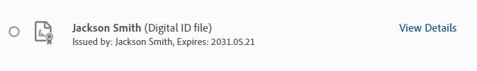
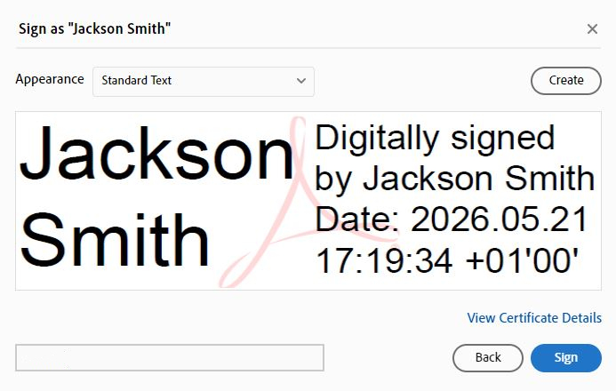

# How to correctly fill in the MEG Operator Checklist

!!! Warning "**An AD-joined University PC *must be used*. Although having a Birmingham email address, don't use a private/personal desktop/laptop unless it's joined to the University domain.**"

- **If necessary:**
	- **Log in to a colleague's domain-joined desktop/laptop.**
	- **Book time in a cubicle/on a hot-desk PC.**

An **[example of a correctly filled-in Checklist](../../meg/pdfs/example_meg_operator_checklist_v4-0c.pdf)**

The **[blank Checklist](../../meg/pdfs/meg_operator_checklist_v4-0c.pdf) - February 2026 (v4.0c)**   

- **Download** the blank Checklist PDF **locally to an AD-joined desktop/laptop** (*either from the link above, or from the MEG training date confirmation email*), and **edit it in a preferred PDF editor-of-choice**.
	- It's usual for IT Services to have **already installed Adobe Reader DC**, but, if necessary, download and **install via Software Centre, or more likely, Apps Anywhere**.  **Don't edit the Checklist in a web browser, that just causes issues!**.
- **Name at the top**, and the date the OPLRs were read. *Using the date of initial training is fine (use only 2 digits, e.g. 26, for the year!)*.
- Type "**YES**", or "**X**", or perhaps use initials (e.g. "**JXS**"), in **capital letters, in all the text boxes found down the right-hand side of the pages**.
	- **Click in the centre of each box/section (text or number) BEFORE typing anything.**
	- **Digitally sign using AD mailname, so make sure to download the PDF locally to an AD-joined desktop/laptop.**
- **Digitally sign** (***using AD mailname***) where it says "**MEG Trainee Signature**", and add the date.  *Use 4 digits, e.g. 2026, for the year*.
- **Save the form as a PDF** and **email it to one of the MEG Operators shadowed**, for them **to digitally sign and date**. They can then either **send the saved PDF to MEG Support** or send the form back to be sent on.
- **MEG Support digitally signs/dates the form, and emails the CHBH Administrator informing them of the new MEG Operator**.

**Digital Signatures**

**All the signature boxes are expecting a digital signature, not text**. **Make sure to be logged into an AD-joined desktop or laptop.**

- **Add the date**, *using 4 digits, e.g. 2026, for the year*. 

- **Click/Select** the **MEG Trainee Signature** box. The "**Sign with a Digital ID**" Window should pop up, e.g.  

{width=80%}

- **Click/Select the relevant Digital ID**, and then click/select **Continue**.

- The "**Sign as ...**" Window should then appear, e.g.

{width=80%}

- Click/Select "**Sign**", making sure to **save the file as a PDF**, and **email to the relevant shadowed MEG Operator for them to digitally sign/date**.

