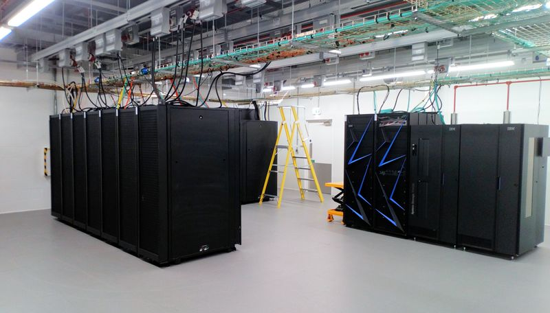

# Copying MEG data

**<span style="color:blue">Operators must have access to a BlueBEAR RDS Project and their own BlueBEAR Linux Account prior to transferring data from the MEG Acquisition computer ("Sinuhe").</span>**

{width=40% align=left}

<br /><br />
**<span style="color:maroon">Data is stored here - in the BEAR Cave!</span>**
<br /><br /><br /><br />

## Requesting RDS / Activating a Linux Account

**RDS** can be requested through the **[IT Service Desk](https://universityofbirmingham.service-now.com/itportal/?id=uob_sc_home)** 

- After **Log in**, select the option **"Research"**, then **"Request a new BEAR Project"**.

!!! info "RDS can only be requested by a member of Staff/PI/Supervisor.<br />The Project MUST have <span style="color:blue">BlueBEAR compute services</span> added ("*BlueBEAR Linux HPC*")."

A **BlueBEAR Linux Account is needed** to be able to **copy off Acquired data from the Console**. To request a **BlueBEAR Linux Account**, after **Log in** ...

- Select the option **"Research"**, then select **"My BEAR Accounts"** and then **"Activate your BEAR Linux Account (you must be on a suitable project)"**.

!!! info "Association is first required with a Project, before data can be copied off the Console.<br />Addition of MEG Operator email address to the Project needs to be requested - by the MEG Operator or PI."


## Transferring Acquired data to RDS

Use the **scp** command from a terminal window on the MEG console. To open ...

- Click the **Application Launcher** button (*bottom left*) and select **```Terminal```**.
- **Right-click anywhere on the Desktop** and select **```Konsole```** from the window that pops up.

Change to relevant Project directory in neuro-data ...

- **```cd /data/neuro-data/project-name```** or more likely
- **```cd /data/neuro-data/project-name/subject-name```**

!!! note "*subject-name* will be the anonymised code generated by the Participant Logging Computer (PLC)<br /> or possibly *no-name* if just Acquiring data for Project Development."

!!! info "If a *subject-name* is not provided when setting up *megacq*, a sub-directory called *no_name* is generated instead in the *project-name* directory."

	- When files are saved in the *subject-name* directory, a sub-directory with the format **YYMMDD** is created.

	- This **YYMMDD sub-directory** will **contain** the **saved** MEG acquisition.FIF data file.

	- If another **Acquisition is started**, any **subsequently saved data** will be in the **same YYMMDD directory**.

Run the **scp** command to copy over the data ...

- **```scp -rp data username@bluebear.bham.ac.uk:/rds/projects/year/project-name```** or 
- **```scp -rp data username@bluebear.bham.ac.uk:/rds/projects/letter/project-name```**
	- Replace **```data```** with the folder to be copied, or use the asterisk character, **<span style="font-size:large">*</span>**, for the complete contents of neuro-data **```project-name```** or **```project-name/subject-name```**.
	- Replace **```username```** with Operator's username.
	- Replace **```project-name```** with Operator's RDS path.

For example ...

- **```cd /data/neuro-data/empty_room```** or
- **```cd /data/neuro-data/empty_room/no_name```**
<br />then
- **```scp -rp 191225 smithj25@bluebear.bham.ac.uk:/rds/projects/2018/jenseno-meg-qualitycontrol/smithj25/meg-data/```**
<br / > or perhaps
- **```scp -rp * smithj25@bluebear.bham.ac.uk:/rds/projects/j/jenseno-meg-raw-data/data/neuro-data/empty-room/```**

Check data has copied correctly ...

- **```ssh smithj25@bluebear.bham.ac.uk```**
<br />then
- **```cd /rds/projects/2018/jenseno-meg-qualitycontrol/smithj25/meg-data/```** or
- **```cd /rds/projects/j/jenseno-meg-raw-data/data/neuro-data/empty-room/```**
- Run the command **```ls -l```** to list the data to allow checking.

**<span style="color:red">NOTE: Please don't save data to anywhere other than the *data/neuro-data/project-name* directory on the MEG console.</span>**


## BlueBEAR Data Backup

For **Duty of Care** obligations, the **following** information is **backed-up, overnight**, to a **RDS Project space on BlueBEAR**.

- **<span style ="color:maroon">Daily acquired MEG data</span>**
- **<span style ="color:maroon">Project & Subject databases, including the *ctc* and *sss* folders</span>**
- **<span style ="color:maroon">The DACQ Tuning directory</span>**

A **backup script** runs as a **CRON job**, generating **backup-log** and **backup-error** txt messages **emailed** as necessary.

!!! note "MEG Operators need to ensure Acquired data is always kept in the correct folder on the Console ... <br /><span style ="color:blue">/data/neuro-data/*project-name*</span>"

!!! info "If data doesn't get copied overnight, due to errors with BlueBEAR, the next time the script runs, and BlueBEAR is available, any missing files are backed up."

**Acquired data** is then **routinely removed** from the DACQ **data partition**, on more-or-less a **monthly** basis, to allow **continued MEG Acquisition.**

!!! note "No quota system is in place, or automatic file deletion deamon running, but MEG Operators will still need to copy off their data to their own RDS space in a timely manner."
