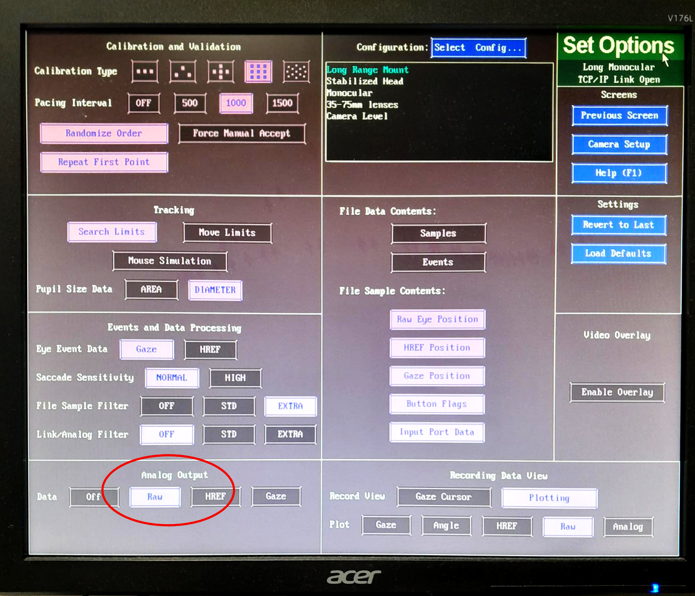

# EyeLink Analog Output

In order to ensure the EyeLink "**X**", "**Y**" and "**P**" **(pupil)** are recorded on MEG channels **MISC#1, MISC#2** and **MISC#3**... 

{width=45% align=left} 

- Make sure **MISC#1, MISC#2**, and **MISC#3** are **selected in MEG Acquisition**.
- **Select a value for Analog Output** e.g. **Raw**, in **EyeLink Set Options** (*bottom left of screen*).
- **Make sure** the **EyeLink is set to RECORD in order to see the Output**.

   
If using any of the **Binocular** settings, make sure the **LEFT eye** is **ALWAYS selected**  - **DAC3, DAC4, and DAC5 are not being recorded** (*no cable connection from EyeLink Host A/D card output to MEG MISC channels*).

**EyeLink Analog Outputs**.