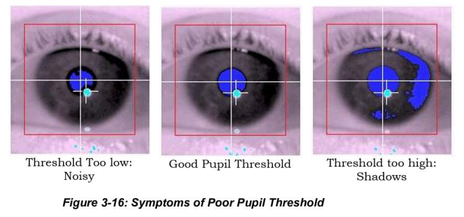
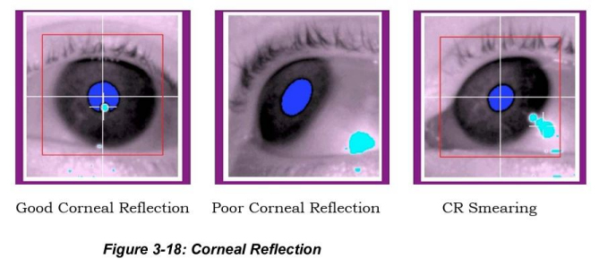

# EyeLink Operations Guide

**[Quick Start Guide](../../meg/pdfs/Quick_Start_Guide_Dell_Workstation_v4.00W.pdf)**<br />
**[Install/Training (slides)](../../meg/pdfs/EyeLink_1000_Plus_Installation_and_Training.pdf)**<br />
**[User Manual v1.0.22](../../meg/pdfs/EyeLink_1000_Plus_User_Manual_1.0.22.pdf)**


## Initial Setup
	
**Switch on** the 6-way bar plug (**next to EyeLink Host PC**), to provide power to the **Host PC, PC monitor & EyeLink camera**.

**<span style="color:maroon">EyeLink batteries</span>** 

- Press the **TEST button** to **check** the power level (batteries **#1** and **#2**), or **power on and press the TEST button** (batteries **#3** and **#4**).<br />
- **Use a fully charged battery** if possible.

!!! Info "<span style="color:blue">A battery with 2-3 hours should be fine for a short experiment. Do not risk using it for a 2-hour experiment.</span>"

**Take a battery into the MSR** and place **in front left hand corner** (*as seen from gantry chair*).<br /> **Arrange** the power cable **around the inside wall of the MSR to avoid any loops**.

**Remove the lens cap** from the **FO camera head**, and **place the FO camera head/IR Illuminator on the small table in front of the gantry chair** (*usually once Participant is in place*).<br /> **Attach** power cable to **battery and FO camera head/IR Illuminator**. **Switch on the battery.**

!!! Note "<span style="color:red">NOTE:</span> Ensure a good cable connection is made (*the black rubber strain reliefs aren't pushed up over the silver two-pin connectors*).<br /><span style="color:red">NOTE:</span> If the camera head/IR Illuminator isn't powered-on first, the Host PC will complain slightly (*ticking sound*) when EyeLink starts up."

!!! Info "<span style="color:maroon">To prevent small threshold drifts, the EyeLink camera Head/Host PC etc should be powered up/switched on for <span style="color:red">at least 5 minutes</span> before recording.</span>"

**<span style="color:blue">If using Monocular</span>**, make sure the FO camera head is **[HORIZONTAL](../../images/meg/Horizontal.jpg)**, and **the knurled silver adjustment knobs** are **centered to the projector screen.**

- Once Participant is in place, tilt the camera head/illuminator as necessary to bring the eye into view, making sure to keep everything **as level as possible**.

**<span style="color:blue">For Binocular use, the position of the camera head will require changing</span>**.

- **Note the value on the [BAR SCALE](../../images/meg/Black_Knurled_Knob.jpg)** (as indicated by the **<span style="color:red">RED line</span>** in the image) **before undoing the knob**, and make sure **the camera mount is back at that value on the bar** after adjusting the camera head and **before tightening the knob**.

- **Undo the [BLACK KNURLED KNOB](../../images/meg/Black_Knurled_Knob.jpg)** (as indicated by the **<span style="color:blue">BLUE circle</span>** in the image) to allow the camera head **to be pulled slightly away from the bar, exposing the [BRASS FIXING PINS](../../images/meg/Brass_Fixing_Pins.jpg)** (as indicated by the **<span style="color:green">GREEN circle</span>** in the image).

- **Adjust the camera head on an angle, aligning the pins** to the secondary/**[BINOCULAR](../../images/meg/Binocular_position.jpg)** position, and then **push the camera head back into place, tightening the black knurled knob** - **[FRONT VIEW](../../images/meg/Binocular_front_view.jpg)** of **Binocular usage position.**

- Ensure the **camera mount hasn't slid closer or further away** from the IR illuminator **when adjusting** (as indicated by the **<span style="color:red">RED line</span>** in the images mentioned above).

- If required, **raise the small table** using the **black plastic [TABLE RISERS](../../images/meg/TableRisers.jpg)**, *3 heights available*, so that the **top** of the IR Illuminator is as **close as possible to the lower edge of the projector screen.**

**<span style="color:maroon">EyeLink Clip Position Adjustment</span>** 

{width=45% align=right}

- **Camera Head and Illuminator Separation**: <br /> Adjust the camera and Illuminator **clip positions** on the mounting bar so that the **inner edges** align with the **eye-to-camera distance measured in cm.**<br />
- When using the **small table**, the **separation should be already adjusted**. *Only if ****moving closer or further away**** will an adjustment need to be made.*

<align=full>
**<span style="color:blue">Position projector screen so the max visual angle subtends no more than: 32<sup>o</sup> horizontally, 25<sup>o</sup> vertically. *The eye-to-projector distance should be at least 1.75 times the display width to ensure that it falls within the trackable range.*</span>**

**<span style="color:maroon">EyeLink Configuration</span>** 

- **Switch on** the **EyeLink Host PC & monitor**. **Select** the default **EyeLink** partition from the **Windows Boot Manager** interface.

- Select the appropriate **EyeLink Configuration** from the **Set Options** screen, e.g. **monocular**, **binocular**.
	- From **Set Options**, select **[LONG RANGE MOUNT](../../images/meg/LongRangeMount.jpg)** in the Configuration window (*may already be highlighted*)
	- Then select **Select Config...** and choose either **[MONOCULAR](../../images/meg/Monocular.jpg)** or **[BINOC/MONOC](../../images/meg/Binocular.jpg)** and click on **Accept**.
		- The following screens should be displayed, depending on the chosen option - **[MONOCULAR IMAGE](../../images/meg/Monocular_eye.jpg)** or **[BINOCULAR IMAGE](../../images/meg/Binocular_eyes.jpg)**.
			- **<span style="color:maroon">Make sure the sample rate is selected back to 1K for Binocular usage</span>**<br /> (*as indicated by the ****<span style="color:red">RED arrow</span>*** in the ***[BINOCULAR IMAGE](../../images/meg/Binocular_eyes.jpg)***). <br /> **<span style="color:red">The sample rate defaults to 500Hz when selecting Binocular</span>**.
			- The **view of the head will need adjusting when using Binocular**, as the **angle of the camera head has changed**. <br />**Select the top right-hand blue square** (*as indicated by the ****<span style="color:blue">BLUE arrow</span>*** in the ***[BINOCULAR IMAGE](../../images/meg/Binocular_eyes.jpg)***) **as many times as necessary to display the correct view.**

!!! Info
	**<span style="color:maroon">Lens Guide</span>** <br />
	**Three lenses** are available for use as required: **35mm, 50mm and 75mm**, with the **35mm lens being used as the default**, currently, for **both monocular and binocular usage**.<br />
	The **35mm lens only has a focusing ring**, whereas the **50mm** and **75mm** lenses have **both focus and apature adjustment**. The **aperture** ring is the smaller of the two, and **probably doesn’t need adjusting** (*currently fixed at 1.8 f-stop on the 75mm lens*).<br />
	**Smaller** numbers (e.g., **f/2.8**) mean a **wider opening for more light/blurry background**, while **larger** numbers (e.g., **f/11**) mean a **smaller opening for less light/sharper background**).

**<span style="color:maroon">Lens Guide for Different Viewing Distances</span>**

|  Lens Apature Size  |  Long Range Mount<br /> (*Monocular/Binocular*)  |
|  ------- |  ------ |
|  35mm  |  60-70cm  |
|  50mm  |  70-100cm  |
|  75mm  |  100-150cm  |


If necessary, have the Participant **remove any mascara**, and **replace glasses** with provided **MEG-safe glasses**. **Soft contact lenses can be worn** during an eye-tracking experiment, but **hard contact lenses may interfere with the corneal reflection (CR)** and thus need to be switched for MEG-safe lenses using the provided GoPro/Loc-Line assembly.

!!! Info
	**Mascara.** Eye lashes with mascara will show very dark on the eye image, which can have a negative effect on pupil detection. Mascara shouldn’t be used in the MEG in any case, due to the possibility of metal particles in the makeup.<br />
	**Soft contact lenses** usually work quite well. The edge of lens can be seen from the eye image as pale ring, but it doesn’t usually have an effect on the eye tracking. Lenses can also create an extra reflection point, which is very similar to a corneal reflection (1st Purkinje image), but is normally only visible at certain angles.<br />
	**Hard lenses** don’t usually work with the EyeLink. They tend to be less stable than soft lenses and can slide partly off the centre of the eye. This will produce an eye image, where the pupil is partially cut off.<br />
	**MEG-glasses**.  The EyeLink will work with our MEG-safe glasses, but it needs to be adjusted very carefully. The lenses may reflect IR light, which can disturb the eye tracking. Also the success rate for good tracking is lower with the glasses than without.

## Focusing

**<span style="color:maroon">Align the camera</span>** 

- Once the Participant is positioned in the gantry chair, **point/tilt** the camera **at the eye to be tracked** so that the eye appears in the **centre of the global view.** (***[TOP IMAGE WINDOW](../../images/meg/Monocular_eye.jpg)**** on the ****Camera Setup**** screen*), undoing/tightening the silver knurled knobs, remembering to **keep the camera/IR illuminiator as level as possible**.
<br /> If necessary, **move the whole Desktop Mount left/right slightly** so that the **patch of IR light** is **aligned with the field of view of the camera head**.

- If **tracking the left eye**, the **illuminator** is usually **on the right side**, but the **position may be irrelevant** for **binocular eye tracking**.
- **Focus the camera image** if the eye looks blurred (by turning the **lens focus ring**).<br />
 The **35mm lens only has a focusing ring**, whereas the **50mm** and **75mm** lenses have **both focus and apature adjustment**. The **aperture** ring is the smaller of the two, and **probably doesn’t need adjusting** (*currently fixed at 1.8 f-stop on the 75mm lens*).

!!! Info "Smaller numbers (e.g., f/2.8) mean a wider opening for more light/blurry background, while larger numbers (e.g., f/11) mean a smaller opening for less light/sharper background)."

!!! Note
	When using **Psychtoolbox (PTB)**, the **image of the eye** can be *thrown* **onto the projector screen** to make focusing easier. The **left/right arrows** on the **Stim PC** toggle **between wide angle view and eye focused view**.<br />

- To *throw* the image, start **TRACK** (using either the installed standalone program (when testing) or as part of stimulus code - see the **[Calibration](eyelink_operations_guide.md/#calibration)** section for more detailed usage and link to the In-House provided code). 
The **[Offline Screen](../../images/meg/Offline.jpg)** should appear.
- Press **```ENTER```** to **start camera setup**, the **[Camera Setup](../../images/meg/Camera_Setup.jpg)** screen should appear, and then press **```ENTER```** again to **display the camera image** of the **[Eye](../../images/meg/Eye.jpg)**<br />
**<span style="color:blue">A good guide is to check if the eyelashes are in focus; when they are sharp the image is usually good enough.</span>**

!!! info
	Ideally when recording from one eye, the eye movements should be measured from the Participant’s dominant eye – but this is the optimal solution and not necessarily essential to obtaining good eye tracking.<br />
	If you want to use the dominant eye, examples to find the dominant eye are shown below:<br />

	- **Extend your arms out in front of you** and create a triangular opening between your thumbs and forefingers by placing your hands together at a 45-degree angle.<br />
	  With both eyes open, centre this triangular opening on a distant object - such as a wall clock or door knob.<br />
	  Close your left eye.<br />
	  If the object stays centred, your right eye (the one that's open) is your dominant eye.<br />If the object is no longer framed by your hands, your left eye is your dominant eye.
	- **Extend one arm out**, holding the thumb (or index finger) of that hand in an upright position.<br />
	  Keeping both eyes open and focused on a distant object, superimpose your thumb/index finger on that object. Don't worry if it looks like your thumb/finger partially disappears - that’s normal.<br />
      Alternately close one eye at a time.<br />
      The eye that keeps your thumb/finger directly in front of the object while the other eye is closed is your dominant eye.

- **Roughly focus** on the eye using the **wide angle view on the projector screen**.

- **Set the search limits** on the Eyelink Host PC by **selecting** the **pupil** image in the global view and then select **Auto Threshold.**

- **Switch to eye-view** (*arrow key*) and **focus using the corneal reflection**. The **focus is best** when the **corneal reflection is smallest (sharp)**.

- Select/click **Auto Threshold** again, and check whether the **pupil value** (*identified by the ****<span style="color:blue">blue shading</span>***) 
is **between 75-115** and the **corneal reflection is less than 240** (*identified by a ****<span style="color:#40e0d0">turquoise circle</span>*** *with* ***crosshair***).<br />
If needed, **manually adjust**. If **sub-optimal**, then the **[ILLUMINATOR FOCUS](../../images/meg/IlluminatorAdjustment.jpg)** may need adjusting.

!!! Info "A good check is to ask your Participant to look along the edges/four corners of the display and ensure that the pupil and corneal reflection do not get lost."

**<span style="color:maroon">Focusing the Illuminator</span>** 

{width=55% align=right}

- If the  **the Illuminator needs focusing**, loosen the **two knurled knobs on the underside** of the Illuminator and then **adjust the cover** so that its edge aligns with the **marking that approximates the eye-to-camera distance** and then tighten the knobs. 


!!! info
	**Pupil threshold:** Fill the dark pupil with blue colour. If there isn’t enough colour inside the pupil, adjust the pupil threshold level up. If there is too much blue colour around the pupil, change the threshold level down. Pupil value should be between 75 and 115. If the pupil threshold is too high or too low, try increasing or decreasing the eye-camera distance. <br />
    <br />
	**Corneal reflections:** You want a small CR as possible, showing the pupil is in focus. If there is a white halo around the turquoise reflections, adjust the CR threshold level down. Also adjust the focus of the camera. Corneal reflections should not exceed 240. If the corneal thresholds are too high, try increasing the eye-to-camera distance.<br />
    CR smearing is typically seen when the Participant looks top-left or top-right of the display, indicating the viewing angle is too large for the setup. Try raising the Desktop mount and/or increasing the viewing distance.<br />
    <br />
    **Correct detection:** When both the pupil and CR are detected correctly, you will see the <span style="color:green">**GREEN** boxes</span>, **under the eye or eyes being tracked**, showing **```PUPIL OK```** and **```CR OK```** in white text e.g. <span style="color: white;background-color: #0BDA51"> PUPIL OK </span>


!!! info
	**Default settings** for the **display resolution** of the EyeLink 1000 are set to **1920 x 1080** in the **PHYSICAL.INI** file that specifies the settings (**screen_pixel_coords = 0.0, 0.0, 1920.0, 1080.0**).<br />
	It’s **important** that it is **matched with the actual display resolution** you use, as the **calibrated gaze data is in pixels**.<br />
	If you **use a different display resolution**, you **can change the settings**, but **<span style="color:red">don’t do this in the PHYSICAL.INI file</span>**.<br /> 
	Rather, **copy** the command line to the **FINAL.INI** file and **change the setting there** (this will **override the settings in the PHYSICAL.INI file**).<br />
	**All setup files** (.ini files) are stored in the **C:\ELCL\EXE** directory. **Remember to reset it to the default setting after you finished your experiment!** <br />
	The **best way to set the display resolution** is to have your script **send a command to the Host PC** to **update this parameter based on the resolution you are using**. For example ...<br />
		**<span style="color:blue">Eyelink('Command', 'screen_pixel_coords = 0 0 1920 1080');</span>**

- **<span style="color:maroon">Check which eye is being tracked in the EyeLink Host Computer!</span>** (*the last known settings are used, which may be different to your own settings*).

## Calibration

!!! info
	When writing your own applications, **try to match the background colour of the screen during calibration and validation to that of the test displays**. Changes in pupil size caused by large brightness differences can degrade the system accuracy.<br />
	A velocity threshold of **22 <sup>o</sup>/S** allows detection of saccades **as small as 0.3<sup>o</sup>**, ideal for **smooth pursuit and psychophysical research**. <br />A conservative threshold of **30<sup>o</sup>/S is better for reading and cognitive research**, shortening saccades and lengthening fixation durations. The larger threshold also reduces the number of microsaccades detected, decreasing the number of short fixations (less than 100 msec in duration) in the data.<br />
	Use of eye-movement acceleration is important for detection of small saccades, especially in smooth pursuit.<br />Acceleration data has much more noise than velocity data, and thresholds of **4000<sup>o</sup>/S<sup>2</sup> for small saccade detection** and
    **8000<sup>o</sup>/S<sup>2</sup> for reading and cognitive research** are recommended.<br />
	**Check your sample rate:** Lowering the sample rate to less than 2K can help with the stability of the eye tracker. **Our Default is 1000Hz for both monocular and binocular**.

!!! info
	Two useful links to Eyelink PTB code (on Github) can be found below ...<br />
	**[EyelinkDoTrackerSetup.m](https://github.com/Psychtoolbox-3/Psychtoolbox-3/blob/fab0b49fd38ec477e3b4573f23dbd7766b0a89aa/Psychtoolbox/PsychHardware/EyelinkToolbox/EyelinkBasic/EyelinkDoTrackerSetup.m)** <br />
	**[Psychtoolbox/PsychHardware/EyelinkToolbox/Contents.m](https://github.com/search?q=repo%3APsychtoolbox-3%2FPsychtoolbox-3+eyelinktoolbox&type=code)** <br /><br />
	Our In-House code **[EYELINK_DEMO.M](eyelink_demo.md)** - ***<span style="color:blue">With many thanks to Dr. Yali Pan</span>***

- **Set the desired Calibration and Validation settings**.
	- From the **[SET OPTIONS](../../images/meg/LongRangeMount.jpg)** screen, choose the **Calibration Type** and **Pacing Interval**.<br />**<span style="color:blue">The current Default is a 9-point grid and 1000msec (1sec) interval</span>**.<br /> **9-point calibration is standard**, but **Participants who find that difficult** can be given an **easier 5-point or 3-point** calibration.<br /> **Click on the relevant "Calibration Type" as necessary.**
	- It is recommended to **perform the Calibration in a randomised order** , so make sure the **Randomize Order** box is selected.
	- Uncheck/disable **Force Manual Accept** to make the fixation point **move automatically** once the **first calibration position is registered**.<br />Otherwise, the **```spacebar```** or **```Enter```** key will **need to be pressed**  on **the Stim or Host PC** to **gather the next point** once the **Participant has fixated their eyes**.

**<span style="color:blue">The following steps are echoed/replicated in the example code, <span style="color:red">Eyelink_Demo.m</span></span>**

- Start **TRACK.EXE** on **the Stim PC** (**```Programs -> SR Research –> EyeLink -> Track```**), or **start relevant Stimulus paradigm code incorporating any/all of the example MATLAB code.** <br />**<span style="color:maroon">The Stim PC ADMIN account password will be required to start "TRACK"**.
	- The **[Offline Screen](../../images/meg/Offline.jpg)** should appear.
	- Press **```ENTER```** to **start camera setup**, the **[Camera Setup](../../images/meg/Camera_Setup.jpg)** screen should appear.


* <big><span style="color:maroon">Begin '''Calibration''' by pressing the '''"C"''' key</span></big>, or the "'''Calibrate'''" button from the '''camera setup''' menu on the '''EyeLink Host PC'''.<br />The '''first fixation point''' needs to be '''manually accepted by pressing the spacebar/ENTER key'''. 
* On the screen, you will '''see a letter "D"''' ('''<span style="color:green">in green (left eye)</span>''' and '''<span style="color:blue">blue (right eye)</span>''', '''which moves when the Participant moves their eyes'''. When the '''"D's" (pupils) appear stable on the fixation point''', press '''‘Accept Fixation’''', or the '''"ENTER"''' button or spacebar to '''accept the first fixation''', then '''let the sequence run by itself''', if you previously unchecked '''Force Manual Accept''' ('''NOTE: you may have to press the spacebar to start the calibration'''). 
* '''Whenever the Participants' gaze reaches a fixation/calibration point''', a '''white cross''' will '''appear on the EyeLink Host PC'''.<br /> '''<span style="color:blue">For a 9-point calibration, you want these crosses to form a perfect grid.</span>'''
* To achieve that, '''instruct''' your Participant to '''focus on the centre of the fixation points and not to change their gaze until the fixation point disappears'''.
** '''"Please don't move your head".'''
** '''“Please look at the middle of the dot”.'''
** '''“Please don't move your eyes until the dot moves”.'''
* Even if '''you’re not running an eye tracking experiment''', but are '''only monitoring pupil size''', it is '''recommended to do at least a 3-point calibration'''.
* '''<span style="color:blue">Use the "Backspace" key to undo recent calibration targets if they are proving problematic to collect.</span>'''
** '''With each press''', the '''data collected for the last point in the calibration sequence is erased''' and '''new calibration data can then be collected'''.<br /> This can be '''used to improve calibration accuracy for one or few selected points without having to restart calibration'''. <br />'''Especially helpful for those Participants whose calibration data is hard to get.'''
* When '''the last calibration target has been presented''', the '''calibration will be evaluated'''.<br />At the '''bottom of the Calibrate screen''', each '''eye's calibration is graded and displayed''' as follows:<br>
** <big>'''<span style="color: white;background-color: #0BDA51"> GOOD </span>'''</big>'''   (green background): No obvious problems found with the data.<br />
** <big>'''<span style="color: white;background-color: red"> FAILED </span>'''</big>'''   (red background): Could not use data, calibration must be repeated.<br />
** '''An example of a "GOOD" result is shown below.'''

[[File:Eye_Calibration_Graded.jpg]]

* '''A "GOOD" calibration is also indicated by a regular pattern of parallel horizontal and vertical lines formed by the calibration fixation crosses. See the image below.'''

[[File:Good_Poor_Calibration.jpg]]

* If you're happy the '''calibration was successful''', press the '''‘Accept’''' or '''"ENTER"''' button to '''accept the result''', press '''‘Restart’''' or the '''"ESC"''' button to '''restart the calibration'''.
* '''Pressing "ESC" twice exits to the Camera Setup screen.'''
** '''<span style="color:red">NOTE:</span>''' '''If you want to keep the current calibration, NEVER press the "ESC" key at the calibration end when the calibration grid is displayed.'''
** '''<span style="color:red">NOTE:</span>''' '''Doing so will DISCARD the current calibration, and the software will revert to any existing cached calibration. You may then need to recalibrate.'''


## Validation

* <big><span style="color:maroon">Begin '''Validation''' by pressing the '''"V"''' key</span></big>, or the '''"Validate"''' button from the '''camera setup''' menu on the '''EyeLink Host PC'''.<br />A '''round, coloured, cursor''' will '''show the Participant's gaze position'''.
* Once the '''cursor appears stable and close to the target''', press '''"ENTER"''' to '''manually accept the first fixation''', then '''let the sequence run by itself''', or '''manually accept''' each fixation by pressing '''"ENTER"'''.
* '''Every time''' the Participant’s gaze '''reaches a validation point''', a '''cross is displayed''' to '''mark its computed position relative to the target''' and a value ('''degrees of deviation''') appears on screen next to it.<br /> '''<span style="color:red">All these values need to be below 1 degree of error.</span>'''
* As with the '''Calibration''' procedure, if necessary '''<span style="color:blue">use the "Backspace" key in the middle of a Validation sequence to redo data collection</span>''' for the '''last''' or '''last few Validation points collected'''.  
* After '''the final fixation is collected''', the '''average and maximum errors are displayed at the bottom of the screen''', and the '''accuracy is scored'''.<br />'''Each eye is graded separately, using coloured messages similar to the calibration results:'''<br>
** <big>'''<span style="color: white;background-color: #0BDA51"> GOOD </span>'''</big>'''   (green background): Errors are generally acceptable.<br />
** <big>'''<span style="color: white;background-color: grey"> FAIR</span>'''</big>'''   (grey background): Errors are moderate, calibration should be improved.<br />
** <big>'''<span style="color: white;background-color: red"> POOR </span>'''</big>'''   (red background): Errors are too high for useful eye tracking.<br />
*** '''View the pattern of errors for each target position'''.<br />'''If only one target has a large error''', the Participant may have '''simply mis-fixated that point''', and the '''validation can be repeated to check this''': '''press "ESC" to return to the Camera Setup screen, and press "V" to repeat the validation'''.<br />'''If a systematic pattern of error is seen''' (i.e. '''all fixations''' on '''the left side are too low''') there is '''probably a calibration or camera setup problem'''. In this case, '''press "ESC" to return to the Camera Setup screen, adjust the set-up as needed, and repeat the calibration'''.
* '''Repeat the Calibration''' if '''Validation is poor''' ('''<span style="color:red">deviations of more than 1 degree are observed for each point</span>''').
* Press '''"Accept"''' or '''"ENTER"''' when you're happy with the Validation results.  
* Close '''"Track"''' if the '''Validation is good'''. If '''using EyeLink PTB code''', pressing '''“ESC”''' will '''exit to your experiment (ending the calibration/validation routine)'''.<br /><br />

## Run Experiment

'''<span style="color:red">NOTE: </span>''' If you receive an '''error message''' and the Tracker software '''fails to start''' when you first turn on the EyeLink PC - the partition could be '''full'''. Try '''deleting''' some of the older EDF files from the '''exe''' ('''/elcl/exe''') directory via the '''File Manager.'''

* '''Start your experiment'''. Make sure that the '''EDF filename/Participant Name''' to store your data '''does not exceed 8 characters''' otherwise it may not properly transfer your data at the end of the experiment (you will get an error when the EDF file is copied to our Stim PC). Or worse, data from a previous session could be overwritten.
** '''<span style="color:maroon">This is an old DOS naming convention (older EyeLink trackers run on DOS). SR Research have kept to this file naming convention, even with newer Windows-based eye trackers, for consistency.</span>'''
** '''(For more detailed information, if you're interested, check out this Wiki page [https://en.wikipedia.org/wiki/8.3_filename[8.3 Filename]])'''

* '''When the experiment is finished''', the EyeLink PTB code should '''exit''' you from the Host PC application to the '''File Manager'''. If not, press '''‘CTRL+ALT+Q’''' to exit the EyeLink 1000 Host PC application, or select '''‘Offline’''' then '''‘Exit EyeLink’'''.
** '''<span style="color:maroon">If the battery, or AC Power, is switched off BEFORE you exit the EyeLink Host PC application, the PC will complain (loud beeping). Repower the camera head/illuminator, and then exit the Eyelink application back to the File Manager and then switch off the battery.</span>'''
 
* If you’re the '''last user of the day''', switch off the EyeLink battery, '''remove/tidy up the FO cable/power cable''', and '''remove''' the battery from the MSR – putting it back on charge (if possible, otherwise leave a note for Jonathan to put it on charge the following morning - attach a piece of Micropore tape). '''Replace the lens cap''' on the FO camera head, and put the FO camera head/IR Illuminator '''back on a shelf''' in the MSR cabinet. 
* '''Copy off''' any required '''EyeLink Data Files (EDF)''' (''see'' '''<span style="color:blue;font-size:large">@</span>''' ''below'') from the Host PC, or check that your EDF files '''were copied automatically''' to the Stim PC (if your code is set up to do that) ...
* ... and then shut down the Host PC. 
** From the '''‘File Manager’''' interface, select the '''‘Power’''' button (top right), or '''“Shutdown Host”''' from Eyelink screen. Switch off the monitor, and then switch off the bar plug on the table. 
* '''Sleep''' the PROPixx projector etc. See '''[[Tidying Up]]'''.
 
'''<span style="color:red">HOTKEYS</span>'''
* '''ENTER''' - show eye on monitor 
* '''Left/Right''' – switch between zoomed in/zoomed out image
* '''C''' - calibration 
* '''SPACE''' - start calibration 
* '''ENTER''' - accept calibration 
* '''V''' - validation 
* '''SPACE''' - start validation 
* '''ENTER''' - accept validation


'''<span style="color:blue;font-size:large">@</span> <span style="font-size:large;color:green">September 2020:</span> '''

The '''EyeLink Host PC software''' has been '''updated from 5.14 to 5.15''', to help Oscar troubleshoot his stimuli.

Most of the changes are under-the-hood, so should be transparent to your usage. The only change that might impact you, is that the '''default storage location of EDF files''' on the '''Host PC''' has been '''changed''' from the '''Data subfolder''' to the '''Exe subfolder'''.

'''<span style="color:maroon;font-size:medium">Sam from SR Research</span> says''' ...'''<span style="color:blue;font-size:medium">"The location of the EDF file on the Host PC should be irrelevant for most users as the EDF should always be transferred to the stimulus display PC at the end of the task - the copy on the Host PC is really just there as a back up in case people somehow lose or delete the copy on the display PC. But letting people know will hopefully prevent any panics if people go looking in the data subfolder and don't see any EDFs!" </span> '''


## Troubleshooting

- Ensure the MSR is as dark as possible when trying to find the pupil and when undertaking the calibration e.g. close the door, or push the door to. Turn the lights down or off.
- If you're still having issues, ask your Participant to close their eyes for a few seconds to reset the pupils.
- If your Participant is tall, place the relevant-size **[TABLE RISERS](../../images/meg/TableRisers.jpg)** under the table legs, so the camera is more in line with their pupils. We have 3 heights available.
- To check focusing, look at the eyelashes. When they are in sharp focus the image of the eye is usually good enough.
- To help with Calibration quality, ask your Participant to look along the edges/four corners of the display after performing the camera setup. <br />Be sure to instruct your Participant to fixate within the bounds of the display, or loss of tracking may occur because they have looked too far outside of the trackable range of the eye tracker, not because of a poor set-up.<br /> Watch for the warning signals on the tracker screen to make sure that the pupil and Corneal Reflection (CR) signal are not lost when the Participant is doing so, and check the CR is not becoming distorted or "smeared" when the Participant looks at the top corners.<br >Try adjusting the screen position to increase the viewing distance and raising the camera when CR smearing is seen (typically at the upper portion of the display). We have our table risers to help with this.
- Participants who have never been calibrated before may require some practice in stably and accurately fixating the calibration targets.<br />Try to perform at least two calibrations per Participant before beginning to collect data.
- Always check the pattern of the calibration grid.<br /> For a 9-point calibration, the fixation crosses should form three parallel horizontal (or close-to-horizontal) lines and three parallel vertical (or close-to-vertical) lines.<br />Redo the calibration or camera setup if you do not see this.
- If the current calibration looks good, press either the "ENTER" key to accept the calibration or press "V" to go to validation screen.<br />Never press the ESC key - doing so will discard the current calibration and thus revert to the cached calibration results.
- Encourage your Participants to sit still! A Participant who doesn't sit still probably is not paying proper attention to the experimental task.<br /> Try to give the Participant a short break in the middle of the experiment and (if possible) recalibrate before resuming the experiment.
- When writing your stimulus paradigms, try matching the background color of the calibration and validation screen to that of the experimental displays.<br /> Changes in pupil size caused by large changes in brightness between the calibration and the experimental displays will degrade the system accuracy.<br />At the beginning of the experiment, let your Participant adapt to the environment and the ambient light levels before performing calibration and data collection.<br />If the illumination levels are altered (i.e. the lights are dimmed) shortly before the experiment begins, the calibration accuracy will be reduced as the Participant adapts to the new illumination level and the pupil dilates or constricts.
- If the validation is off, redo BOTH the calibration and the validation.<br /> **<span style="color:blue">Validation deviation needs to be less than 1 degree of error.</span>**
- Calibration improves when you:<br />
	- Tell your Participant to "***not move your head***".<br />
	- Tell your Participant to "***look at the middle of the dot***".<br />
	- Tell your Participant to "***not move your eyes until the dot moves***".
- If the Eyelink Host PC starts to beep, either the battery has run down or the battery has been switched off BEFORE the EyeLink software has been exited first.
- CALIBRATION BEEPS:<br /> *Some Participants reported the beeps are too loud through our Natus audio system.*
	- If using Experiment Builder, click on the **[EL_CAMERA_SETUP](../../images/meg/ExptBuilderBeeps.png)** node and turn the relevant properties from **DEFAULT** to **OFF**.
	- If using Psychtoolbox (MATLAB) or PsychoPy, some comands can be sent to the Host PC to turn the beeps off. E.g. in **[Psychtoolbox](../../images/meg/PsychtoolboxBeep.png)** set these parameters to '0' instead of '1'.

```matlab
% Set calibration beeps (0 = sound off, 1 = sound on)
el.targetbeep = 1; % sound a beep when a target is presented
el.feedbackbeep = 1; % sound a beep after calibration or drift check/correction
```

- OLDER PARTICIPANTS:<br /> The biggest problem is likely to be **Ptosis** (*droopy eyelids*). The top eyelid can obscure the top of the pupil, making it difficult for the eye tracker to determine the pupil’s centre.
	- Whilst monitoring the thumbnail images of the eye(s), it may help to issue verbal prompts to "***try and keep your eyes wide open***"as often as necessary.
	- On the **Camera Setup** screen, changing the **Pupil Tracking** from **Centroid** to **Ellipse** can sometimes help. In Ellipse mode, the Host software draws a green circle around the pupil and tracks the centre of the circle. This sometimes helps the tracking cope a bit better if the top of the pupil is obscured by the eyelid.
	- Rather than reduce the light levels, increase them or have the MSR lights on full. This will cause the pupil size to decrease, and smaller pupils are easier to track in this context. In low light conditions, the pupil will expand making it more likely to be obscured by the eyelid and harder to track.
	- Moving the camera head/illuminator closer, rather than raising it, may also help, as looking up at the eye at a steeper angle may expose more of the smaller pupil.
	- When recruiting older Participants, ask if they have had eye surgery (particularly cataract removal). This can cause corneal scarring and result in flat spots on the cornea, both of which can make tracking difficult or impossible and may discount them as a potential experimental subject if recording eye movement is vital.

