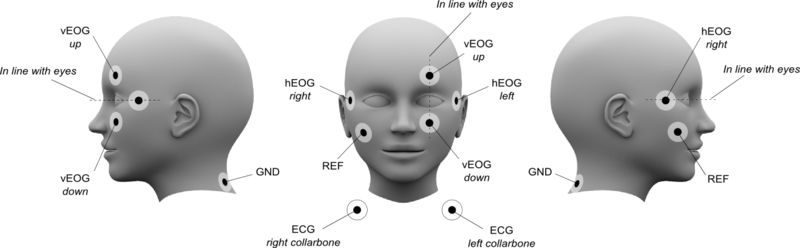
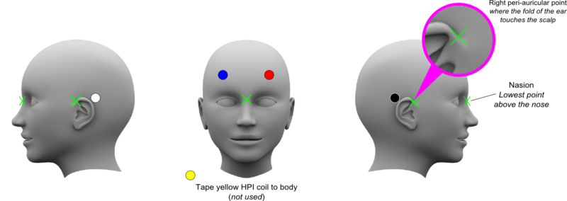
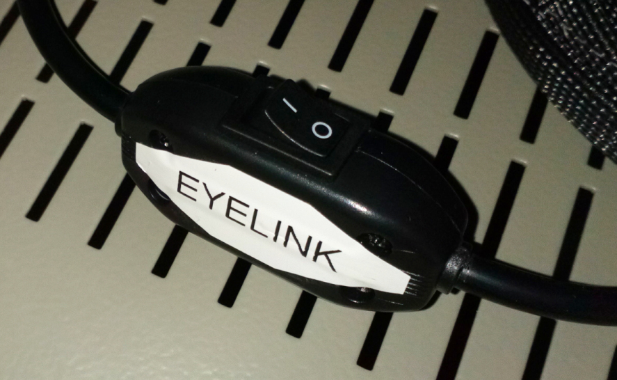

# MEG Data Acquisition Checklist

Click on the checklists to mark your progress through data collection.

## Prepare Control Room & MSR

-  [ ] Check functioning of stimulus and response equipment.

    === "Select the stim PC"

        - Select the correct Stim PC via KVM.
            - Press button 1 to connect to the OLD Stim PC.
            - Press **button 3** to connect to the **NEW Stim PC**.
                - LED Meanings.
                - <b><span style="color:green">Green</span></b>/<b>Dark</b> for connected PCs, but not active.
                - <b><span style="color:green">Green</span></b>/<b><span style="color:red">Red</span></b> for connected PCs actively using the KVM.
                - <b>Dark/Dark</b> for no connection.

    === "Select the parallel port"

        - Select the correct Parallel Port via the Parallel Port (PP) Switch Box.
            - PP Switch position A to connect STI101 to the OLD Stim PC (PP Base Memory Address: BFF8).
            - PP **Switch position B** to connect STI101 to the **NEW Stim PC** (PP Base Memory Address: CFF8).
            - PP **Switch position C** to connect STI101 to the **[LabJack U3-LV](../hardware/meg-labjack.md)** connected **via USB to the NEW Stim PC**.

- [ ] Check Gantry position. Move from liquefaction (25) position to usage position.
	* **[Moving the Gantry](moving-the-gantry.md)**

- [ ] Check experimental paradigm.

    === "Check the PROPixx projector"

        - Check the PROPixx projector is "awake" (make sure lens cover is removed).
            - Start the VPutil program, from the Stim Desktop shortcut, and **type**...
            - (ANY DEVICE) > **`ppx a`** - should respond with "PROPixx is in awake mode"
            - To "sleep" the projector ...
            - (ANY DEVICE) > **`ppx s`** - should respond with "PROPixx is in sleep mode"
            !!! note "Please do not leave the PROPixx projector in *awake* mode when not in use e.g. overnight!"
			!!! Note
			    **`ppx a / ppx s`** didn't work on one occasion. PROPixx needed a full power off/on to reset.
				

    === "Check Stimuli, Responses and Triggers"

        - Check that the stimuli and responses are as expected.
        - Check arrival of triggers in MEG recording.
		!!! note "New Stim PC PP card has a different Base Memory Address than the OLD Stim PC PP card."
			Change any, e.g. MATLAB, code on the NEW Stim PC, referencing the PP Base Memory Address to...<br />
			**CFF8** ... e.g. in `initialiseParallelPort.m`

- [ ] Start participant preparation - items to have ready/available.
 
	!!! info "Reusable and disposable electrodes are available for use as required."
	- **Label 4 electrodes for EOG, 2 electrodes for ECG** and **any other (i.e. EMG) electrodes as required**. Have some additional electrodes ready in case you have to redo them.
    - Electrode gel (in 20ml syringes - use the caulking gun to fill them.) We also have 12ml *curved tip* syringes available.
    - **Cut tape** ready for attaching electrodes to skin (*Tegaderm* tape).
    - **Cut tape** for securing electrodes (*Micropore* tape) and *Blenderm* tape for attaching cHPI coils.
	- Small double-sided sticky discs used to secure reusable electrodes.
    - If using an EEG cap, check it over for damaged electrodes. Makes sure it's clean and dry.
    - Set up the Digitiser chair, away from any metal. Attach the transmitter cube to the back of the chair. The **cable has to point downwards**.
    - See this page for our various consumable items - **[MEG Consumables](meg-consumables.md)**.

- [ ] Check the MSR, yourself, and participant, for any unwanted items that could cause artefacts and remove them.
	- See this PDF... **[Metal items Checklist](../../meg/pdfs/Metal_items_checklist.pdf)**

- [ ] Check that the participant monitoring camera and microphone are working correctly.


## Prepare MEG system

- [ ] Login to the Console, start MEG Acquisition program (***megacq***).
- [ ] Load latest Tuning file, check quality of channels.<br /> "***Heat Sensor***", "***Reset Channels***" as necessary.
    - See this flowchart **[Noisy Channels](noisy_channels.md)**, or for a more detailed process see this walkthrough **[To fix noisy channels](to_fix_noisy_channels.md)**.
- [ ] Exit Tuner and return to ***megacq***. Adjust **Settings**
    - Select Project, or create new.
	- Input pseudonymised participant details from Participant Logging Computer (PLC).
	- Adjust Acquisition parameters or load settings...<br /> **```File -> Load settings```** .
    - Create or adjutst stimulus generation, on-line averaging (as necessary).


## Prepare participant
 
- [ ] Offer bathroom break.
- [ ] Explain preparation procedure.
- [ ] Explain experiment.
- [ ] Have participant read and sign ethics consent and screening questionaire.
- [ ] Have participant remove metal objects, and do **a comprehensive check with both metal detectors**. Participant to change into scrubs if necessary (show participant to Changing Room and show scrubs sizes that are available).

!!! note "We are trying to reduce our laundry bill so only use scrubs if necessary e.g. metal in clothing."


## Attach electrodes

!!! info "Reusable and disposable electrodes available for use as required."

- [ ] Clean hands with provided Alcohol Gel Sanitiser.
- [ ] Ask participant to sit in **Digitisation Chair**.

When ready **to attach a reusable electrode:**

- [ ] **Carefully attach** a sticky disc to the electrode, **centering the hole** over the grey Ag/AgCl. **Remove** the paper protective cover, exposing the disc adhesive.
- [ ] Using a gel-filled syringe and blunt needle, **place a drop of gel in the electrode center** and place the electrode on the prepared site.
- [ ] **Do not pull on the cable when applying it or when attached**. Apply *Micropore* tape as necessary to help secure it in place.

If using the **[NeuroTab](https://www.unimed-electrodes.co.uk/15x20mm-Disposable-solid-gel-electrode-150cm-Lead-TP-connector-Box-of-120/151)** **disposable electrodes**.

- [ ] **Remove** the transparent backing from the electrode and place the electrode on the prepared site.
- [ ] To **ensure good contact**, apply pressure to the center of the electrode and move to the edges.
- [ ] **Do not pull on the cable when applying it or when attached**. Apply *Micropore* tape as necessary to help secure it in place.

**For either electrode type:**

- [ ] Where necessary, **remove makeup with the provided *Micellar* water and cotton pads**.
- [ ] **Rub skin with alcohol wipes** where the electrodes and HPI coils will be attached (see **Figure 1** below). 

!!! note "Don't overdo it as the skin can become sensitive."

- [ ] Some Operators also like to then **abrade the skin with *NuPrep* paste**. 
	- Using one of our **small stainless steel bowls**, squeeze out some *NuPrep* and rub it **onto the skin using a cotton bud**.
    - **Use tissues to gently wipe-off excess *NuPrep*** as it is **non-conducting** (some Operators then like to **re-rub the skin with an alcohol wipe**).
- [ ] **hEOG**: Attach an electrode on the outside of the subject's left eye (**hEOG left**) and on the outside of the subject's right eye (**hEOG right**). 
- [ ] **vEOG**: Attach an electrode above subject's right eye (**vEOG up**) and below the subject's right eye (**vEOG down**). 

!!! note "In both cases, **make sure that the electrodes are in line with the eyes - horizonally & vertically**."

- [ ] **ECG**: Attach an electrode on the left collarbone (**ECG left**) and on the right collarbone (**ECG right**).
- [ ] **GND**: Attach an electrode on the back of the subject's neck (**GND**).
- [ ] **REF**: Attach an electrode on the subject's right cheekbone (**REF**).


**Figure 1: Standard locations of EOG and ECG electrodes**

!!! Note
	REF may not be required for the bipolar EOG, ECG, but use as necessary if channels are noisy.<br />
	For EMG, site REF electrode where required/as per your paradigm.<br />
	Use *Micropore* tape over the electrodes to help hold them in place.
	
    Our Electrode input on the gantry is to the **right of the subject**, so we use the **right eye for vEOG**.


## Check impedance of electrodes

Use the **[SIGGI II impedance meter](../../meg/pdfs/SIGGI_II_User_Manual.pdf)**

- [ ] Press the white button, labelled *Enter/Esc*, on the jog-shuttle to turn on.
- [ ] Press the white button *again* to enter *Impedance Meter* menu.
- [ ] On the top side of the SIGGI ("***Single-Ch-In***") plug **GND** electrode into **"N"**.
- [ ] On the top side of the SIGGI plug **REF** electrode into **"-"**.
- [ ] On the top side of the SIGGI plug the **electrode of interest** into **"+"**.

!!! note "If measuring EEG cap impedance, use the provided adapter."

- [ ] **Cycle through all electrodes**, and make sure the **impedance is <10kOhm**.
- [ ] Quit *Impedance Meter* by selecting *Return* symbol and press *Enter/Esc*. 
- [ ] Select *Power off* via the jog-shuttle and press *Enter/Esc*.


## Attach HPI coils

!!! info "*[Why do we attach HPI coils?](../../meg/pdfs/Why_attach_HPI_coils.pdf)*"

!!! Note "Our HPI coils are energised at different frequencies (now 25Hz separation) compared to the default <br /> ([HPI Coil Placement and Frequencies](../../meg/pdfs/HPI_Coil_Placement_and_Frequencies.pdf))"

- [ ] If necessary **test the HPI coils** first, for continuity, uisng our ***[HPI Coil Tester](../../meg/pdfs/HPI_Coil_Testing.pdf)***<br />
<span style="color:green">With many thanks to Gary Chandler & David Hayes (MRC-CBU).</span>
- [ ] **Attach HPI coils** with either ***[Tegaderm](../../meg/pdfs/Using_Tegaderm_Tape.pdf)*** tape, ***[Blenderm](../../meg/pdfs/Using_Blenderm_Tape.pdf)*** tape, or ***Micropore*** tape, on **the forehead below the hairline**, and **behind the ears** (where there is exposed skin) as shown in **Figure 2** below.

!!! Note
	- If using Micropore, a good trick is then to mark the center of the tape-covered HPI coil with a pencil to aid digitisation/locate the stylus tip correctly.<br />
	- The coils must be covered by the MEG helmet/sensor array, so place them as high on the head as possible.<br />
	- The coils behind the ears as high up as possible, without being in the hair.<br />
	- The coils on the forehead well separated, but not in the hair.<br />
	- The coils should not be directly under the Internal Active Shielding (**IAS**) reference channels, i.e. they should not be in the middle of the forehead, on the inion or near peri-auricular points.<br />
	- The most precise HPI information is obtained when the coils are as far apart as possible but still within the sensor helmet.<br />
	- Try avoiding situations where coils form a nearly perfect square.

- [ ] If **using only 4** coils, **tape the 5th (YELLOW) coil** to the **shoulder**.<br /> *This one will not be used or digitised*.

!!! Note
	- If desired, The 5th coil can be placed in the upper parietal region, preferably somewhat off midline.<br />
	- Do not place the fifth coil directly on vertex as it may interfere with the Internal Active Shielding (**IAS**) if turned on. 
	- Avoid the locations of the zero detectors when placing the HPI coils in order to prevent this problem. Refer to the **IAS User’s Manual** section found in the **User's Manual** for zero detector locations (middle shelf, right-hand white cupboard in Control Room).

- [ ] **Place** the *Polhemus* goggles **carefully on your participant**, or attach the small receiver firmly on the forehead using tape. Make sure the coils do not come unstuck.

<br />

**Figure 2: Standard locations of HPI coils**
<br />

**<span style="color:blue">Please don’t rush the HPI coil attachment!</span>**

- The better the coils are attached, the less likely they will move during digitisation and when the participant is sitting in the gantry chair.
	 - Less likely to produce a **non-Acceptance** when performing the ***megacq*** HPI check.

## Digitise head-coordinate system

!!! note "Make sure that the *goggles don't move* when making the digitisation."

!!! note "The order in which the fiducial points are digitised does not matter."

- [ ] Turn on the *Polhemus* system (switch on the back right of the unit).
- [ ] Place the Transmitter cube in the grey bracket on the back of the **Digitisation chair**, with **the cable pointing down**.
- [ ] Place the *Polhemus* goggles on your Participant.
- [ ] Click **Change** next to **HPI: not digitized!** in the *Acquisition control* **Settings** panel.
- [ ] Click **Coordinate frame alignment** in the **Head shape digitization** window.
- [ ] **Remove** the black rubber tip cover from the stylus. **Do not drop the stylus** as the point is easily damaged!
	- **Rest the tip** of the stylus gently on the first fiducial point, e.g. **nasion** or a **peri-auricular point** (see **<span style="color:green">green</span>** crosses **in Figure 2 above**), and **press the stylus button**.
	- **Repeat** this procedure for **the other two fiducial points**. You should **hear two beeps** after the 3rd point, signfying completion.
- [ ] If time allows, as a *sanity-check*, to make sure the measured location of the fiducial points are in still in alignment...
	- Click **Coordinate frame alignment** again, and select **Check** from the pop-up window.
	- **Digitise all three fiducial points (cardinal landmarks) again** by pressing the stylus button after each beep. You should **hear two beeps** after the 3rd point, signifying completion.
	- **To abort** digitise a point 75cm from the head origin/receiver, by pressing the stylus button at that distance.
	- **Deviations from the first digitisation** will appear in **another pop-up window** after you have digitised all three fiducial points/landmarks.
	- **Deviations < 5mm** are considered to be **"OK"**, no redo required.
- [ ] If necessary (**values > 5mm**), **redo measurement** by clicking **Coordinate frame alignment** again and selecting **Redo**.


## Digitise HPI coils

!!! note "The coils *must not move* relative to the head during the measurement!"

!!! note "The order in which the HPI coils are digitised does not matter."

- [ ] Click **HPI coils** in the **Head shape digitization** window.
	- **Rest the tip** of the stylus gently in the **little hole in the centre of a coil** and **press the stylus button**.
	- **Repeat** this procedure for **the other three coils**, as shown **in Figure 2 above**.
- [ ] **Stop** the digitisation after the 4th coil (**if only using four coils**) by **digitising a point 30cm from the head origin**.
	- Hold the stylus that distance **away from the receiver on the *Polhemus* goggles**, and press the stylus buttton **once**. You should **hear two beeps**.
	- If you were **digitising all five HPI coils**, you should **hear two beeps** after the 5th coil, signifying completion.
- [ ] If time allows, as a *sanity-check*, to make sure the measured locations of the HPI coils are in alignment.
	- Click **HPI coils** again, and select **Check** from the pop-up window.
	- Digitise **all four (or five) HPI coils again** by pressing the stylus button after each beep.
	- **To abort**, digitise a point 30cm from the head origin/receiver, by pressing the stylus button at that distance.
	- **Deviations from the first digitisation** will appear in **another pop-up window** after you have digitised all four (or five) HPI coils.
	- **Deviations < 5mm** are considered to be **"OK"**, no redo required.
- [ ] If necessary (**values > 5mm**), **redo measurement** by clicking **HPI coils** again and selecting **Redo**.


## Digitise head shape

- [ ] Leave the *Polhemus* goggles in place on your participant, then ...
- [ ] Click **Pen** in the bottom right (*Additional Data*) window.
	- **Gently stroke** the tip of the stylus (usually with the black rubber tip cover in place) over several (especially bony) shapes of the head ...<br /> 
      *eyebrows, around the eyes, nose*, and *along the scalp*,<br /> ...to capture the head shape, while **pressing the button of the stylus**.
	- At least **200 extra points** would be the minimum number to digitise.
- [ ] Ideally **select the cardinal landmark locations again** as the **last 3 points** you collect.
- [ ] **Stop** when ready by **digitising a point 30cm from the head origin**. 
	- Hold the stylus that distance **away from the receiver on the *Polhemus* glasses** and click the stylus button **once**. You should **hear two beeps**.


## Prepare the participant in the MSR

**<span style="color:maroon"> At all times make sure your participant knows what is going to happen. Make him/her comfortable in expressing his/her opinions.</span>**

- [ ] **Before** escorting the participant into the MSR, **secure any relevant cables** to the body (i.e. shoulder) of the participant e.g. the **unused (5th) yellow HPI coil**, using *Micropore* tape.
- [ ] When the **participant is seated** in the gantry chair, **plug in the EOG, ECG, EMG electrodes** (as required) into the **correct BIO sockets** of the gantry side panel, as determined by your experimental setup.
- [ ] **Attach the HPI coils** (red plug) into the **red "HPI" socket** of the gantry side panel.
- [ ] If used, **attach the *Natus* audio plug** into the **green "Patient" socket** of the gantry side panel.
- [ ] **Raise participant** into the gantry helmet, using the chair foot pedal, until the top of the head *almost* touches the inside top of the helmet.
- [ ] **Make participant comfortable** with cushions/pillows and/or by raising the leg rests of the chair.
- [ ] If using, **setup the EyeLink 1000 Plus Camerahead/Illuminitor** on the small table, placed over the participant's legs. (*See the ***[Eyelink 1000 Plus](meg-acquisition-checklist.md/#if-using-the-eyelink-1000-plus)*** section for more detailed usage*).
- [ ] **Position the back projection screen** in front of the participant, with the glossy side facing them.
- [ ] **Place NAtA button pad/s, response device/s** - e.g., on the gantry chair waist tray.
- [ ] If necessary, **run through the stimulus paradigm again** to confirm they know what they need to do/what is required.
- [ ] Exit, then **close MSR door**.
- [ ] **Check communication both ways** using the intercom. Put the participant at ease.
- [ ] **Check again** that the participant is happy/knows what to do.


## If using the EyeLink 1000 Plus

***See the [EyeLink Operations Guide] for more detailed usage.***

!!! Note "<span style="color:red">NOTE:</span> STIM PC will need to be powered up to allow network communication to the EyeLink PC<br />(both APC Back-UPS 1400s will need to be powered)."

- [ ] **Switch on 6-way bar plug** on table alongside EyeLink Host PC (**to power EyeLink camera (on desk), Host PC, and monitor**).
- [ ] **EyeLink Batteries:** *Use a fully charged battery where possible*.
	- **Press the TEST button** to check the power level (batteries **#1** and **#2**).
	- **Power on, and press the TEST button** (new batteries **#3** and **#4**).
	
!!! info "*<span style="color:maroon">"A battery with 2-3 hours left should be fine for a short experiment. Do not risk using it for a 2-hour experiment"</span>*(SR Research)."

- [ ] **Put any used battery on charge** *as required*. 
	- Make sure **battery is switched OFF when charging**.
	- **#1** and **#2**: AC Adapter **<span style="color:orange">Orange</span>** LED **will extinguish when battery is charged**.
	- **#3** and **#4**: AC Adapter **<span style="color:red">Red</span>** LED will change to **<span style="color:#FDDA0D">Yellow</span>** **when battery is charged**, eventually **<span style="color:green">Green</span>**.
	- **Unplug battery once fully charged**, **switch off AC Adapter** (at Mains socket).
	- **<span style="color:red">DO NOT leave a battery on charge overnight, or unsupervised!</span>**
		- **<span style="color:blue">Leave a strip of *Micropore* on battery to signify charging required the following day.**</span>
- [ ] **Swap to a new battery between Acquisition sessions**. *Put the used battery on charge.*
- [ ] **Take** a battery into the MSR. Place in **front left corner** (*as viewed from gantry chair*).
- [ ] **Arrange power cable** around the edge of the MSR, *avoiding any loops*. **Attach** power cable **to battery** and to **FO Camera Head/IR Illuminator**. **Switch on battery**. 

!!! Note "<span style="color:red">NOTE:</span> If you don’t power the Camera Head/IR Illuminator first, the Host PC will complain when "EyeLink” starts up (*ticking sound*).</span>"

- [ ] **Place** FO Camera Head/IR Illuminator **on small table.** *Position table as required, use provided table risers as necessary*.
- [ ] **Turn on** EyeLink 1000 Plus Host PC and monitor.
	- **Select** "EyeLink" with the mouse, or just wait.
- [ ] **Set up** EyeLink FO Camera Head/IR Illuminator as per normal usage ...
	- *Adjust Camera Head position, remove lens cap, adjust focus/thresholds etc.*

!!! Note "<span style="color:red">NOTE:</span> You can view the EyeLink IR lamp via the MSR camera monitor on the wall in the Control Room - helps in checking lamp alignment on the participant."
- [ ] **<span style="color:blue">EyeLink 1000 Plus AC Adapter usage (*if batteries have failed/none have enough charge*)**.</span>

{width=40% align=right}

- **Unplug the battery cable** from the EyeLink FO Camera Head/IR Illuminator, and **attach** the cable labelled "**AC Adapter**". 
- **Coil up** the now-unused battery cable and **leave** it on the shelf.
- **Turn on** the EyeLink FO Camera Head/IR Illuminitor power (**via switch labelled "EYELINK"**), in the **Stimulus Cabinet** (*see image right*), and close the door.
- **Set up** EyeLink FO Camera Head/IR Illuminator as per normal usage.


## Start recording

- [ ] Instruct participant to **remain still and relaxed**, and announce the start of the experiment.
- [ ] Start Acquisition by pressing **"GO!"**.
- [ ] Tick **Record raw**.
- [ ] Tick **Average** (if required).
- [ ] Start experiment on Stim PC.


## Finishing recording session

- [ ] When the experiment has finished, press **Stop**.
- [ ] **Inform** participant that the experiment is over, to **remain seated**, and that you will be in there shortly.
- [ ] If *Average* was ticked, the **first file saved** will be the **averaged data** and the **second file** will be the **raw data**.
- [ ] **Name** your files as per your usual file-naming scheme.
- [ ] **Do not change the default path** (*ProjectName/SubjectID/Date*). 
- [ ] Enter MSR, disconnect electrode cables and HPI coils. **As a help**, ask participant to hold cabling.
- [ ] **Lower chair** by using foot pedal, and pull chair out from under the gantry.
- [ ] **Help** participant up out of the chair (if required), and escort them back to the **Digitisation chair**. When seated, **gently remove** all electrodes and tape. If used, remove the *Tegaderm* tape from the HPI coils as soon as convenient - see [Tidying Up] page.

## **[Tidying Up](tidying_up.md)** (separate page)

- [ ] Some procedures **only need to followed** if **End of Day**, as indicated by **<span style="color:orange">orange</span>** wording in the document.

- Most equipment can **be left on** during normal working hours.

