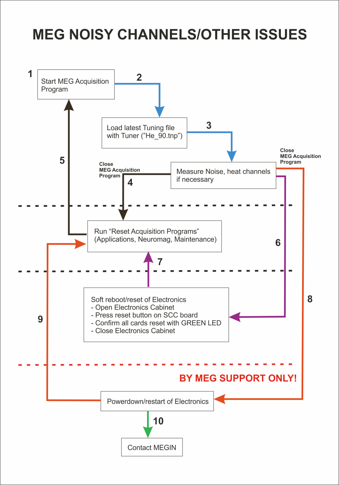

# Noisy Channels

{width=35% align=right}

* Start the MEG Acquisition program.
* Load the latest Tuning File ("*He_90.tnp*").
* Measure Noise, and Heat Channel/s if necessary.  Reset Channels is also a good first attempt at a fix.
* If heating/resetting doesn't help, exit Tuner, exit Acquisition, perform a **[RAP](rap.md)** (**R**estart **A**cquisition **P**rograms).
* Start the MEG Acquisition program again, load the latest Tuning file etc.
* If that doesn't help, exit Acquisition and Soft Boot the electronics.
* Run a RAP again, Start Acquisition, load Tuning file etc.
* If that doesn't help, powerdown/restart electronics - **by MEG Support only!**
* Run a RAP again, Start Acquisition, load Tuning file etc.
* If channels are still too noisy to acquire with, then MEG Support may need to Tune the channels.
* If still too noisy to acquire, a Help Request with MEGIN Support will be required.