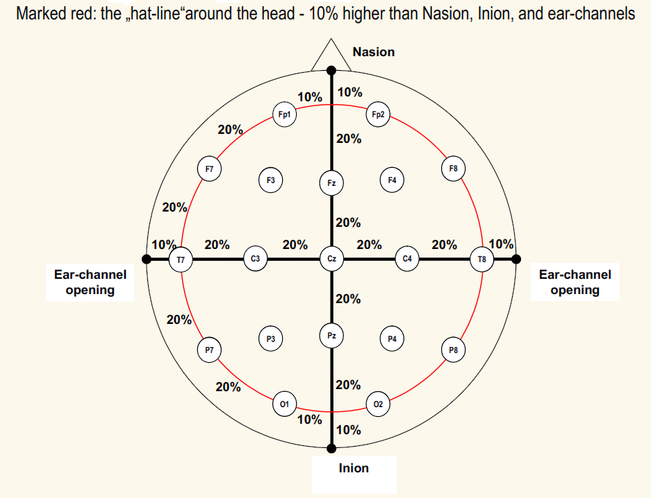
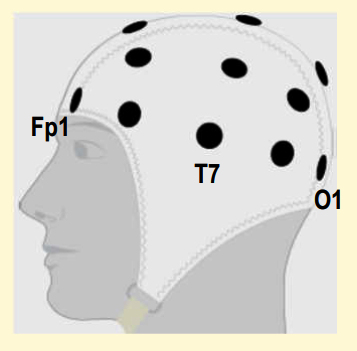
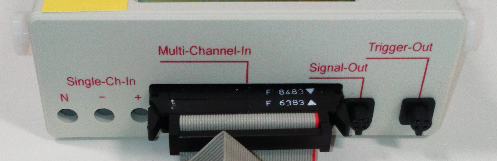
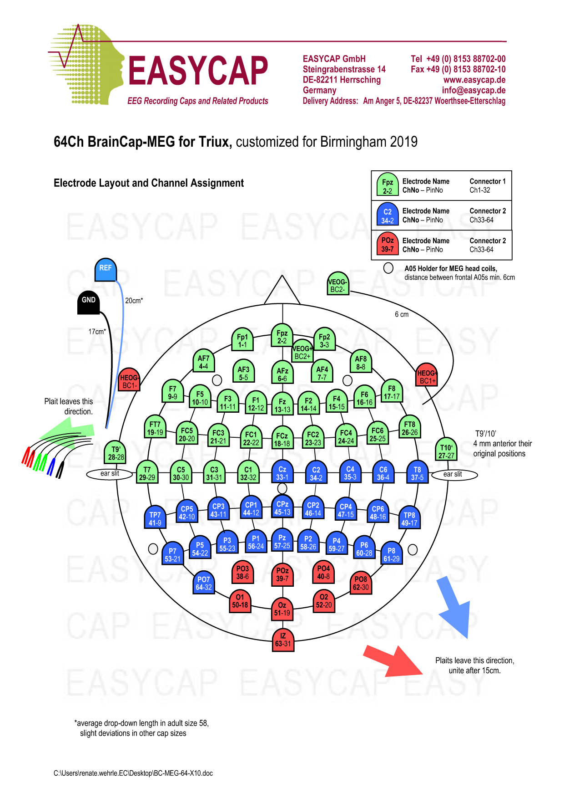

# Correct Positioning & Usage of EEG Caps

**CHBH MEG uses 64 Channel EASYCAPs purchased from Brain Products UK, and have 6 caps available in 4 different sizes. The caps use the 10/20 system of electrode placement.**

- **1 x 54cm, 2 x 56cm, 2 x 58cm, 1 x 60cm**

### **The International 10/20-System**

{width=50% align=left}
 

- This system employs **connecting lines of anatomical landmarks**, with the **length of these lines defined as 100%**. 
- Electrodes are placed at **distances of 10% or 20% in either the longitudinal or the lateral lines**, resulting in approximately **equidistant points**.
    

### **Cap Sizes**

- The **cap size denotes the circumference of the head in centimeters**, with the size labels found at the back of the cap.

- **Measure** the participant's head circumference **at the "hat line"** (10% higher than the Nasion, Inion, and ear openings), and **choose a corresponding cap size (or one slightly larger)**.

### **Correct Positioning of the Cap**

{width=50% align=left}

- Caps are **placed on the head in relation to the Nasion and Inion anatomical landmarks**.

- **Measure** the distance from **Nasion to Inion centrally over the head** with a tape measure.
 

{width=40% align=left}

- Then put the cap on the participant, **making sure the Cz electrode position is centered/halfway between the Nasion and Inion**.

- Make sure the **cap is left-right symmetric** and then **close the chin strap**.

- The cap is **fitted** on the participant correctly **when Fp1/Fp2 - O1/O2 - T7/T8**, viewed from the side, are **all in the same plane (with Fp1/Fp2 close to the eyebrows)**.
  

### **Achieving good signal quality**

**Good contact** between the skin and the electrode, using **an electrolyte gel or paste**, is **essential** to maintain **low impedance** and ensure **high signal quality**.

- With the **wooden end** of a cotton swab, **push aside the hair** in the electrode opening until the **skin is clearly visible**.
- **Clean the skin** with **70% Isopropyl Alcohol**. Decant some alcohol into the provided stainless steel pot. ***Rinse out/clean the pot after use.*** 
**Dip the cotton end** of the swab in the pot and then, by **twirling the swab between thumb and index/forefinger, degrease the skin** in the electrode opening by **rotating on the spot**. This should **reduce the initial impedance to below 30 kOhm**.

!!! note "If possible, ask participants to arrive with their hair washed, without using any conditioner."

- **Abrade the skin** with ***NuPrep* paste**. Squeeze some paste into the provided stainless steel pot. ***Rinse out/clean the pot after use***. 
**Dip another cotton swab into the paste** and, again, **rotate the swab on the spot in the electrode opening**. This should **further reduce the impedance to below 5 kOhm**.

{width=40% align=left}

- EasyCap EEG caps have **large openings in their ring-shaped electrodes, enabling abrasion of the skin by means of a cotton swab**.
- **Best results** are achieved when **rotating the swab FAST (4-5 fast twirls) but with MINIMAL PRESSURE**.
- Using **more pressure** will only **result in reddening of the skin/possible bleeding**.
- ***"Quick, but gentle, is the order of the day!"***.
- With **low pressure**, this procedure is **painless and very effective**.
    

<align=full>

- **After** abrading using ***NuPrep*** (*removing as much as paste as possible as it is non-conducting*), **apply electrode gel through each electrode opening, using the filled syringe and a blunt needle.**

!!! Note "Check needle is firmly luer-locked in place, and gel is being extruded, BEFORE using the syringe."

- **Touch the skin with the blunt needle and start to press the plunger**. This is to **establish contact between the skin and the gel**. Only after the **gel starts to extrude is the syringe pulled back, filling the electrode opening with gel**.

!!! note "DO NOT re-use the same needle on a second participant. Throw the needle away, in the provided yellow Sharps box, and open a new blunt needle."

- If **more** electrode gel is required, **reverse fill a syringe** using the provided **caulking gun and the 300g gel cartridge**.

### **Check impedances** 

- As **most electrolytes permeate the skin, impedances improve after a few minutes '*magically*' by themselves**. Thus it's **best to fill all the electrodes first, starting with REF and GND**, and **check the impedances afterward**.
- **If needed, repeat the abrasive step** by gently twirling with a cotton bud.
	 - **Most impedance problems** result from **insufficient contact between skin and gel or gel and electrode**.

### **SIGGI-II Impedance Meter** 

- Although the **EEG impedances are checked by the Acquisition software**, after plugging the cap into the side of the gantry, it is **worth checking them whilst the participant is outside the MSR**.

{width=50% align=left}
    

**[SIGGI-II User Manual](../../meg/pdfs/SIGGI_II_User_Manual.pdf)**
      

- The **SIGGI-II can measure either single electrodes (*Single-Ch-In*) or multiple electrodes (*Multi-Channel-In*)**.

<align=full>

 - A **customised adaptor (*Brain Products UK*) allows 32 of the 64 EEG cap electrodes to be checked at the same time**, with the **Ground electrode** plugged into the **BLACK GND socket**, 
 and the **Reference electrode** plugged into the **BLUE REF socket**.

- When **testing a single electrode e.g. an EOG or ECG electrode** ...
	 - **Plug** a *Ground-Electrode* into "**N**"
	 - **Plug** a *Reference-Electrode* into "**-**"
	 - **Plug** the *to-be-measured electrode* into "**+**"

### **Switching the SIGGI II On** 

- **Press the white button** named ***Enter/Esc*** on the **jog-shuttle**.
- After a short message the ***Main Menu* will appear on the LCD-display**.
	 - SIGGI II **starts with the settings stored last within the** ***Setup Menu***.

### **Impedance Measure** 

- Select ***Impedance Meter*** from the ***Main Menu*** (*turn the jog-shuttle*) and press ***Enter/Esc***.
- The menu ***Impedance Measurement*** appears. The **electrode impedances** of the *to-be-measured electrode, the reference- and the ground-electrode* are **displayed simultaneously**.
- **Impedance is shown as a bar graph as well as a numerical value**. The **range** of the bar graph can be adjusted in the ***Setup*** menu, and **also the Impedance measurement frequency** if so desired.
- The **electrode potential of the to-be-measured electrode compared to the reference electrode is shown beneath the selected input channel**.
	 - If all the electrodes are **the same material => high potentials indicate faulty electrodes**.
	 - If the electrode **materials are different => some amplifiers may be unable to process the signal if the electrode potentials are high**.
- To **select the channel** for impedance measurement **select *CH menu*** and press ***Enter/Esc***.  
By **turning the jog-shuttle**, ***Single-Ch-In*** with **its three safety sockets**, or **one of 32 channels of** ***Multi-Channel-In***, is **selected**. 
***Single-Ch-In*** is depicted by ***III***, whereas ***Multi-Channel-In*** is shown by the **channel numbers 1–32**.
- To **quit** channel selection press ***Enter/Esc***.
- To **quit *Impedance Measurement*** select the "**up arrow**" (*on top row*) and press ***Enter/Esc***.
- To **switch off** the SIGGI-II, select ***Power Off*** from the ***Main Menu*** and press ***Enter/Esc***

{width=50% align=left}   

- When **checking EEG Cap electrodes 1-32** (*yellow connector*), SIGGI-II **displays numbers 1-32 as the channels under test**.
- When **checking EEG Cap electrodes 33-64** (*green connector*), SIGGI-II **STILL displays numbers 1-32, NOT 33-64** e.g.
	 - **Electrode #33** => SIGGI-II **channel #1**
	 - **Electrode #64** => SIGGI-II **channel #32**

