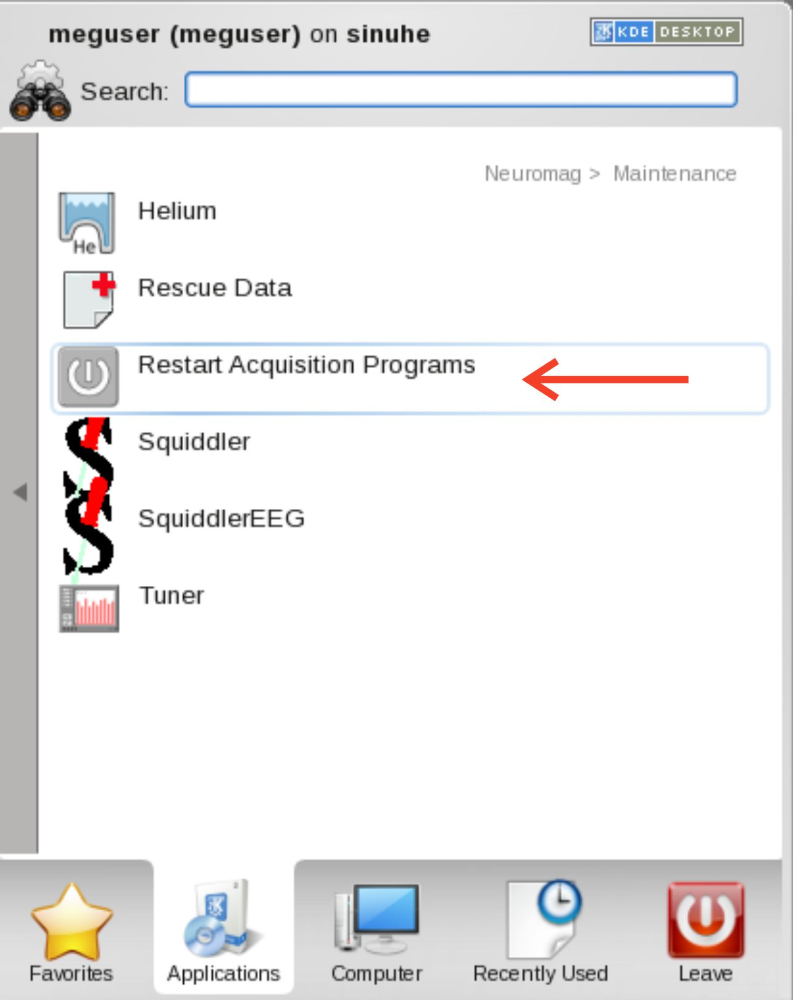

# Restart Acquisition Programs ("RAP")

{width=40% align=right}

1. Stop/Close the Acquisition program (***megacq***).
2. Open the **Maintenance** folder under the **Neuromag** folder in the Desktop’s **Applications** menu to see the available actions.
3. Select the **Restart Acquisition Programs** icon (**"RAP"**).
4. Confirm that you really want to proceed by answering **"Y"** to the question appearing in the **Restart Acquisition Programs** terminal window.
5. Observe the messages in the window during the restarting. 
6. Should the restart operation fail, verify all physical power and data connections, as well as network connections, are working. Then ...

<align=full>
7. Close the terminal window, and try from point #2 again. If successful, then...<br />
8. Wait until the message...**```Restart complete. Press <Enter> to close the window```** ...appears and press **Enter** on the keyboard.<br />
9. If you had collected data and ***megacq*** ceased to work after you pressed **Stop**, you can rescue your data by double-clicking the **Rescue Data** icon in the **Maintenance** folder.<br />
10. If there is some data to be saved, you will first see a dialog to confirm that you would really like to proceed. Thereafter, a standard ***megacq*** saving dialog will appear. The rescued data will be 
saved under the project directory called **unknown** if the real project name could not be retrieved.<br />
11. Restart ***megacq*** by selecting the **Acquisition** icon in the **Neuromag** folder.
