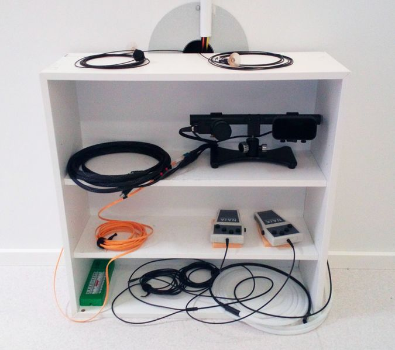

# Tidying Up

### **Tidying Up e.g. before next Operator**

**End of day “to do” procedures shown in ORANGE  - if you're the last Operator of the day (according to Calpendo).**

**SUMMARY**

- UPSs in place, to remain powered/protecting equipment. REO Isolation Transformer removed.
- EyeLink Host PC to be shut down after use, the 6-way Mains extension bar plug then switched off (to power off Camera).
- EyeLink batteries charged/used as normal. Don't leave switched on/charging overnight. Make sure the AC Adapter in the Stimulus Cabinet is switched off.
- PROPixx projector to remain powered, to be "awakened" or "slept" as necessary. Lens cover can be left off.
- STIM PC to remain powered, leave switched to NEW Stim via KVM at End of Day (a screensaver is set to protect monitor).
- NAtA Response Box Controller to remain powered up.
- All other Tiding Up as per our usual procedures...
	 - L2V Converters switched off after use.
	 - HPI coils cleaned.
	 - Polhemus cabling left tidy, L2V FO cabling/NAtA Response Box FO cabling/EyeLink cabling, left tidy in MSR.
	 - Log out of the DACQ Console, switch off the DACQ Console monitor once login screen appears.
	 - Fill out a Maintenance Log report for your session (one report for each session, if you have consecutive sessions).
	 - Move the gantry to 25, if you're the last Operator of the day/End of Day, or more than ~1hr between daily booked slots (check Calpendo).

**Remember to check Calpendo to see if another Operator has booked the next session after yours; in that case, you may be able to leave some equipment powered up.**

**FULL PROCEDURE** 

- [ ] Stop Acquisition and Save Data. Copy off data to RDS - **[Copying MEG data](copying_meg_data.md)**.
- [ ] End session on **P**articipant **L**ogging **C**omputer (**PLC**), click on “**SCAN END**”, **turn off monitor**.
- [ ] Inform participant (via intercom) that the experiment has finished, that they are to remain seated, and you’ll be in to unplug/disconnect them shortly.
- [ ] Carefully disconnect EEG cap connectors (if used), NATUS audio (if used), BIO Electrodes, and HPI coils from the gantry side.
- [ ] Ask participant to remove NATUS ear tips (if used). Dispose of used ear tips in the provided flip-top bin (*spare bin liners are available on the bottom shelf of the EEG trolley*).
- [ ] Ask participant to remove SOUNDPixx ear tips (if used). Disconnect black SOUNDPixx participant tubing from the main tubing (if used). Dispose of used ear tips in the bin.
- [ ] If required, help participant up from gantry chair (they may be a little unsteady), and have them resit in the Digitisation chair in Control Room.
- [ ] Carefully remove EEG Cap (if used), and reusable EOG/ECG electrodes (if used) from the participant, DO NOT pull on the cables!
- [ ] Remove any disposable electrodes carefully, to avoid any unnecessary pain to the participant.
- [ ] Remove HPI coils carefully from the participant, DO NOT pull on the cables!
- [ ] Inform participant that they can wash their hair if necessary, before or after changing out of scrubs (*if used*).
	 - Towel and hair dryer in IKEA wardrobe. 
	 - Show participant to the Shower Room. Remember to take your swipe card! 
	 - Leave the used towel on the drying rack in the Changing Room for MEG Support to deal with.
- [ ] Participant changes out of scrubs (*if used*) in the Changing Room, and back into their street clothes. The used scrubs to then be put into the kitchen laundry basket by the participant or the Operator on their exit from the Lab.
- [ ] Check all necessary documentation has been signed by the participant. Thank your participant for their cooperation and show them out, making sure they have all their belongings with them when they leave.
	 - Make sure used scrubs are put into the kitchen laundry basket. 
	 
**Return to the Control Room, and ...** 

- [ ] Remove, and throw away, disposable Response box covers (if used). If not, wipe down NAtA button boxes - with Alcohol wipes (not gel!). Be careful! Don't wipe too hard!
- [ ] Throw away disposable electrodes/used *Micropore* tape.
- [ ] If used, **[Clean EEG cap](cleaning_eeg_caps.md)**.
- [ ] Clean reusable electrodes.
	 - Carefully remove the double-sided sticky disc, and any *Micropore* tape, and dispose of in the bin.
	 - Use a cotton bud dipped in Isopropyl Alcohol to remove any sticky disc residue from the white surround.
	 - Wash the electrode in warm water in the Shower Room sink, using a cotton swab/soft toothbrush to remove the gel.
	 - Dry the electrode using a green paper towel, and hang the cable over the handle of the EEG trolley. 
- [ ] Remove as much *Teagderm* as possible from each HPI coil - be gentle - DON'T PULL on coil or cable.

!!! info "Use a piece of *Blenderm* tape to pull/pick off ("*stipple*") the remaining stubborn small bits of *Teagderm* tape from the coloured heatshrink sections of each HPI coil."

- [ ] Wash HPI coils in warm, soapy water - DON'T GET grey end connector wet!
- [ ] Dry coils with a green paper towel.
- [ ] Soak coils in Isoproply Alcohol (**IA**) (*marked tub*) for a few minutes, then wipe with a paper towel and leave to dry on a paper towel.
	- If the coils still feel "sticky", put some Alcohol gel in the palm of your hand and rub each coil carefully. 
	- Resoak again in IA if necessary.
- [ ] Leave the HPI lead coiled up on a green paper towel to dry off on the EEG trolley.
- [ ] Replace the internal cover on any open pot of Isopropyl Alcohol, then screw on the lid gently but firmly. Leave pot upright on EEG trolley.
	 - **If end of day**, return Isopropyl Alcohol pots to red Flammables cabinet located in Changing Room.
- [ ] Throw away used cotton buds/used paper towel/*Tegaderm* backing paper. 
- [ ] Dispose of used blunt needles in the yellow “SHARPS” box. Throw away used syringes, when necessary, in the bin.
- [ ] **We have a *Dyson* vacuum cleaner - please use it on the Control Room carpet/Changing Room floor, as necessary.**

{width=40% align=right}

- [ ] Leave EEG trolley tidy – (*see image right*).
	 - Alcohol pots returned to Flammables cabinet - **if end of day**).

 
 

- [ ] Wipe inside gantry helmet, chair tray, chair arms - with Alcohol gel on green paper towel.
- [ ] Turn off L2V Converters (*in Stimulus Cabinet*) - move switch to ‘OFF’ position - make sure ** RED ** LED is NOT lit.

{width=40% align=right}

- [ ] Turn off *Polhemus*, tidy up cables – (*see image right*).
	- *Polhemus* power switch can be found back right of control box.  Front panel **GREEN** LED should go out.

 
 
 
 

- [ ] **If end of day, or Eyelink not required by next Operator**, shutdown EyeLink PC, switch off EyeLink monitor, switch off extension 6-way bar plug.
- [ ] Turn off/Remove EyeLink Battery from MSR.
- [ ] Put battery on charge, unplug once charged, don’t leave on charge overnight.
	 - See **[Charging EyeLink batteries](charging_eyelink_batteries.md)** for further information.
	 - If necessary leave a note for MEG Support, to put the battery on charge first thing in the morning.
!!! info "A piece of *Micropore* tape on the front of the battery indicates charging required."

{width=40% align=right}

- [ ] **If end of day, or EyeLink not required by next Operator**
	 - Remove EyeLink Camera head/Illuminator from small table and replace in MSR shelving. Replace the lens cap on the Camera head.
	 - Tidy up EyeLink Camera head/Illuminator battery (or AC Adapter) power cables, and Orange FO cable, neatly and loosely, and place back on MSR shelving.

 

- [ ] Remove L2V Converter suction mounts (if used) carefully from projector screen, coil their FO cables neatly, and replace on MSR shelving. 
	 - Clean any marks on the screen with a Lens Cleaning Wipe.

!!! note "DO NOT coil the FO cables tightly!"

- [ ] Leave everything tidy – *as per MSR Shelving image shown above*.

 - [ ] **If the EyeLink "AC Adapter" has been used ...** 

{width=40% align=right}

- Shutdown the EyeLink PC, switch off the EyeLink monitor, switch off the extension 6-way bar plug.
- Turn off the FO Camera Head/IR Lamp power (via switch labelled "**EYELINK**", in the Stimulus cabinet - *see image right*), and then close the cabinet door.
- Unplug the AC Adapter cable, coil it up, and leave on the MSR shelving.

 

- [ ] **If end of day**, move projector screen to the side of MSR. Move small table to the side of MSR.

- [ ] **If end of day**, replace the black cloth cover on projector mirror, and "sleep" projector, as described below...
	- Start the VPutil program, from the Stim Desktop shortcut, and **type**...
	- (ANY DEVICE) > **`ppx s`** - should respond with "PROPixx is in sleep mode"
- [ ] Open MSR and check projector is "sleeping".

!!! Note "`ppx a / ppx s` didn't work on one occasion. PROPixx needed a full power off/on to reset."
!!! Note "Projector lens cover to remain off, so the projector state can easily be determined."

- [ ] **If end of day, or no one booked in for the session following yours**, move the gantry to the Liquefaction position ("**25**"). Make sure the gantry traffic light is **FLASHING GREEN**.
- [ ] NAtA Control Box in Stimulus Cabinet can remain switched on.
- [ ] **If end of day**, Stim PC to left switched on (no need to logoff/shutdown), then ...
	 - Make sure KVM is switched to "NEW" (button #3), so the monitor is displaying the NEW Stim Desktop (*a screensaver is set to protect the monitor*).
	 - (*Monitor can still be powered off as normal if necessary*).
- [ ] **[Copy off](copying_meg_data.md)** data from DACQ console, if not already done so.
- [ ] **If end of day**, switch off the MSR Participant Monitoring Intercom (press the "**X**" button).
- [ ] **If end of day, or no one booked in for the session following yours**, logout of DACQ console (“***Sinuhe***”). 
	 - Click/select "**Application Launcher**" button (*bottom left of screen*).
	 - Hover mouse over "**Leave**” button.
	 - Move to, and click/select, "**Logout**" button.
	 - Move to, and click/select, "**Logout**" buton in center of screen - *or just wait (30sec)*.
- [ ] Once login screen appears, turn off monitor - *switch bottom right of monitor*.

!!! Note "**Don’t shutdown the Console! Only logout and then switch the monitor off.**"

- [ ] **Fill out a Maintenance Log report for your session (one report for each session, if you have consecutive sessions).**
- [ ] **If end of day**, open MSR door for one last sanity check that gantry traffic light is **FLASHING GREEN**.
	 - If not, de-metal and adjust gantry up/down buttons as necessary.
- [ ] **If end of day**, Switch off Control Room light.
- [ ] **If end of day**, Lock MEG lab, return key to key safe. Make sure key safe is locked!
- [ ] **On leaving, sanitise your hands with the provided Anti-bac foam (dispenser on wall outside Control Room).**
- [ ] Put all relevant documentation in the black Postbox outside Reception as you exit the MEG corridor.
