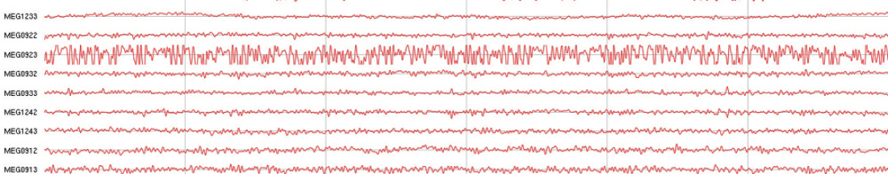

# Fixing Noisy Channels

If, on starting Acquisition, you **encounter a noisy channel**, after installing your participant in the gantry chair and your **empty room check** was fine beforehand ...  

 

* Hopefully you would have confirmed your participant was clean of any metal (*correct use of* ***both*** *metal detectors*).
* Ask your participant to open/close their mouth (*dental artefacts*).
* Ask your participant to blink their eyes once per second (*eye makeup artefact*).
* Ask your participant to take 2 deep breaths (*clothing arefefact*).

First thing to try would be a **channel reset**. 

* From the Acquisition Menu Bar, choose ...
	* **`Tools -> Reset Channels`**

The noisy channel may return to normal after the reset artefact has passed through.

If not, try **heating the sensor**.

- Stop any ongoing Acquisition by pressing the **`Stop`** button.
- From the Menu Bar, choose **`Tools -> Tuner`**.
- Load the latest Tuning file **`File -> Load Tunings ->`** Select **OK** (to load the default tuning file **He_90.tnp**).
- Select **`Measure Noise.`**
- In the **`View Channel`** window, replace the word **`ALL`** with the noisy channel in question e.g. **`MEG0923`**, press **`Enter`**.
- From the Menu Bar, choose **`Commands -> Heat sensor`**. Wait for the buffer to be reprocessed... **noise level should hopefully show a reduction**.
- Select **`Stop measurement`**, then **`Stop Collector`**.
- From the Menu Bar, choose **`File -> Exit ->`** **Yes** to close the Tuner window.
- Start Acquisition, check if channel is still noisy.

If the sensor is still noisy, perform a **[RAP](rap.md)**.

- Once done, then ...
- Restart Acquisition.
- From the Menu Bar, choose **`Tools -> Tuner`**.
- Load the latest Tuning file **`File -> Load Tunings ->`** Select **OK** (to load the default tuning file **He_90.tnp**).
- Select **`Measure Noise`** to see if the **[RAP](rap.md)** has reduced the channel noise level.
- If not, try another **[RAP](rap.md)** and then repeat from "Restart Acquisition" above.

If the sensor is still noisy, do a **soft reboot/reset** of the electronics, as per **[Restart Acquisition #resetting the electronics](restart_acquisition.md/#resetting-the-electronics)**

- Exit Acquisition back to the Console login screen. 
- Open the Electronics Cabinet.
- Press the **Reset** button on the **System Controller Card**, **[SCC](../../images/meg/SCC.jpg)**, as shown by the arrow.
- Confirm all cards/boards are reset (all are showing **GREEN** LEDs) - takes 30-60sec.
- Close the Electronics cabinet door.
- Perform a **[RAP](rap.md)**, then make sure the deafult tuning file is reloaded...
	- **Acquisition -> Tuner -> Load Tunings -> Measure Noise**.

If the sensor is still noisy, **contact MEG Support** to attend to power down then restart the electronics.

!!! info "Dr. Chris Bailey, former MEG Lab Manager at Aarhus University, Denmark, had this to say re: "noisy" participants ...back in 2018."
	*First, I’d try to figure out whether the artefacts are body motion-related. Ask the participant to keep completely still, and hold their breath while you count slowly to ten. 
	At ’two’, hit “Reset channels”. If the sensors return to something sane (non-saturated) after the reset-artefact has passed, there’s likely something magnetic on or in the participant.  
	The Reset is needed if the source is very strong: the SQUID’s operating points will be screwed in a very strong static field. You can also try without the Reset, just ask them to hold (Very) still.  
	We routinely use Hospital scrubs, at least the blouse. Hair wash is probably less likely to help, but getting all pins and clips out is important. A recent MRI will be a problem if there’s magnetic material inside the subject. 
	Finally, women with bras need to be asked whether they have a metal support, many do. Most artefacts will clearly be breathing-correlated, so that usually helps locating external sources.*

