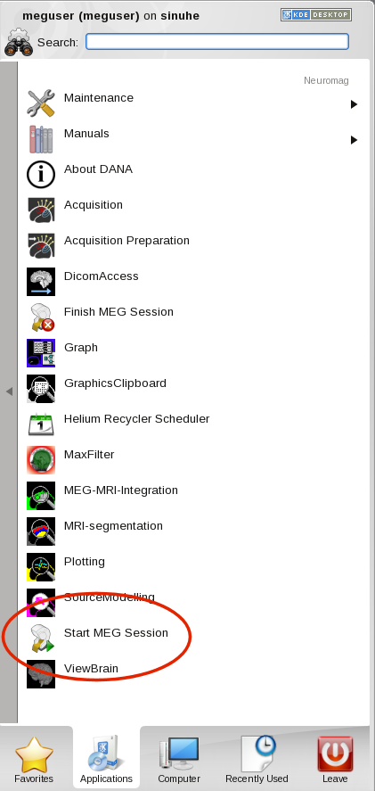

# Weekend Working

### **"Testing Buddy"**.

A "Testing Buddy" is required for MEG sessions where a participant is present and data collection occurs outside of regular opening hours (7am to 7pm, Monday to Friday).

- Buddies need to be present for experiment set-up, and remain "on call" within the building for the entirety of the Acquiring session.
- A Buddy must hold at least "Building General User" status in the CHBH, or if they intend to help with experiments then they must be a trained up as a "MEG General User" (Level 2), or be a "Full MEG Opeartor" (Level 3).
- A Buddy isn't necessary if just testing equipment/experimenatal software (stimuli/triggers etc).

!!! Warning "**No MEG Lab usage, of any kind, is permitted on Sundays!**"

!!! Warning "**Please be aware that if booking requests/technical support requests are made during the weekend or when MEG Support is on AL, a response may not be immediate.**"

!!! Note "**In an Emergency, [Security Contact Details](../../meg/labsafety/securitycontact.md)**"

### **Location of Equipment/Consumables**.

Make sure the location of any equipment used, e.g. MEG-safe glasses, Loc-Line GoPro mount, is known before booking a Saturday slot. Items can inadvertently be moved/stored in a different location to normal, and with no one on site to ask this can lead to delays in preparation.

The consumables on the EEG trolley should be up-to-date, but if not ... **[Location of Consumables](../../meg/acquisition/meg-consumables.md)**

### **Calpendo Booking System**

Check Calpendo, to see if there is an Acqusition session following the one currently booked. 
There may be no need to **"Finish MEG Session"/move gantry to liquefaction** if another MEG Operator is boooked in later in the day. 

- Obtain the MEG Operator's contact details (email/mobile), just in case they've cancelled and the MEG Session will need to be Finished, and the gantry moved to 25.

### **Start/Stop MEG Session.**

In **normal, daily usage** liquefaction should **finish ~9:00am everyday**. If a Saturday session is booked to acquire data, and the system is **still liqufying** upon arrival, due to...

- Being **the first MEG Operator of the day**.
- The previous MEG Operator has started liquefaction (**Finish MEG Session**)
- Liquefaction is **occuring during the day** (due to a previous night, or for an up-and-coming night, Acquisition session).

#### Start MEG Session

{width=20% align=left}

- Open the '''Neuromag''' folder in the '''DACQ desktop's Applications menu''' to see the available options.
- Select '''"Start MEG Session"'''. Liquefaction will '''stop'''.
- '''Move gantry''' to your usage position.

'''If you're the final user of the day''', or there's a '''number of hours''' between '''you and the next user''' e.g. a night acquisition, then ...

#### Finish MEG Session

[[File:FinishMEGSession.png|50px|thumb|left|Finish MEG Session]] 
'''Move gantry''' to '''liquefaction position (25)'''.
Open the '''Neuromag''' folder in the '''DACQ desktop's Applications menu''' to see the available options.
Select '''"Finish MEG Session"'''.
'''Check the IHR Scheduler''' to see what '''time liquefaction is expected to start'''.
Ideally '''wait''' until liquefaction starts before leaving (but in some instances this won't be possible due to a '''late liquefaction start time''' so just...
'''Follow current procedures to [https://www.chbh.bham.ac.uk/wiki/index.php/Tidying_Up[Tidy Up]]''', lock MEG lab, return key to key safe, and ...    
'''Enjoy the rest of your weekend.'''

