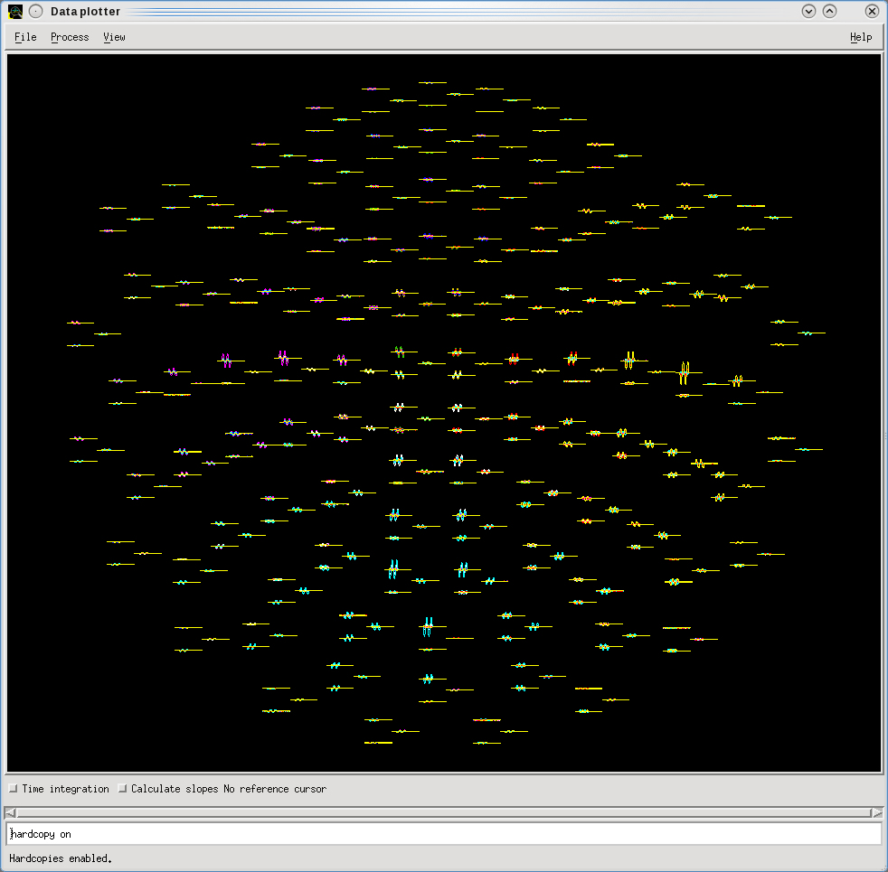

# Phantom Measurement

{width=30% align=left}

Perform a **Phantom Measurement** as detailed in the following guides ...

**[User Manual April 2017](../../meg/pdfs/NM24131A-C_Triux_UM.pdf)**
- **Section 7.2 Phantom, page 88.**

**[Data Acquisition v6.0](../../meg/pdfs/NM23732A-B1-Dacq-6.0-UM_FINAL.pdf)**
- **Section 9.0, Phantom Measurement, page 49.**
   

<align=full>
Running the ***Autophantom*** script on the acquired .fif file produces a **[Report](../../meg/pdfs/autophantom.pdf)** detailing 2 results, based on dipoles that are checked to be "**OK"** ...

- The average **Qpp value** for **all 32** dipoles... between **950 - 1050 nAm** 
	- (nano Ampere-meters - "*a measure of dipole moment*").
- The average **d value** for **all 32** dipoles ("**OKs only**"). ***The smaller the better***.
- A final "**OK**", if **all** the dipole Q-values are ***within +-10% of the average***.

The ***Autophantom*** script can be found here on the DACQ console ...

**/neuro/dacq/tools/service/**

This measurement is normally performed once a month by the MEG Support Officer.

When queried, MEGIN said ... 

"*The report prints the deviations in the x,y and z directions (dx,dy and dz) and the vector length d  in mm from the 'known' locations of the dipole.  
The tolerance is 5mm and obviously, we want the measured dipole position to be as close to the 'known' dipole position as possible so low values for d are better.  
The dipoles are activated with a current which should, (in a perfect system with no losses of any sort) generate a dipole of 1000nAm. 
Due to manufacturing and calibration tolerances this is never the case and the system will accept a peak-to-peak average between 950 and 1050 nAm.  
Additionally, each dipole itself must be with +/- 10 % of the average value.  
Assuming that the phantom test has been performed properly and passed, there is nothing you need to do. If the average Qpp is nearing 950 then we (MEGIN) would 
possibly consider recalibrating the phantom path but this is somewhat less than trivial.*"

**Ross Devlin, Senior Service Specialist, 10th March 2025**

