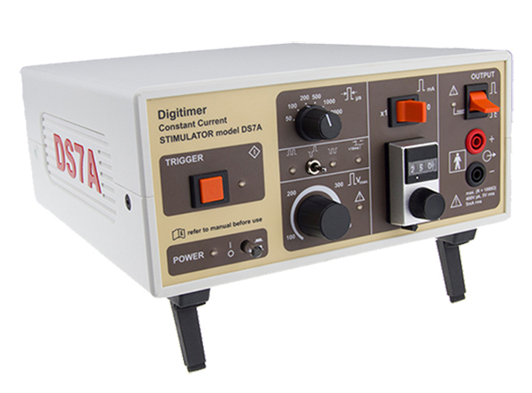

# Digitimer DS7A Constant Current Stimulator

A **[DS7A](https://www.digitimer.com/product/human-neurophysiology/peripheral-stimulators/ds7a-ds7ah-hv-current-stimulator/)** constant current stimulator 
from **[Digitimer](https://www.digitimer.com/)** is available for **recording various magnetic evoked fields**.

{width=50% align=right}

- Magnetic evoked fields **under stimulation**:
	- Somatosensory Evoked Fields (**SEF**)
	- Auditory Evoked Fields (**AEF**)
	- Visual Evoked Fields (**VEF**)
	- Language Evoked Fields (**LEF**)
- Magnetic evoked fields **under voluntary activity:**
	- Motor Related Fields (**MRF**)

!!! warning "Improper installation of the DS7A can result in an increase in sensor noise levels due to RF leakage and/or unwanted ground loops." 

**[Guidelines to MEG Data Acquisition]** <!--- (../../meg/pdfs/NM26082A-A_DACQ_Guidelines.pdf)** (*Customer training, May 2020*) ---!> *(SharePoint link to be added)* provides more information. 

Also **[Stimulus System User's Manual September 2011]** <!--- (../../meg/pdfs/NM21789A-A_StimSystem.pdf) ---!> *(SharePoint link needs to be added)*

**The DS7A is located in the Stimulus Cabinet**.

