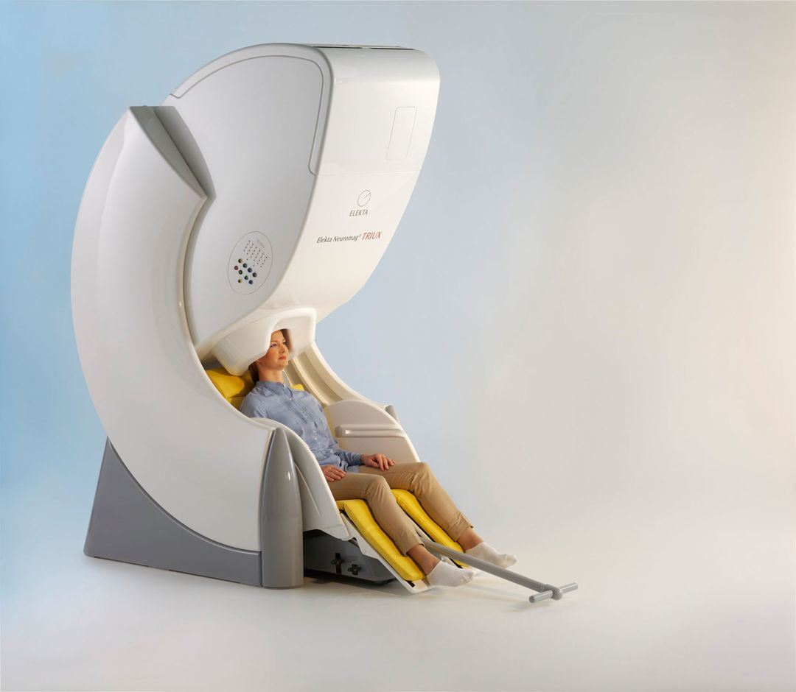

# Basic Workings of MEG

**Magnetoencephalography (MEG) measures the magnetic fields generated by electric currents in the brain.** 
When neurons are activated synchronously they generate electric currents and thus magnetic fields, which are then recorded by MEG outside the head. 
Unlike electrical currents (like in EEG), magnetic fields pass through the head without any distortion. Since this is a passive measurement, **MEG is non-invasive**.

Recording the minute magnetic fields of the brain creates two challenges. One is to create a superconducting detector and the other is to attenuate external magnetic noise.

The technology that helps record the minute magnetic fields is a **superconducting quantum interference detector (SQUID)** which is like a highly sensitive magnetic field meter. 
To maintain superconductors one needs to provide an extremely cold environment, which is achieved by using liquid Helium around the sensors. 
At the CHBH we use an **integrated closed-loop Helium reliquefaction system** which collects the Helium gas that boils off during testing and liquefies this back when the MEG is not in use. 
The system, therefore, needs regular downtime in the evenings/weekends.

**Our MEG Laboratory houses an *Elekta Neuromag TRIUX* system, reinstalled in January 2019.**

{width=50% align=right}

- The TRIUX system has **306 sensors** distributed over the head:
	- **204 planar gradiometers**.
	- **102 magnetometers**.
- **Sensors arranged in triplets.**
	- **One magnetometer** and **two planar gradiometers** in **each triplet**.
	- **102 high-precision triple-sensor elements.**
- **Integrated heater** in each element.
- **Overlapping pick-up loops.**
	- Total **sampling area** is **1220 cm2**   **27% larger than the helmet surface area.**

The **MEG system is situated in a two-layer Magnetically Shielded Room (MSR)**, installed by **[VAC](https://www.vacuumschmelze.com/products/Advanced-Technologies/MSR)**. The system allows for concurrent EEG recordings from 64 electrodes and continuous monitoring of the head position.
 A closed-loop Helium recycler eliminates refills.

<align=full>
Datasheet: **[NM25184B-B](../../meg/pdfs/NM25184B-B.pdf)**, 2017