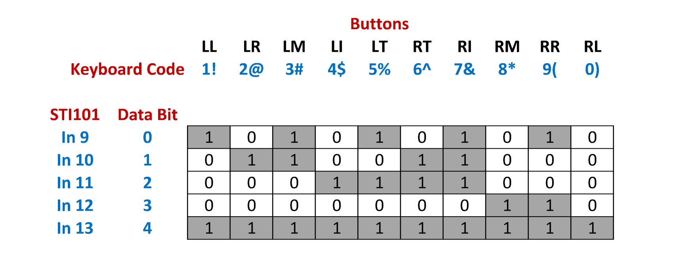
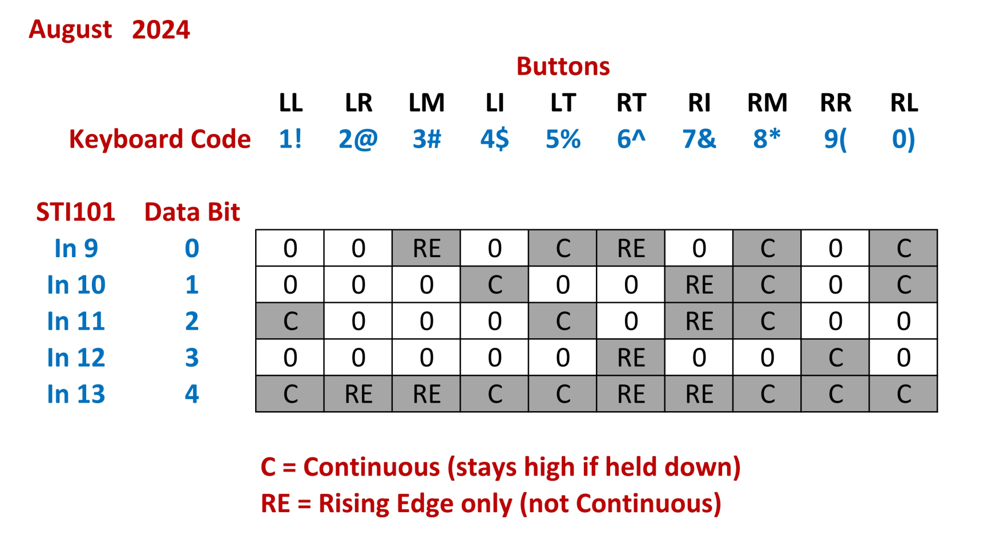

# Recovering responses via NAtA Interface

**[LxPad Operating Instructions February 2017 Rev.3](../../meg/pdfs/LxPad_New_Converter_Instructions_Rev3.pdf)**

**[FO Connector - correct usage](../../meg/pdfs/NAtA_Fiberoptic_Connector_Correct_Usage.pdf) on how to remove.**

**[CON-004 Converter Box PP pinouts](../../meg/pdfs/CON-004_Parallel_Port_Pin_Diagram_NAtA.pdf)**

The **<span style="color:maroon">MATLAB</span>** script below utilises the Psychtoolbox function **KbQueue** to **record the responses of the 5- and 2-button NAtA Boxes**.

It uses information taken from ...

**[https://github.com/Psychtoolbox-3/Psychtoolbox-3/blob/master/Psychtoolbox/PsychDocumentation/KbQueue.html](https://github.com/Psychtoolbox-3/Psychtoolbox-3/blob/master/Psychtoolbox/PsychDocumentation/KbQueue.html)**

and

**[http://psychtoolbox.org/docs/KbQueueCheck](http://psychtoolbox.org/docs/KbQueueCheck)**


The **NAtA Response Boxes output button presses as Keyboard numbers** via USB to the STIM PC.

The NAtA Converter box **uses the US Keyboard layout**, and since **most modern keyboards have two ways to input a numerical value**
 (standard row of numbered keys, and a number keypad) the **correct key "name" needs to be implemented correctly** in the Psychtoolbox code.

!!! NOTE
	**<span style="font-size:medium">This "naming" could also apply to Python/E-Prime/Presentation (*citation needed*).<br />Many thanks to Dr. Tjerk Gutteling for pointing this out</span>.**

```
5 Button      Keyboard number    [KbName ('xx')];

Left Little            1               1!                
Left Ring              2               2@
Left Middle            3               3#             
Left Index             4               4$
Left Thumb             5               5%

Right Thumb            6               6^           
Right Index            7               7&             
Right Middle           8               8*               
Right Ring             9               9(           
Right Little           0               0)

2 Button      Keyboard number    [KbName ('xx')];
(Could be either hand, left or right)

#1 L                   1               1!          
#1 R                   2               2@

#2 L                   3               3#               
#2 R                   4               4$
```

**The NAtA Converter Box has TTL outputs** to enable **recording of button presses in MEG data**.

**STI102** channels **In 9** to **In 13** in the Stimulus Cabinet have been connected to **Data Bit 0** to **Data Bit 4** from the **NAtA Converter box**. 

These **5 channels provide unique TTL combinations for all 10 buttons**, according to the following ...



**Select the relevant combination** of the 5 channels in **```Acquisition Settings -> Channel selection```** to **record the participant's responses**.

**<span style="font-size:large;color:blue">August 2024</span>**

The **original MEG Converter Box has been removed and the original buttons swapped to a new set** (***buttons set swapped again in October 2024***), to allow the **faulty "RR" button to be repaired or replaced**. <br />
The **new buttons are non-sticky**, and **respond as before, LL => RL, 1 => 0**<br />
However, **unfortunately** the new Converter Box ***maps the button's parallel port outputs differently to the above, and not all buttons respond with a continuous press***.<br />
**For now**, use the following when deciding which button data bits to select in MEG Acquisition ...




**<span style="font-size:large;color:maroon">NAtA_bbox.m</span>**<br />
***<span style="color:blue">Many thanks to Dr. Tjerk Gutteling / Dagmar Fraser for providing the code</span>***


```matlab
function [] = NAtA_bbox()

KbName('UnifyKeyNames'); % for easy use of Keyboard keys

activeKeysOnly=0; %If you want to listen only to specific keys, you can
device=0; %default device

if activeKeysOnly %here we listen only to specific keys
    active=[KbName('4$') KbName('7&')]; %These are the left and right index fingers of the (5-button) NATA boxes
    keylist=zeros(1,256); %Set all keys to zero (ignore)
    keylist(active)=1; %set active keys to 1 (listen)
    KbQueueCreate(device,keylist);%%Create queue, this is a time consuming operation (relatively), do while non-time critical
    disp('I will only listen to: ');disp(KbName(active));
else
    KbQueueCreate; %Default initialization, all keys listened to
end

noResponse=1; %While loop break

KbQueueStart(); %Start listening
startTime = GetSecs; %to get reaction times relative to some event (e.g. stimulus onset)

KbQueueFlush();% clear all keyboard presses so far. Basically, you want the responses after this point 

%listen to reponses for a fixed amount of time, using KbQueueCheck (similar to KbCheck)
disp('Press some keys for the next 10 seconds..');
while noResponse
    
    [pressed, firstpress]=KbQueueCheck(); %check response, return whether pressed, and first press timestamp
    
    %Note that two keys may have been pressed    
    keyCode=find(firstpress);

    if length(keyCode)>1 %two or more buttons pressed
        [~,ind]=min(firstpress(keyCode));
        keyCode = keyCode(ind); %select first response
    end

    t_keypress=firstpress(keyCode);
    
    if pressed
        %disp(['You pressed ' KbName(firstpress) ' ' num2str((firstpress(find(firstpress))-startTime)*1000) 'ms after start'])        
        disp(['You pressed ' KbName(keyCode) ' ' num2str((t_keypress-startTime)*1000) 'ms after start'])        
    end
    
    if (GetSecs-startTime)>10 %let's stop listening after 10 seconds
        noResponse=0;
    end
    
    WaitSecs(0.01); %no need to poll very tightly as responses are timestamped as they come in (unless you want something to happend right after the button press).
    
end

disp('Ok, I stopped listening.')

KbQueueFlush();% clear all keyboard presses so far. Basically, you want the responses after this point 

%now wait for a response (similar to KbWait)
disp('Press a key to continue...')
KbQueueWait();

disp('Great, done!')

KbQueueRelease() %clean up the KbQueue, you need to re-create in order to use it again.


end
```