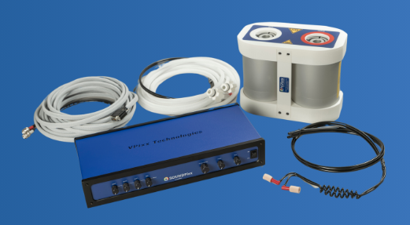

# VPixx SOUNDPixx

**[MEG Audio Connections](../../meg/pdfs/MEG_Audio_Connections.pdf)**

**[SOUNDPixx UserManual v3.1](../../meg/pdfs/SOUNDPixx_UserManual_3R1.pdf)**

The **[SOUNDPixx](../../meg/pdfs/soundpixx.pdf)** (*datasheet*) is a **complete MEG/MRI stereo audio system**, 
providing **perfect integration when paired with PROPixx or DATAPixx systems** and also **microsecond-precise audio stimulation when driven by VPixx hardware**.

{width=50% align=right}
 
It is **comprised of three main parts**. The **amplifier**, the **pneumatic transducer**, and the **coil headset**.
The **amplifier is situated on the Control Room desk**, and is **connected to the Stim PC sound via its AUX1 Phono connectors through a 3.5mm stereo adapter cable**. 

The **pneumatic transducer is found in the Stimulus Cabinet**, and is **connected by BNC cabling, through the filter panel and under the floor, to the amplifier**. The **frequency response is 20Hz to 20KHz**.

The **coil headset (*kept on the Control Room shelf*)**, comprises **a pair of MEG/MRI compatible in-ear headphones**, and is **connected (*when in use*), via tubing through the wave guide, to the pneumatic transducer**.

**Two sizes of eartip** or "***MagnaPlug***" - **standard (0.75” x 0.50”) & mini (0.75” x 0.38”)** - are avaialble to plug into the headphones for participant usage.

**[How to insert the MagnaPlug foam eartips](../../meg/pdfs/soundpixx_eartip_usage.pdf)**

!!! warning "SOUNDPixx and NATUS eartips are NOT TRANSFERABLE between systems. The tube diamter for each is different."

