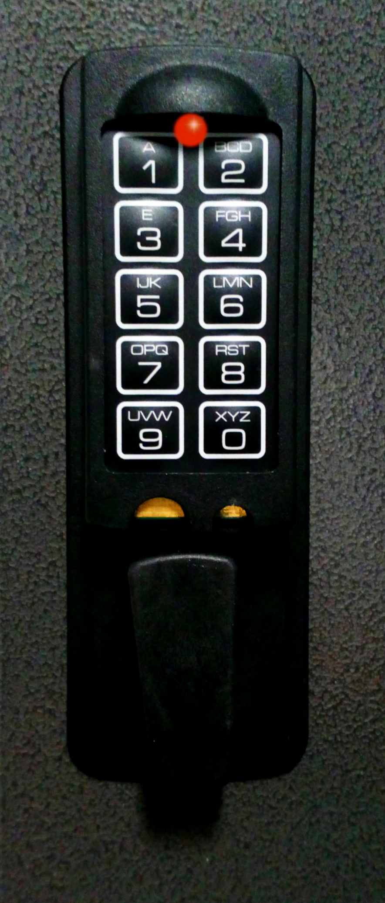

# Key Safe Instructions

{width=39% align=left}

- ***Each number entry is confirmed by a red LED blink signal. A valid code is followed by a red light signal, an invalid code by a triple blink signal. After an interval of more than 10 seconds, the already entered part of the code is deleted and the entire sequence has to be re-entered.***

**To open the lock:**

- ***Enter the code and (after a red LED light signal) the lock is open, turn the grip clockwise. If the lock is not opened within 2 seconds, it will be locked automatically.***

**To close the lock:**

- ***Close the door and turn grip counter-clockwise. The lock will close automatically. Check if it is really closed by turning the grip.***

**Lighting the entry-pad:**

- ***Press number 9 first and the entry-pad will be lit. After that, the 6-digit code will still need to be entered. The LED stays on during code entry.***

 
**Wrong code penalty:**

***After 4 invalid codes, the entry is blocked for about 5 minutes.  During this period the lock signals every 10 seconds.  If, after 5 minutes, 2 wrong codes are entered, the 5-minute time delay starts again.***

**Battery change:**

**When the batteries are running low, the lock will signal/blink for about 5 seconds (3 blinks) while opening/after code entry, signifying the batteries will need replacing. Use ALKALINE batteries only!   The battery compartment is behind the lock, on the inside of the door. Open the battery clip carefully.  If the battery voltage is so low and insufficient to open the safe on code entry, hold a new 9V ALKALINE battery to the outside terminals and try entering the code again. The red LED should blink after successful code entry and the grip can be turned as normal.   Replace the battery.**

**Battery change (9V):**

- **4th August 2025**