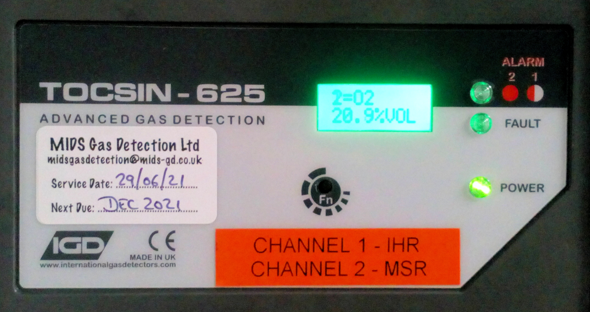

# Procedures to follow in an emergency

## **Helium is not life supporting!**

If released into the air it poses a danger of suffocation. If a significant Helium leakage is detected our Oxygen Depletion Alarm (ODA) will sound, then :

- Immediately, calmly, evacuate MEG Control Room & MSR, and inform Sleep Control Room & Labs of their need to evacuate also, and instruct other staff/students not to enter the corridor.
- Arrange proper ventilation.
    - Open Fire Exit.
    - Open MEG Corridor door.
    - Open Sleep Lab doors and subsequently the windows (if possible).
- **Beacon will flash/Alarm will sound - until Oxygen level is back above threshold.**

!!! info "Our ODA is not connected to the building Fire Alarm system"
    Swipe access will not be disabled/corridor door will remain locked. **Use of the green "*no touch*" button** will be required to exit the corridor towards Reception.

    **If "*no touch*" button doesn’t work to exit corridor**, lift clear plastic flap, press **green emergency button**. Lock will lose power/switch off, and door will pull/push open.  
    Button Reset key in MEG Key Safe – to be used by Ops. Comm. staff and trained MEG Operators as necessary.

The IHR tank room and MSR are protected by Oxygen Depletion sensors, with both a flashing Beacon and an 85dB Sounder.

{width=40% align=left}

- **Default/Normal reading: 20.8/20.9%VOL for both sensors.**
- **Below 19.5%VOL, Beacon flashes.**
- **Below 18.5%VOL, Beacon flashes, Sounder activates.**

### **First Aid help:**

- Notices for CHBH First Aiders can be found at each floor teapoint (by the central atrium staircase), the ground floor kitchen (G29), and in the MRI and MEG Suites.
    - If in doubt, contact Security (once phoned they can be on-site within a matter of minutes):
        - Security:
            - **Emergency: 0121 414 4444**
            - Non-emergency: 0121 414 3000
- First Aid Kits can be found at:
    - Each floor teapoint (by the central atrium staircase)
    - Ground floor kitchen (G29)
    - In the MRI and MEG Suites - **NOT MRI SAFE**.
- Burns Aid Kit is at ground floor teapoint.
- Defibrillator (AED).
    - CHBH ground floor adjacent to the lift, in bright orange case.
    - Edgbaston Park Hotel - behind the Reception Desk in the Lobby.
- Emergency Box, on the CHBH ground floor adjacent to the lift.

**To call an ambulance, telephone "999" or "112" (mobile only) followed by Security on "44444" to let them know one is on the way.**

- If unable to contact a First Aider, call Security on 44444.

### **In case of Fire:**

- Operate the nearest Fire Alarm Call Point.
- All swipe access will be switched to failsafe mode, allowing corridor access.
- Fire Exits are at the end of MRI and MEG corridors.
- Link Corridor can be used as Fire Exit, as well as Main CHBH Entrance.
- Emergency Fire Escape Staircase leads to the MEG Fire Exit on Ground Floor. Access is via:-
    - 1st Floor - opposite breakout room #135.
    - 2nd Floor - adjacent to cubicle #222 and 224 (Lab 12).
- CHBH Fire Assembly Point - up the path/grass verge alongside the Hotel.
- Chrome Carbon Dioxide and Foam Fire Extinguishers can be found on each floor:
    - Ground Floor - adjacent to the lift, G09 (Lab 4), and end of MR/MEG corridors.
    - 1st Floor - adjacent to 109 (Hippocampus), 122 (Hot Desks), and 103 (Thalamus).
    - 2nd Floor - adjacent to 202 (Researchers Room), 207 (Amygdala), and 224 (Lab 12).

### **MEEP**

The **M**EG **E**mergency **E**vacuation **P**lan can be found on the MEG Control Room wall, and the on door of the MSR. A PDF copy can be viewed from the link below ...

**[MEEP](../../meg/pdfs/MEEP.pdf)**

### **CHBH GEEP**

The CHBH **G**eneral **E**mergency **E**vacuation **P**lan can be found on the MEG Control Room wall, and is also on the notice board adjacent to the MRI corridor. A PDF copy can be viewed from the link below ...

**[GEEP](../../meg/pdfs/GEEP.pdf)**
