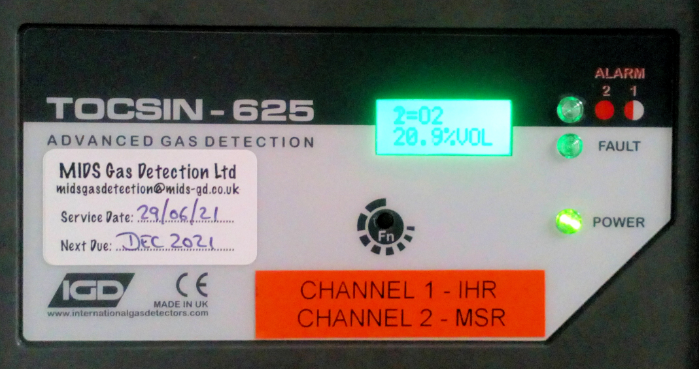
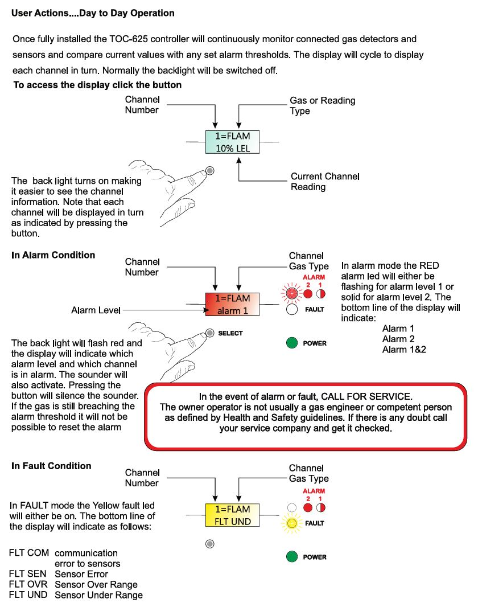

# Procedures to follow in an emergency

### **ODA Protection of Labs & Tank Room**

**Helium is not life supporting!**

**If released into the air it poses a danger of suffocation. If a significant Helium leakage is detected our Oxygen Depletion Alarm (ODA) will sound, then :**

* **Immediately, calmly, evacuate MEG Control Room & MSR, and inform Sleep Control Room & Labs of their need to evacuate also, and instruct other staff/students not to enter the corridor.**
* **Arrange proper ventilation.**
	* **Open Fire Exit.**
	* **Open MEG Corridor door**.
	* **Open Sleep Lab doors and subsequently the windows (if possible).**
* **Beacon will flash/Alarm will sound - until Oxygen level is back above threshold.  (*The sounder can be silenced (press button), but if alarm threshold is still breached it will not be possible to reset the alarm*).**

!!! info "Our ODA is not connected to the building Fire Alarm system"
	Swipe access will not be disabled/corridor door will remain locked. **Use of the green "*no touch*" button** will be required to exit the corridor towards Reception.
	
	**If "*no touch*" button doesn’t work to exit corridor**, lift clear plastic flap, press **green emergency button**. Lock will lose power/switch off, and door will pull/push open.  
	Button Reset key in MEG Key Safe – to be used by Ops. Comm. staff and trained MEG Operators as necessary.

The **IHR tank room and MSR (*and Control Room by association*) are protected by Oxygen Depletion sensors, with both a flashing Beacon and an 85dB Sounder**. **The Control Panel for the ODA is found on the wall to the left of the IHR Tank Room**.
  

{width=45% align=left}

* **Default/Normal reading: 20.8/20.9%VOL for both sensors. Backlight: GREEN**
* **Below 19.5%VOL, Beacon flashes. Backlight: flashes RED.**
* **Below 18.5%VOL, Beacon flashes, Sounder activates. Backlight: flashes RED.**   

**[Oxygen Level Monitor (TOC-625-630)](https://canvas.bham.ac.uk/courses/81128/files/folder/MEG?preview=21926106)** (***Oxygen Depletion Alarm***)

### **First Aid help:**

* **Notices for CHBH First Aiders** can be found at **each floor teapoint** (by the central atrium staircase), the **ground floor kitchen (G29)**, and in the **MRI and MEG Suites**.
	* **If in doubt, contact Security** (once phoned they can be on-site within a matter of minutes):
		* Security:
			* **Emergency: 0121 414 4444**
			* Non-emergency: 0121 414 3000
* **First Aid Kits can be found** at:
	* **Each floor teapoint** (by the central atrium staircase)
	* **Ground floor kitchen (G29)**
	* **In the MRI and MEG Suites** - **NOT MRI SAFE**.
* **Burns Aid Kit is at ground floor teapoint**.
* **Defibrillator (AED)**.
	* **CHBH ground floor adjacent to the lift, in bright orange case**.
	* Edgbaston Park Hotel - behind the Reception Desk in the Lobby.
* **Emergency Box, on the CHBH ground floor adjacent to the lift**.

**To call an ambulance, telephone "999" or "112" (mobile only) followed by Security on "44444" to let them know one is on the way.**

* **If unable to contact a First Aider, call Security on 44444**.

### **In case of Fire:**

* **Operate** the **nearest Fire Alarm Call Point**.
* **All swipe access** will be **switched to failsafe mode, allowing corridor access**.
* **Fire Exits are at the end of MRI and MEG corridors.**
* **Link Corridor can be used as Fire Exit, as well as Main CHBH Entrance.**
* **Emergency Fire Escape Staircase leads to the MEG Fire Exit on Ground Floor**. Access is via:-
	* **1st Floor - opposite breakout room #135.**
	* **2nd Floor - adjacent to cubicle #222 and 224 (Lab 12).**
* **CHBH Fire Assembly Point - up the path/grass verge alongside the Hotel**.
* **Chrome Carbon Dioxide and Foam Fire Extinguishers can be found on each floor**:
	* **Ground Floor - adjacent to the lift, G09 (Lab 4), and end of MR/MEG corridors**.
	* **1st Floor - adjacent to 109 (Hippocampus), 122 (Hot Desks), and 103 (Thalamus).**
	* **2nd Floor - adjacent to 202 (Researchers Room), 207 (Amygdala), and 224 (Lab 12).**

### **MEEP**

The **M**EG **E**mergency **E**vacuation **P**lan can be **found on the MEG Control Room wall**, and the **on door of the MSR**. A **PDF copy can be viewed from the link below** ...

**[MEEP](https://canvas.bham.ac.uk/courses/81128/files/folder/MEG?preview=21930308)**

### **CHBH GEEP**

The CHBH **G**eneral **E**mergency **E**vacuation **P**lan can be **found on the MEG Control Room wall**, and is also **on the notice board adjacent to the MRI corridor**. A **PDF copy can be viewed from the link below** ...

**[GEEP](https://canvas.bham.ac.uk/courses/81128/files/folder/MEG?preview=21930307)**