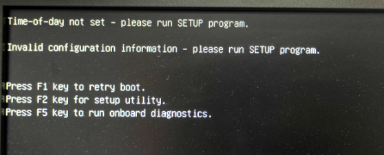

# EyeLink BIOS battery

### **Problem**

On Tuesday 21st June 2022, a MEG Operator emailed a snapshot of the below **error message displayed on the EyeLink PC monitor on power-up** ...

### **Solution**

The **inability to display the correct date and time** is usually **caused by a low voltage, or faulty, BIOS battery**.  
**It may have been possible to run SETUP (F2) to set date/time for emergency useage, to allow Acquisition with eye movement recording to continue.** 
The EyeLink PC **was powered down**, and the case opened. The **battery** (***CR2032, 3V***) was **removed and replaced**. On **checking its voltage**, it was **found to be 0V**.  
**BIOS batteries last ~5 years**, and the EyeLink system was ordered in November 2017/delivered in February 2018, so this **problem was to be expected eventually**. 
**On power up the correct date and time had to be entered**, as well as, after another reboot, the **hard disk partitions/SATA devices had to be reset back to "customer settings"**. 
After **another reboot, both the Eyelink and Windows partitions were readable/usable**.

**BIOS battery replacement: 2nd June 2022.**
