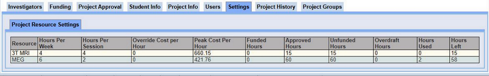

# FAQ

### **<span style="color:green">"How do I check how many Project hours I have left?"</span>**

To **check** the amount of **Project hours** in ***Calpendo*** (**new** as well as **ongoing** Projects). <br />
On the **top Menu bar** ...

- **<span style="color:blue">Select</span>** - **```Projects => My Projects```**
- **<span style="color:blue">Click on the Project number under</span>** - **```Display Name```**
- **<span style="color:blue">Scroll down and across to the select the</span>** - **```Settings```** -  **<span style="color:blue">tab.</span>**
- **<span style="color:blue">Check whether the correct amount of hours under</span>** - <br /> **```Approved Hours```**, **```Unfunded hours```**, **```Hours Left```** <br />- **<span style="color:blue">(*for the Modalities concerned*) have been added.</span>**



During the Project run, it's possible to **check here how many hours have been used** from the total.

- ***<span style="color:maroon">Should be reduced after making a booking.</span>***
- ***Calpendo will <span style="color:red">automatically</span> send an email (to the Project*** **```Users```**) ***when there is <span style="color:red">less than 10%</span> of the Project hours remaining.***


If the **the end** of the Project **is in sight**, but **more hours are needed, to be able to finish**, request extra hours by sending an email to the Modality Lead, cc-ing the Project Lead/PI,
also the Operations Manager, **providing good reasoning as to why more hours are being requested** e.g. Participant cancelled last minute, other unforeseen circumstances.<br />
Please keep a list during the Project run of these situations. 

**Upon approval** by the Modality Lead/Operations Manager (*possibility the Management Committee if a lot of hours are requested*), the **extra hours** will then be **added to the Project**.

<hr style="border:2px solid green">
### **<span style="color:green">"My Participant cancelled, what do I do?"</span>**

If unfortunately a **Participant cancels**, and enough time is available, **cancel the slot in Calpendo first**.<br /> 
**Then email** **<span style="color:maroon">Chbh-meg-operator[at]lists.bham.ac.uk</span>** informing that **the booked slot is now free**.

There's **always the possibility another MEG Operator could use the slot themselves** at the last minute - and the Project **hours would then be recoverable**.

**Hours are refunded** if they are **cancelled 72 hours beforehand (*not including weekends*)**.<br /> For **cancellations less than 72 hours in advance, the full amount is charged, unless the cancelled slot is rebooked by another MEG Operator within this time**.<br />
For **every other situation, hours are not refunded** and MEG Operators **can request additional unfunded hours via the Modality Lead & Operations Manager (*possibly also the Directors*)**.

<hr style="border:2px solid green">
### **<span style="color:green">"The MEG's free now, can I book last minute?"</span>**

MEG Operators can book slots **up to a minute before** the session start time.

However, if the session has **already started** then MEG Operators will be **unable to book the full slot** and will have to **ask the help of an Admin** to get the slot added to ***Calpendo***.

**<span style="color:maroon">For Example...**</span>

- A MEG Operator **notices at 11:08am** that the MEG is **free from 11-1pm**. 
- The MEG Operator books the slot **from 11:30-1pm**, and then asks an Admin to **ammend** their slot to **11-1pm**.
