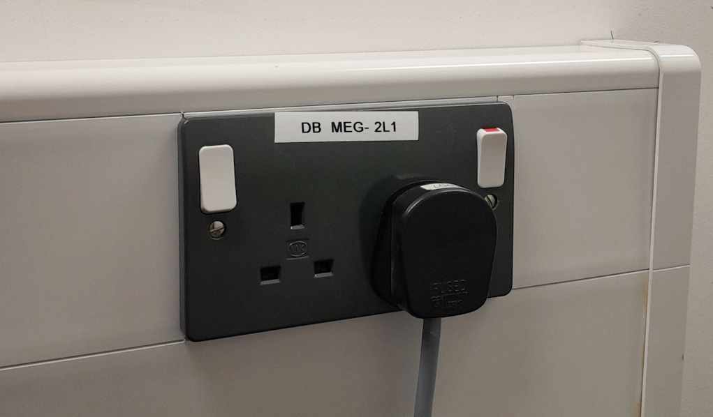

# Gantry Position not detected

### **<span style="color:maroon">Problem</span>**

After the gantry was unintentionally moved beyond FU (68 degrees) the **Acquisition (*megacq*)** program failed to detect the gantry position. See below.<br />
Gantry position detection failure may also occur if the DACQ Console ("Sinuhe") has been rebooted.

**```CHANGE: Gantry position: Detected: illegal value(0), Manual:Supine(0)```**

Before proceeding further, check first that the **gantry position indicator display (*traffic light*)** is showing **<span style="color:green">GREEN</span>** in the position to be used e.g. 60.<br />

- If it isn't showing **<span style="color:green">GREEN</span>**, adjust the **up/down**buttons until it does, then check to see if the gantry position is now recognised in **Acquisition**. If not ...

### **<span style="color:maroon">Solution/s</span>**

1. Perform a **soft boot/reset of the electronics** **<span style="color:red">(press the [SCC](../../images/meg/SCC.jpg) board Reset button in the electronics cabinet).</span>**
	- **[Resetting the electronics](../../meg/acquisition/restart_acquisition.md/#resetting-the-electronics)**
2. **Perform** a **[RAP](../../meg/acquisition/rap.md)** (**R**estart **A**cquisition **P**rograms).
	- **[Restarting the software](../../meg/acquisition/restart_acquisition.md/#restarting-the-software)**
3. Restart the **Acquisition** program.<br />
4. Hopefully the gantry position should now show ...<br /><br />
**```CHANGE: Gantry position: Detected: Upright(60)```**<br /><br />
5. Repeat from Step 1. if the gantry position is still failing to be detected.
6. Once detected correctly, check sensor noise levels if necessary.
	- **[Loading a Tuning File](../../meg/acquisition/restart_acquisition.md/#loading-a-tuning-file)**

or

**Power cycle the gantry lifting motor.**

{width=48% align=right}

- Switch off the socket that is housing the **Black** plug with the **<span style="color:grey">GREY</span>** power lead.
- Wait a few moments, then switch back on.
- Check the **gantry position indicator display (*traffic light*)** is back on.
- (May still require a **soft boot and [RAP](../../meg/acquisition/rap.md)** as mentioned above).
- Then restart the **Acquisition program**. <br />

<align=full>
If the gantry position still undetected, **<span style="color:red">MEG Support only!</span>** to **power down then restart the electronics**.

- The **Main switch** (Switch 1) of the **[Power Control Panel](../../images/meg/DSP_Electronics.jpg)** is not normally powered off in this situation.

Once power is back, perform a **[RAP](../../meg/acquisition/rap.md)** and then restart the **Acquisition** program to check again.

**If the gantry is still not detected correctly, contact MEGIN Support**.

!!! note "<span style="color:blue"> If the gantry position is not detected during an Acquisition, data can still be acquired.<br />Enter the position manually (chose the correct position value from the menu provided).</span>"
