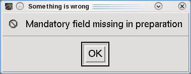

# HPI Digitisation/Preparation error

### **<span style="color:maroon">Problem</span>**

On Thursday 16th February 2023, MEG Operators reported seeing the **following message pop up when starting Acquisition** ...</span>



Apparantly **the Index file used to save/list HPI digitisations was corrupt**. It's possible that a HPI check was stopped halfway through 
causing the file to be corrupted as it hadn't finished writing to disk correctly, perhaps during the digitisation of extra points for the fitting of an MRI T1. <br />
The Polhemus stylus <sup><span style="font-size:large;color:red">*</span></sup> had previously been reported as occasioanlly problematic when registering HPI coils/extra points.

- ***<span style="color:blue">A replacement Stylus Pen Assembly was purchased in May 2023</span>*** <sup><span style="font-size:large;color:red">*</span></sup> 

### **<span style="color:maroon">Solution</span>**

The **Index** file, found in ***/neuro/dacq/prepared***, was **deleted**. </span>

**```[Meguser@sinuhe /]$ cd /neuro/dacq/prepared```**<br />
**```[Meguser@sinuhe prepared]$ rm Index```**

HPI digitisations/preparations **are only taken during the current Acquisition session**. <br />
Participants **aren't prepared a day or more beforehand, nor are the digitisations taken via a separate Workstation** in another room. A previously-saved head preparation **has never needed to be loaded**, so it was **safe to remove the Index file**.<br />
**After deletion, a HPI digitisation was taken using the Phantom, and all was fine**. The preparation was saved, Acquisition was exited/restarted, saying "No" to using the previous existing preparation. **The saved preparation was then loaded successfully**. <br /> 
On checking ***/neuro/dacq/prepared*** the **Index file was found to be recreated, but no more error messages were seen when starting Acquisition**.
