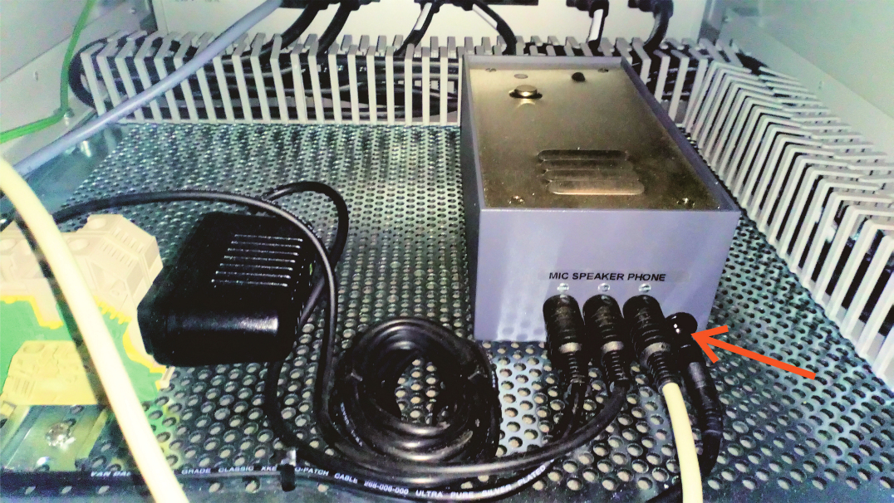

# MEG Intercom faulty

### **Problem**

On a couple of occasions, pressing **"11"**, as usual, on the intercom produced an atypical beep, then a number of rapid beeps were heard and communication to the MSR failed.

### **Solution**

The **MIC SPEAKER PHONE** needs to be power cycled.

{width=40% align=left}

* **Open up the rear door of the Electronics cabinet.**
* **Unplug the intercom power cable from the unit located at the bottom of the cabinet (as indicated)**.
* **Replace the cable after a few seconds.**
* **Attempt to open the intercom by pressing "11".**

