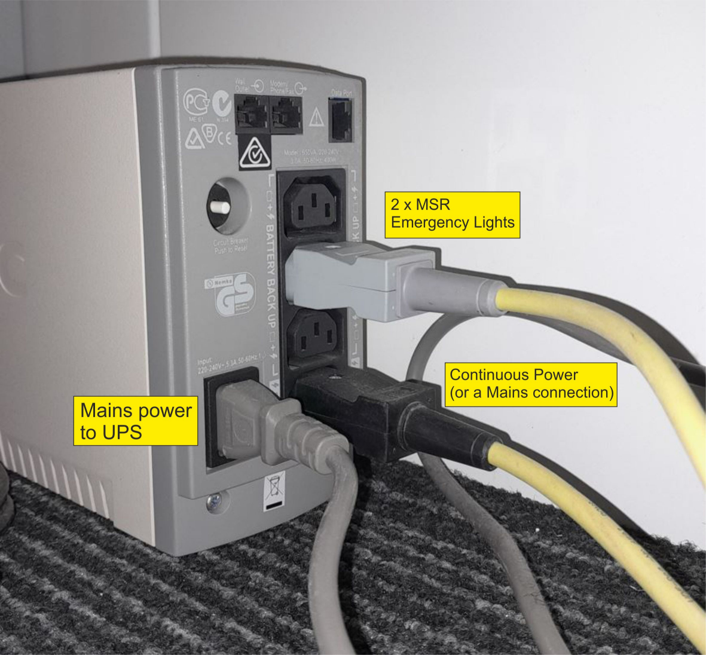

# MSR lights not always turning on

### **Problem**

On 22nd March 2024 a MEG Operator reported the **MSR lights were failing to turn on every time**. 
Only **after waiting a few minutes did they come on again**. Other MEG Operators may have come across this problem previously but not reported it, or not noted it in the Maintenance Log.
 This **inconsistency with the lighting had been seen before**, but not for a year or so (***the MSR lighting UPS battery was replaced in May 2022***).
  **No fuse was found to be tripping**, and an **email was sent to VAC asking for advice**.

### **Solution**

After **emailing a photo** of the UPS connections, **VAC noticed a wrong connection**. 
This probably occurred when the UPS was put back together/connections remade, after the battery replacement in 2022. 
**The UPS has four outlets,** ***three are "Battery Backup"*** **and** ***one is "Surge Only"***.  In the **case of a power outage**, **battery power is automatically provided to the Battery Backup outlets**,
whereas the **Surge Only outlet is always "ON"** (***when utility power is available***), and **DOES NOT receive any power during a power outage**. 
The **MSR lighting setup has two yellow power cables, one with a Black connector and one with a Grey connector**. The **Black connector** is now known to **require continuous current/power** 
and was **incorrectly attached to a Battery Backup outlet** after the battery replacement. 
After powering off the UPS, the **Black cable connector** was then **correctly attached to the Surge Only outlet** (***VAC says it could also be attached directly to a wall socket***), 
and the **Grey cable connector** was attached to **one of the Battery Backup outlets**.
The **Grey cable connector powers two emergency lights** in the **event of a power failure**. 
The **UPS was powered on** again and the **lights were tested**. All good.

{width=40% align=left}

   

- Image of the **now-correct UPS power cable connections**.

