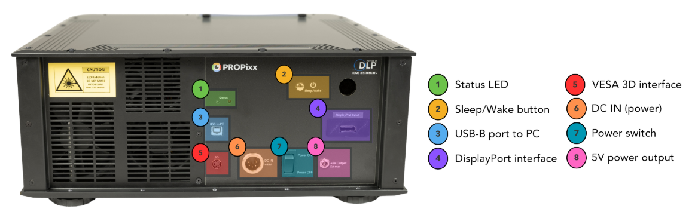

# PROPixx wouldn't "wake" after a change to a different Experimental Environment

### **Problem**

An Operator reported they couldn't wake the PROPixx (***ppx a***) from within VPutils in their experimental environment. 

### **Solution**

To wake the PROPixx, the silver 'Sleep/Wake' button ("**2**") at the rear of the PROPixx was pressed. See image below. 

Once finished, the default environment was replaced, and once the Stim PC had rebooted VPutils was started and ***ppx s*** was run from there.

### **Fix**

The **PROPixx Controller** (now rebranded as *DATAPixx*) hadn't been rebooted for a while. As a first attempt at a fix it was powered off then on. 
After then rebooting off of the problematic environment, it was found the running ***ppx a, ppx s*** from VPutils now worked.
