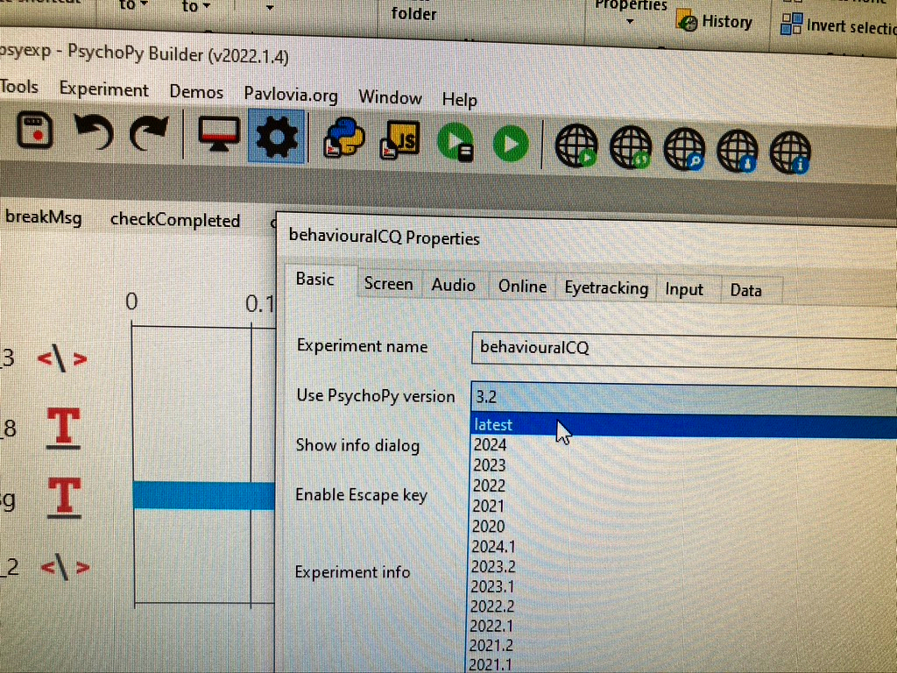

# PsychoPy error

### **<span style="color:maroon">Problem</span>**

In June 2024 an Operator reported the **following error when starting an experiment in PsychoPy on the new Stim PC**.

```from pyQt5 import Qtwidgets```<br />
```DLL load failed: the specified procedure could not be found```

The **version of PsychoPy currently installed** is **v2022.1.4**

### **<span style="color:maroon">Solution</span>**

Evidently **another MEG Operator had set the internal version of PsychoPy to an earlier version**, to enable their older code to work without them needing to rewrite/update their code.
<br />This **internal version wasn't then returned** to the **default** "***latest***" **after use**, so the **subsequent MEG Operator's code failed with the above error**.

### **<span style="color:maroon">Fix</span>**

If the **internal version is needed to be changed to get older code to work**, then please do so but **remember to change** the "***Use PsychoPy version***" back to "***latest***" after the session is over, 
to **avoid affecting other MEG Operator's experiments**.

To **make the internal change**...

- Start **PsychoPy v2022.1.4**, from either the pinned shortcut in the Taskbar, or from the Desktop shortcut (if there is one).
- Load Experiment.
- Click on the **CogWheel** icon, which opens the **Properties** window for the Experiment.
- In the "***Use PsychoPy version***" option, **choose the version needed** to make the code work.
- Once Experiment is over, click on the **CogWheel** icon again, and change the "***Use PsychoPy version***" back to "***latest***".

{width=40% align=left}

<br /><br />

- Image of the **Properties** window, showing "***latest***" as the "***Use PsychoPy version***".


