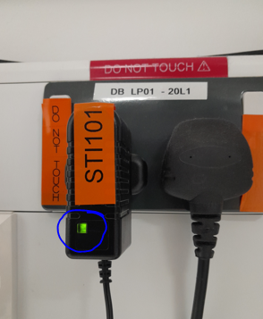

# STI101 AC Adapter Outage

### **<span style="color:maroon">Problem</span>**

An issue was reported (24th June 2025) that ***megacq*** had **suddenly stopped receiving triggers**.<br /> 
Triggers had **been recorded previously that session**, but after **a new PRESENTATION paradigm was started, no triggers were observed**.<br />
***No trigger LEDS were observed lighting up <span style="color:green">GREEN</span> on STI101***.


### **<span style="color:maroon">Fix</span>**

The **AC Adapter**, powering the Stimulus Trigger Interface (STI101), **was found to be off** (the **<span style="color:green">GREEN</span> power LED wasn't lit**).<br />
**Powering off its Mains socket for a few seconds**, then switching back on, **repowered the AC Adapter**, and triggers were **again observed** in ***megacq***.

### **<span style="color:maroon">Solution</span>**

{width=35% align=right}<br />

- **No other UPS-protected sockets appeared to be affected**, so hopefully this was just a one-off occurrence.
 
- **MEG Operators are now**, as part of their setup procedure moving forward, **to check that the AC Adapter power-on LED is showing <span style="color:green">GREEN</span>** (***as indicated***).
<br /><br /><br /><br /><br />

<align=full>
A **"TRIGGER_TEST" batch file** has also been created to **test whether the triggers are being generated correctly, and show on STI101**.<br />

Double-clicking the batch file will ...

- **Start a new instance of MATLAB** (won't interfere with any MATLAB already open).
- **Run a check/test, twice, that all 8 triggers work** (the **<span style="color:green">GREEN</span> LEDs on STI101 In 1 => In 8 switch on then off in sequence**).
- Then **exit MATLAB gracefully**.

**<span style="font-size:large;color:maroon">Code used ...</span>**

**TRIGGER_TEST.bat**

```matlab
@echo off
matlab -nosplash -r "cd('L:\winterj\');TriggersOnOff;TriggersOnOff;quit"
```

**TriggersOnOff.m**

```matlab
sendTrigger = intialiseParallelPort();

for ii = 0:7
    sendTrigger(power(2, ii));
    WaitSecs(0.2);
end

%% Reset Triggers to 0
sendTrigger(0);
```

**initialiseParallelPort.m**

```matlab
function sendTrigger = intialiseParallelPort()
% sendTrigger = intialiseParallelPort()
%
% Tries to initialise a parallel port using the inpoutx64.dll library.
% Returns the function sendTrigger, which takes a single 8-bit integer
% input and sends it to the parallel port. NB: no input checking is done!
% Make sure you only use values 1-255. Also, the trigger lines are not
% pulled down automatically, you need to do this manually by sending a 0:
%
% sendTrigger(15)  % send trigger 15
% ... do something ... e.g. a Screen('Flip')
% sendTrigger(0)  % pull all lines down
%
% If initialisation fails, returned sendTrigger-function simply prints
% out the input code; useful for developing/testing.

% Revision history:
% - created on 26 Jan 2018, cjb
%
% Copyright 2018 Christopher J. Bailey under the MIT License
%
% Permission is hereby granted, free of charge, to any person obtaining a
% copy of this software and associated documentation files (the
% "Software"), to deal in the Software without restriction, including
% without limitation the rights to use, copy, modify, merge, publish,
% distribute, sublicense, and/or sell copies of the Software, and to
% permit persons to whom the Software is furnished to do so, subject to
% the following conditions:
% 
% The above copyright notice and this permission notice shall be included
% in all copies or substantial portions of the Software.
% 
% THE SOFTWARE IS PROVIDED "AS IS", WITHOUT WARRANTY OF ANY KIND, EXPRESS
% OR IMPLIED, INCLUDING BUT NOT LIMITED TO THE WARRANTIES OF
% MERCHANTABILITY, FITNESS FOR A PARTICULAR PURPOSE AND NONINFRINGEMENT.
% IN NO EVENT SHALL THE AUTHORS OR COPYRIGHT HOLDERS BE LIABLE FOR ANY
% CLAIM, DAMAGES OR OTHER LIABILITY, WHETHER IN AN ACTION OF CONTRACT,
% TORT OR OTHERWISE, ARISING FROM, OUT OF OR IN CONNECTION WITH THE
% SOFTWARE OR THE USE OR OTHER DEALINGS IN THE SOFTWARE.


try
    % ------------------------------------------------------------------------
    % INITIALIZE PARALLEL PORT
    % ------------------------------------------------------------------------
    % Aarhus: based on InpOut-library, and C:\Windows\System\inpoutx64.dll
    % Aarhus: io64.mex in stimuser's Documents\MATLAB-folder (in path)
    % create an instance of the io64 object
    ioObj = io64;
    % initialize the interface to the inpoutx64 system driver
    status = io64(ioObj);
    % LPT1 memory port address
    % address = hex2dec('DFF8');
    address = hex2dec('CFF8');

    sendTrigger = @(code) io64(ioObj, address, code);
catch  % assume either drivers not found or running on non-stim PC
    fprintf(1, '############################################################\n');
    fprintf(1, 'WARNING: No parallel port access, triggers will not be sent!\n');
    fprintf(1, '############################################################\n');
    sendTrigger = @(code) fprintf(1, 'TRIG %d\n', code);
end
end
```

**<span style="color:blue">With many thanks to Dr. Chris Bailey, Aarhus Univeristy</span>**