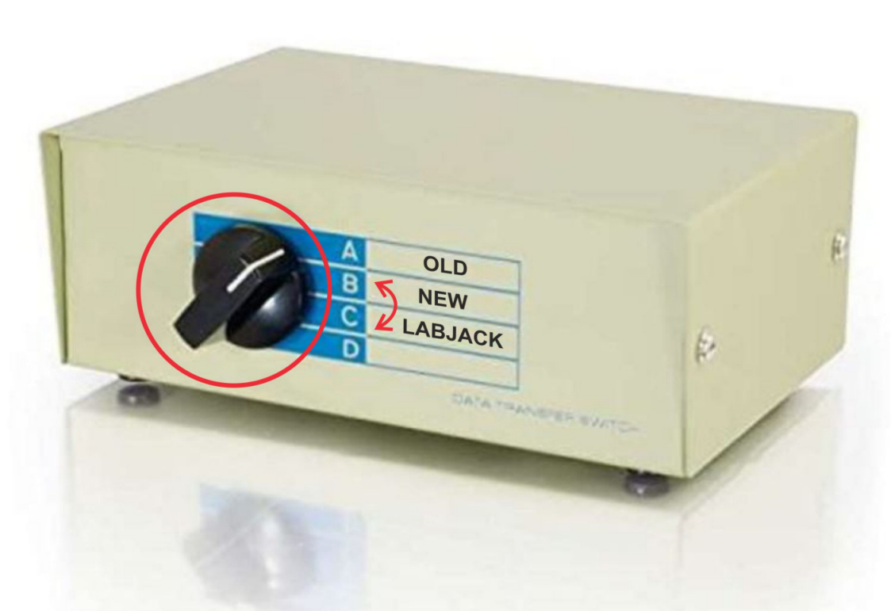

# STI101 Not all triggers being detected in *megacq*

### **Problem**

An Operator reported that **only some, not all, of their triggers** were being detected/recorded in ***megacq***. They were running PsychoPy, and this was **after a change back to the default** experimental environment. 
A Python script was shown to MEG Support, detailing not all triggers being generated/recorded, and also the default MATLAB **"TRIGGER_TEST"** batch file **did not show every trigger working** (not all the **GREEN** LEDs on STI101 were being displayed).

### **Fix**

The **Parallel Port Switch Box** was found to **be stuck half way** between position "**B**" (**"NEW" Stim**) and position "**C**" (**LabJack**). Consequently the Switch Box was *confused* as to which device needed connecting to STI101. 
**Robustly changing the Switch position** from "**B**" to "**C**" then back to "**B**" was undertaken. See image below 

{width=75%}

On re-running the Operator's Python script, and the MATLAB batch file, all triggers were detected on STI101 (all **GREEN** LEDs lit as expected), and, on restarting ***megacq***, all expected triggers were recorded.

### **Solution**
 
**MEG Operators are now**, as part of their setup procedure moving forward, **to check that the Parallel Port Switch Box** is **correctly positioned** to the **correct trigger-generating hardware**.

