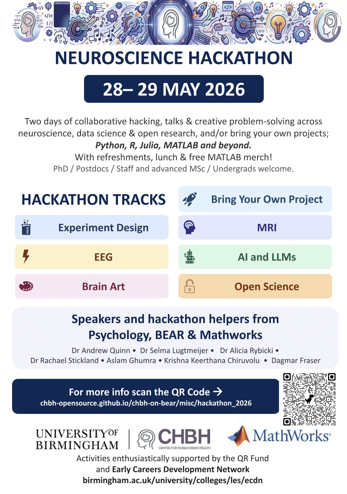

# CHBH Hackathon 2026

## Learn together & build together.

The CHBH is proud to host the **second CHBH Hackathon**—a collaborative, non‑competitive event focused on learning, curiosity, and making connections.

This is **not** a race and **not** a pitch contest. There are no prizes and no judges. Instead, the hackathon is a shared space to explore ideas, try new tools, and spend focused time working with others who enjoy building and experimenting.

Whether you are an experienced developer, a student, a researcher, or someone who is just starting out, you are welcome.

!!! Important

    This hackathon is for staff and students at the University of Birmingham only, we cannot accept registrations from outside the University - apologies!

[Click to register here](https://forms.office.com/Pages/ResponsePage.aspx?id=z8oksN7eQUKhXDyX1VPp83M8iLRyzLRFh-4kkJtOoOlUQ045UTQ0VVNYWjc3RjhNMDY0UEJCNlpCQS4u)

---

## What to Expect

Over two days, participants will come together to:

- Explore new project ideas in a supportive environment
- Share practical skills and approaches to coding and computing
- Learn techniques you can take back to your own work
- Meet people from different backgrounds and disciplines

You can take part in whatever way suits you best:

- **Join an existing project**
  Project leads will introduce the idea and guide participants through the tools and methods they are using.

- **Propose your own project**
  Bring an idea you are curious about, and invite others to explore it with you.

- **Focus on an ongoing piece of work**
  Use the hackathon as protected time to push something forward with your collaborators.

Throughout the event, we will come together as a group for short keynote-style talks, informal project check-ins, and shared reflection.

---

## Feedback from 2025

Our participants rated their hackathon experience as 4.75 stars our of 5!

Quotes from the feedback form...

- "Very open and collaborative atmosphere, well-designed schedule"
- "I enjoyed the ability to learn things I would not have had the time or will to learn on my own in a safe environment with some lovely people. It was a nice retreat to collaborate on a project and learn some new things. The food and talks were lovely too!"
- "It was a good opportunity to interact with researchers from other disciplines"
- "Great space and collaborative attitude from attendees"

## Examples of Projects from the Previous Hackathon

To give you a sense of what usually happens, here are examples of projects participants worked on last time:

- **Learn open science skills by helping to develop the CHBH website**
  This project focused on learning important and transferrable tools such as git, markdown and github to contribute to this website! group members added pages on how to contribute, started work on the brain stimulation pages and consolidated the overall formatting of the website to make navigation easier.

 - **Computational modelling code in Matlab**
  This project focused on cleaning and refactoring existing computational modelling code to make it more generalisable, faster, and robust. Group members refactored many functions and added documentation throughout to make the code easier to read and use for future projects. Group members learned to use git/github, markdown, Matlab, and knowledge of computational modelling.

None of these projects were expected to be “finished.” The aim was to learn something new, make progress together, and leave with ideas to continue later.

---

## Who Is It For?

The CHBH Hackathon is designed for:

- People who enjoy learning by doing
- Anyone curious about coding, data, or computational methods
- Beginners who want a safe space to try things out
- Experienced participants who enjoy mentoring and sharing knowledge

You do **not** need to arrive with a polished idea or advanced skills. Interest and openness are enough.

---

## Format and Schedule

- Two full days of in‑person collaboration
- Short opening session to introduce projects and form groups
- Long blocks of time for hands‑on work
- Regular, low‑pressure check‑ins to share progress and challenges
- A closing session to reflect on what we learned

You are free to move between projects if your interests change.

---

## The Atmosphere

We aim to create an environment that is:

- **Inclusive** – everyone’s contribution is valued
- **Approachable** – questions are encouraged
- **Curious** – exploration matters more than outcomes

Kindness, patience, and mutual respect are core expectations.

---

## What to Bring

- A laptop and charger
- Any data, notes, or materials you might want to work with
- Willingness to collaborate and learn

## What we'll provide

- Flexible workspaces
- Tea, Coffee & Lunch
- Co-ordination and support for projects.

---

## Join Us

If you are interested in spending two days learning, building, and connecting with others in a relaxed and supportive setting, the CHBH Hackathon 2026 is for you.

More details on registration, location, and accessibility information will be shared soon.

Hope to see you there!

[Click to register here](https://forms.office.com/Pages/ResponsePage.aspx?id=z8oksN7eQUKhXDyX1VPp83M8iLRyzLRFh-4kkJtOoOlUQ045UTQ0VVNYWjc3RjhNMDY0UEJCNlpCQS4u)
