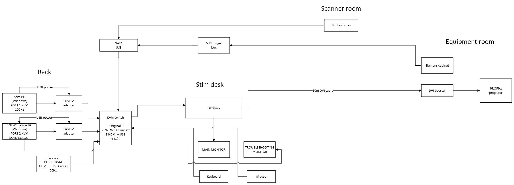

# Stimulus Equipment

## Stimulus PCs

The CHBH has a rack of Stimulus PCs in the Console Room. The individual PCs are addressed by a single keyboard mouse & local screen via the KVM Switch (Keyboard/Video/Mouse Switch) mounted at the top of the rack.

{width=300}

Choose which Stimulus PC you want to run your experiment on and select that via the KVM Switch. You can freely switch between KVM positions, though MATLAB may need to be relaunched if it was active during switching.

What is seen on the local screen in the console room, is seen on the projector screen (when the wake command has been issued to the projector).  Note that only the central element of the Console Screen will be visible on the in bore projection screen. The Projector overfills the rear projection screen and the useful resolution is closer to ~4:3 ~1440x1080 visible. Always verify your paradigm's visual elements are not only visible on the projector screen and stimulus machine monitor, but remain so via the participant's superior mirror.

The KVM is not configured to route Audio, therefore to choose a specific Stimulus PC, as audio source, employ the plugs on the Audio Patch Panel.

Available Stimulus PCs are;

- KVM 1 - Windows 10 CEP - PsychoPy, MATLAB 2018B with the PTB, Presentation, EPrime and NIDAQ Hardware. This is the original Common Experimental Platform (CEP) machine. Note: this machine has a known colour saturation issue with its VPixx connection.  1920x1080@100Hz 

- KVM 2 - Windows 10 - PsychoPy, MATLAB 2018B with the PTB, Presentation, EPrime. This is a new tower PC located behind the rack, with identical software to KVM 1 but without the colour saturation issue. It does not have the National Instruments DAQ. 1920x1080@120Hz

{width=400}

- KVM 3 - End user laptops. HDMI, USB-A and USB-C power connectors are exposed atop the rack, allowing researchers to connect their own laptop and access the VPixx projector, NAtA triggers and response boxes via the KVM. Both local terminal screen and VPixx Projector are 1920x1080@60Hz  

- KVM 4 - Ubuntu LTS (pending installation). Identical hardware to the KVM1 and 2 tower. Both local terminal screen and VPixx Projector are 1920x1080@120Hz.

KVM 1 has an additional National Instruments DAQ and BNC breakout attached. KVM1, KVM 2 and KVM 4 share identical hardware (INTEL i7, AMD WX7100). Similar Common Experimental Platform PCs are also installed in other modalities and in several cubicles. You are invited to test your paradigms there.

{width=600}

When any Stimulus PC (or laptop on KVM 3) is selected via the KVM it will receive reports from the Keyboard, Mouse at the local screen, and from the NAtA Response Interface (Response Box and Triggers) and the LABJACK U3, as these are connected via USB through the KVM. Other devices may be plugged directly into the USB ports of the desired Stimulus PC.

## vPixx Projector

The commands needed to enable the projector are as follows;

THis will not necessarily be availabke ovailabel on your laptop, so use on of the other KVM channels to enable.

- launch the VPUtil command line interface (click the desktop icon in Windows / under Linux; click to open the desktop VPUtil folder, and in the folder pane that opens rightclick on the white space and Launch A Terminal From That Location, then type ./vputil and press enter).

- In that VPUtil interface type *ppx a* and return to awaken the projector.

- In that VPUtil interface type *ppx s* and return to deactivate.

- Do not leave the projector awakened.

-  If you get the error 'VPixx Device FPGA device appears unprogrammed' this means the USB connection to the Projector has failed. Switch the KVM to another position and then back again, for 10 seconds to restore connection. You can switch between KVM positions whilst the projector is live, and the projector will display the selected desktop.

These should be all you need for basic use of the VPixx. if the projector / console screen is flickering for more than a minute after booting you may need to reboot.

The projector optimum setting is 16:9 1920x1080@120Hz. However differing PCs/Laptops may not offer this.. check your paradigm is not adversely affected by refresh rate changes. The Projector overfills the rear projection screen and the useful resolution is closer to 4:3 1440x1080 visible. Always verify your paradigm's visual elements are; not only visible on the projector screen and stimulus machine monitor, but also remain so via the participant superior mirror.

## Recovering responses/triggers via NATA Interface

{width=400}

### Recovering Triggers

Scanner volume timing is delivered to the CEP Stimulus machines by the detection of the letter 't' (as if from a USB keyboard, spoofed by the NAtA interface box). This will echo into any command windows you use for running stimulus. Consider using the 'commandwindow' command at the beginning of MATLAB scripts to direct key presses away from the script editor! Alternatively switch off the NAtA interface box when troubleshooting, or open a notepad window to redirect these.

When a Stim PC is selected via the KVM [[9]] and the 2x5 NATA Response Interface is on, [[10]], then scanner volume triggers will echo as 't' keypress (at ~7ms after the volume begins). Consider using the suggested trigger code snippet on github, linked below, to recover this timing. If you are recovering other keypresses (e.g. 0-9) make sure you ignore ensuing 't's. Beware also, that if CAPSLOCK is on any keyboard attached to the current Stim PC, the NAtA will report 'T'. So always check CAPS LOCK is off, or program defensively to respond to 't' or 'T'.

KbCheck on Windows, and KbCheck(-3) on Linux should suffice to recover the 't' press. When you want to ignore successive 't' during recovery of Response Box keypresses use DisableKeysForKbCheck.

Example code using the more complex KbQueue is provided [here](https://github.com/theCHBH/fMRI/blob/master/SampleTriggerCodeCHBH_Windows).

The SIEMENS Prisma produces a 1us impulse which is delivered fibre-optically to the SIEMENS Interface Box behind the console PC. This has two settings, TOGGLE and IMPULSE, and requires USB power. Ensure IMPULSE is selected. The BNC output of this SIEMENS Interface Box is relayed to the NATA Response Interface, with potential breakout for other devices. 

The NAtA is connected directly to the KVM and reports a 't' via USB connection, which also reports 1,2,3,4,5 & ,6,7,8,9,0 for the NAtA response peripheral. The NAtA Interface Box also passes the signal via a DB25 breakout with <1ms delay. The DB25 breakout may be connected to the LABJACK U3, the National Instruments DAQ or the BlackBoxToolKit.

### Recovering Participant Responses in Linux

The NAtA Response Pads are installed in the scanner chamber in two configurations. 2x2 which report 12 34 and 2x5 which report 12345 67890 as if they were cut down USB keyboards. (NB Responding as US keyboards in PTB, not UK configuration.)

The 2x2 Interface and 2x5 are always on and connected. Both are connected via the KVM. If you switch between KVM positions whilst MATLAB is open, you may need to re-open MATLAB to detect the NAtA.

Under Ubuntu (KVM 4) use the following device names when setting up your KbQueue in PTB MATLAB;

```MATLAB
DeviceName = 'NAtA Technologies LxPAD PK080219 v6.11'  % 2x5 and trigger 't'

DeviceName = 'NAtA Technologies LxNK Keypad' % 2x2 only

DeviceName = 'Dell Dell QuietKey Keyboard'  % Experimenter Keyboard
```

Here is example [code](https://github.com/artaxerxes/TheCHBH/blob/master/twoDevice_KbQueue) that demonstrates gathering Experimenter Keyboard Responses and Participant 2x5 / Scanner volume triggers from the NAtA 2x5.

Always ensure the NAtA boxes respond before placing your participant in the scanner. They will illuminate the red LEDs on the front of the NATA Interface Box, so observe these. If they illuminate and there is no response from the stimulus PC then reset the PC as the USB hub has been sent to sleep and not awoke with the PC.

## Participant audio - Siemens / SoundPIXX

For Operator/Participant contact we rely on the inbuilt Siemens audio console. This broadcasts into the Room, and optionally via the mono pneumatic in-ear headphones that can be attached to the base of the participant bed.

For experimental audio, routed from the CEP stimulus machines the Siemens Room Audio / In-Ear Headphones may be suitable. However if you require Stereo reproductions or and higher fidelity audio reproduction there is the SoundPIXX system. This requires the use of a second set of headphones, stored to the left hand side of the head of the scanner bed.

As noted above, the KVM is not configured to route Audio, therefore to choose a specific Stimulus PC, as audio source, employ the plugs on the Audio Patch Panel. To switch between the two audio systems there is a patch panel (bank of ports for large audio cables) below the CEP Stimulus machines on the main rack. These allow audio to be routed from the Stimulus PCs to the two available audio outputs. Sources are the individual Stimulus PCs, outputs are the Siemens (Room + Participant Headphones), or the SoundPIXX (Participant Headphones only).

When utilising the SoundPIXX Audio the Siemens Room audio may suffice for participant communication still, but there is a secondary black desktop Microphone that you can use to speak directly into the SoundPIXX headphones.

!!! warning
    The SoundPIXX headphones have a much higher range of available volume than the Siemens in-Ear headphones and participants may be overwhelmed. Before any experiment involving their use check the settings are suitable, and that they have not been changed since your last scan. Additionally check the volume setting on our CEP Stimulus machine has not changed as the interaction of these two can produce surprisingly high volumes of noise which will be delivered directly into the SoundPIXX in ear headphones.

## Troubleshooting

When the Siemens Room audio is all that is required the patch panel should be left in the standard position to avoid a ground loops developing - which delivers a rumbling bassy noise. Should you experience this noise switch the Audio patch from 23-24 or vice versa.