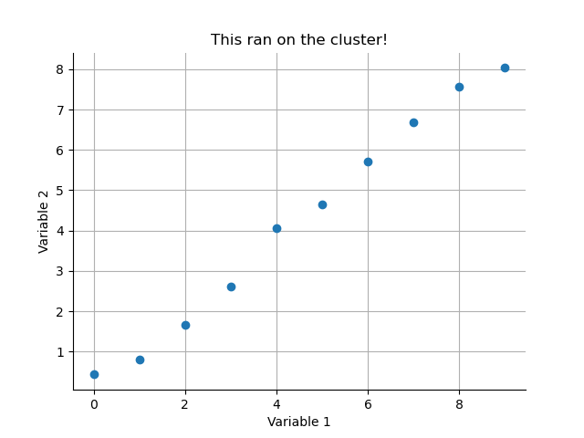
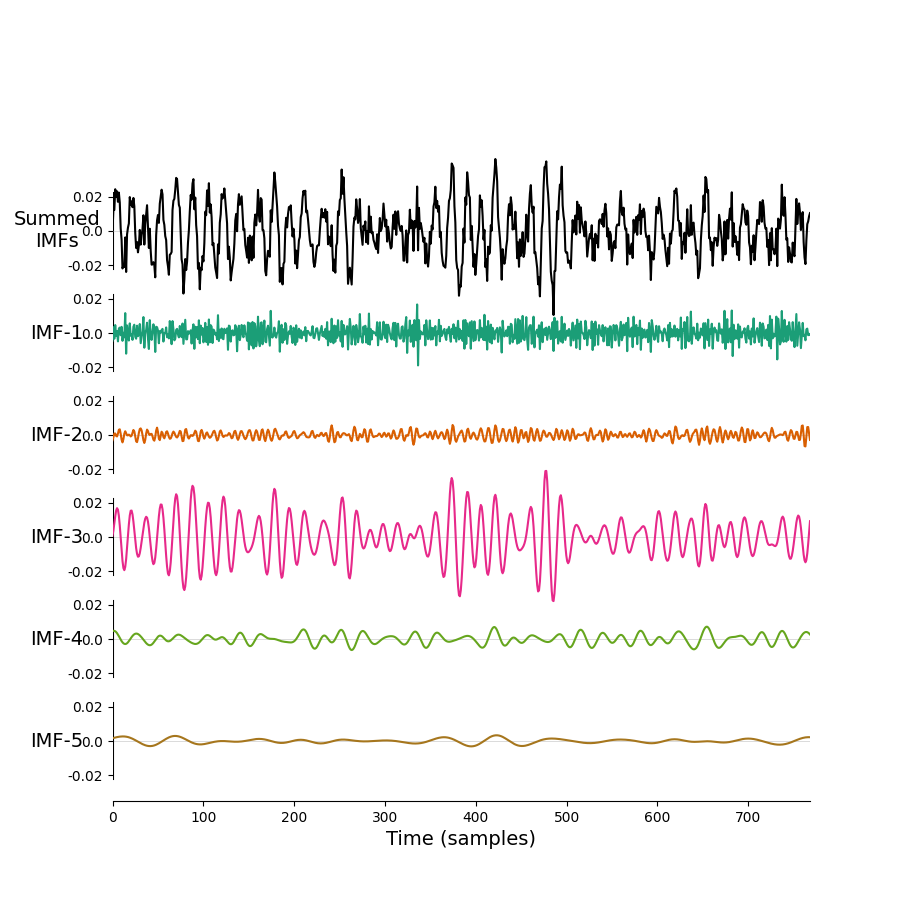

# Python

[Python](https://www.python.org/) is a interactive programming language known for being flexible and (relatively) simple to use. A vast range of scientific applications have be built in and around Python.

Some of the most common are:

- [numpy](https://numpy.org/): fundamental array computing in python
- [scipy](https://scipy.org/): fundamental algorithms in python
- [pandas](https://pandas.pydata.org/): manipulation and analysis of data tables
- [scikit-learn](https://scikit-learn.org/stable/index.html): efficient tools for machine learning

and many, many more. Many Python packages are distributed on [PyPI.org](https://pypi.org/)

## Python versions on BEAR

Many versions are supported as [loadable modules on BEAR Apps](https://bear-apps.bham.ac.uk/applications/Python/). These can be loaded into a terminal session ready for use, for example:

```shell
module load bear-apps/2022a
module load Python/3.10.4-GCCcore-11.3.0
```

This will be sufficient to run a pure Python script inside that terminal session. Frequently we'll want to load a wider range of modules to use in the script. There are several ways to do this.

We could load these modules one at a time, ensuring that any versions relating to Python, FOSS or GCCCore all match each other:

```shell
module load bear-apps/2022a
module load scikit-learn/1.1.2-foss-2022a
```

!!! note
    Modules will load any relevant dependencies at the same time, so loading `scikit-learn` will also load the relevant Python version into the session. It is best to trust the dependencies built into the `module load` system and only define the minimum necessary modules in your session.

Or we can load a bundle of applications. The [`SciPy-bundle`](https://bear-apps.bham.ac.uk/applications/SciPy-bundle/) includes the `numpy`, `scipy` and `pandas` packages among many others.

```shell
module load bear-apps/2022a
module load SciPy-bundle/2022.05-foss-2022a
```

### iPython

[iPython](https://ipython.org/) is a powerful Python console that you can use for interactive sessions in the terminal.

```shell
module load bear-apps/2022a
module load SciPy-bundle/2022.05-foss-2022a
module load matplotlib/3.5.2-foss-2022a
module load IPython/8.5.0-GCCcore-11.3.0
```

You can then start an iPython session from a terminal:

```shell
ipython --pylab=tk
```

and start running some Python code using your loaded libraries:

```python
import numpy as np
import matplotlib.pyplot as plt

x = np.arange(10)
y = np.random.randn(10,)/2 + x

plt.figure()
plt.plot(x, y, 'o')
plt.show()
```

You can also save some Python code into a file and run it on the command line (this is very useful for running jobs on the cluster later...). If we save the code above into a file called `my_plot.py` - we can run it in the terminal using:

```shell
python my_plot.py
```

## Submitting Python jobs to the cluster

We need to prepare two things to run Python jobs on the BlueBEAR cluster:

1. Python script to run the analysis
2. bash script to prepare an environment and actually run our code

Let's make a simple example. The following script creates and saves a simple scatter plot of some random data.

```python
import numpy as np
import matplotlib.pyplot as plt

x = np.arange(10)
y = np.random.randn(10,)/2 + x

plt.figure()
plt.plot(x, y, 'o')
plt.title('This ran on the cluster!')
plt.xlabel('Variable 1')
plt.ylabel('Variable 2')
for tag in ['top', 'right']:
    plt.gca().spines[tag].set_visible(False)
plt.grid(True)
plt.savefig('my_cluster_figure.png')
```

We can save this script as `quick_python_plot.py`. 

Next, we need a `bash/slurm` script to submit and run our Python code.

```slurm
#!/bin/bash
#SBATCH --account quinna-example-project
#SBATCH --qos bbdefault

module purge; module load bluebear

module load bear-apps/2022a
module load SciPy-bundle/2022.05-foss-2022a
module load matplotlib/3.5.2-foss-2022a

python quick_python_plot.py
```

We can save this as `submit_quick_python_plot.sh` in a directory next to our Python code (Remember to update the project on line 2 to a BEAR project that you can access!).

```shell
sbatch submit_quick_python_plot.sh
```

You can monitor the progress of your job in the [active jobs tracker](https://portal.bear.bham.ac.uk/pun/sys/activejobs) on BEAR portal. Once it has finished you should find a nice figure saved in your directory.



## JupyterLab

Interactive python notebooks are available to run as a [JupyterLab GUI App](https://docs.bear.bham.ac.uk/portal/jupyterlab/) through the BEAR Portal. The pre-installed Python modules can be [loaded as modules](https://docs.bear.bham.ac.uk/portal/jupyterlab/#loading-modules) in the notebook session.

Only the pre-installed modules available in [BEAR Apps](https://bear-apps.bham.ac.uk/index) are installable in the JupyterLab GUI App.

## Virtual environments

More involved analyses may required dependencies or package versions that aren't available on BEAR Apps. The next option for these analysis is to use [virtual environments](https://docs.bear.bham.ac.uk/bluebear/software/self_installs_python/) as described on the BEAR Technical Docs.

The following `bash` script (adapted from the main docs) loads the standard BEAR modules for MNE-Python, creates a virtual environment and then installs the EMD package with `pip`:

```shell
#!/bin/bash
set -e

# Load our core modules from BEAR
module purge; module load bluebear
module load bear-apps/2021b
module load Python/3.9.6-GCCcore-11.2.0

# Prepare path locations and name for virtual environment
export VENV_DIR="${HOME}/virtual-environments"
export VENV_PATH="${VENV_DIR}/my-virtual-env-${BB_CPU}"

# Create a master venv directory if necessary
mkdir -p ${VENV_DIR}

# Check if virtual environment exists and create it if not
if [[ ! -d ${VENV_PATH} ]]; then
    python3 -m venv --system-site-packages ${VENV_PATH}
fi

# Activate the virtual environment
source ${VENV_PATH}/bin/activate

# Perform any required pip installations. For reasons of consistency we would recommend
# that you define the version of the Python module – this will also ensure that if the
# module is already installed in the virtual environment it won't be modified.
pip install emd==0.5.4
```

You can save this into a shell script such as `init_myenv.sh` and run it using `source init_myenv.sh` to create the environment. You can now run `init_myenv.sh` when opening a new terminal to initialise an environment before running scripts or interactive sessions. The code above is all you need for this option, you can add or change the dependencies in the script as you need.

## Python on the cluster

<!-- TODO: this is pretty redundant with the "Submitting Python jobs to the cluster" section above. See if can combine this with above.-->

You can also adapt the script to submit jobs to the cluster. For this, we'll need to add the appropriate `slurm` commands to the start of the script and add a line running our analysis to the end. That might look something like this:

```shell
#!/bin/bash
#SBATCH --account quinna-example-project
#SBATCH --qos bbdefault

set -e

# Load our core modules from BEAR
module purge; module load bluebear
module load bear-apps/2021b
module load Python/3.9.6-GCCcore-11.2.0

# Prepare path locations and name for virtual environment
export VENV_DIR="${HOME}/virtual-environments"
export VENV_PATH="${VENV_DIR}/my-virtual-env-${BB_CPU}"

# Create a master venv directory if necessary
mkdir -p ${VENV_DIR}

# Check if virtual environment exists and create it if not
if [[ ! -d ${VENV_PATH} ]]; then
    python3 -m venv --system-site-packages ${VENV_PATH}
fi

# Activate the virtual environment
source ${VENV_PATH}/bin/activate

# Perform any required pip installations. For reasons of consistency we would recommend
# that you define the version of the Python module – this will also ensure that if the
# module is already installed in the virtual environment it won't be modified.
pip install emd==0.5.4

# Python script to be run.
python emd_example.py
```

Note the additional `SBATCH` options at the start and the `python emd_example.py` at the end. We can save this script as 'submit_emd_example.sh`.

We'll need a Python script for this example. Let's save the following script as `emd_example.py` on RDS.

```python
import matplotlib.pyplot as plt
import numpy as np
import emd

# Define and simulate a simple signal
peak_freq = 15
sample_rate = 256
seconds = 10
noise_std = .4
x = emd.simulate.ar_oscillator(peak_freq, sample_rate, seconds,
                               noise_std=noise_std, random_seed=42, r=.96)[:, 0]
x = x*1e-4
t = np.linspace(0, seconds, seconds*sample_rate)

# Run a mask sift
imf = emd.sift.mask_sift(x, max_imfs=5)

fig = plt.figure()
emd.plotting.plot_imfs(imf[:sample_rate*3, :], fig=fig)
fig.savefig('my-emd-example.png')
```

Now, we can submit our job to the cluster.

```shell
sbatch submit_emd_example.sh
```

You can monitor the progress of your job in the [active jobs tracker](https://portal.bear.bham.ac.uk/pun/sys/activejobs) on BEAR portal. Once it has finished you should find a nice new figure saved in your working directory.



### Using uv to manage dependencies and environments

[uv](https://docs.astral.sh/uv/) is a python package and project management tool that helps with consistency and reproducibility. It makes it easier for others (and yourself) to setup and run your code without worrying about differences between versions and dependency issues. 

Instead of using `pip` and a `requirements.txt`, uv creates a `uv.lock` and `pyproject.toml` file to keep track and manage package versions. These files can be version controlled using git.

uv is compatible with `pip` but is 10x-100x faster. It aims to replace similar dependency management tools (`pip`, `pyenv`, `poetry`, `virtualenv`, etc.) 

#### Installing uv

If you are running things on BEAR, you can [install uv to your home folder](https://docs.bear.bham.ac.uk/bluebear/software/self_installs_python/).

For example, go to your home folder (`cd ~/` in the terminal) and then run:

```shell
curl -LsSf https://astral.sh/uv/install.sh | sh` 
```

Further installation instructions, e.g., for Mac or Windows, can be found on the [uv website](https://docs.astral.sh/uv/getting-started/installation/).

#### Initial setup

Once you have uv installed, you need to setup a project in your project's folder. 

In the terminal run:

```shell
uv init
```

This will create a universal lock file `uv.lock` and a `pyproject.toml` file to help manage the packages and dependencies used.

The [`pyproject.toml`](https://docs.astral.sh/uv/guides/projects/) contains metadata about your project, such as the packages required, project name and description, development tools used (e.g., formatters), etc.

The [`uv.lock`](https://docs.astral.sh/uv/concepts/projects/sync/) file keeps a record of all the packages used and their specific versions and dependencies.

> uv.lock is a cross-platform lockfile that contains exact information about your project's dependencies. Unlike the pyproject.toml which is used to specify the broad requirements of your project, the lockfile contains the exact resolved versions that are installed in the project environment. This file should be checked into version control, allowing for consistent and reproducible installations across machines.

These files can be version controlled using git, so you can keep track of when you changed versions, added packages, etc.

#### Installing packages

To install packages, use `uv add <package-name>`, for example `uv add numpy`. This will automatically install the package and any dependencies, and make sure that it does not conflict with other packages installed.

#### Syncing/creating virtual environments

To create a virtual environment based on the uv.lock and pyproject.toml files, run in the terminal:

```shell
uv sync
```

This will create a virutal environment and install the required packages (defaults to `.venv`) .

If a `.venv` folder already exists, it will sync/update the packages to match the versions required.

To activate the virtual environment, run `source .venv/bin/activate`.

!!!Note
    A virtual environment created on Linux will not work on Mac or Windows. In this case, delete the .venv folder and use `uv sync` to rebuild it on your local machine.

#### Running a python file

To run a python file, use `uv run <python-file>.py` where "python-file" is the name of the file you want to run (e.g., `main.py`).

Using uv to run the file, rather than `python <python-file>.py`, will check that all the correct packages are installed and the correct version. It will even create and setup the virtual environment if it doesn't exist!

#### Running files on BEAR

When running scripts on BEAR, you will first need to load any modules you will be using. For example, in the terminal:

```bash
module purge
module load bluebear
module load bear-apps/2024a
module load Python/3.12.3-GCCcore-13.3.0
```

You can put this into a script, for example called `setup_bear.sh`:

```bash
#!/bin/bash

# set up bluebear
set -e
module purge
module load bluebear
module load bear-apps/2024a
module load Python/3.12.3-GCCcore-13.3.0
```

You can then run `source setup_bear.sh` in the terminal and it will setup setup the modules for you.

```bash
[vogelt@bear-pg0201u17a example-project]$ source setup_project_bear.sh 
Detected OS: RedHatEnterprise 8.10
GCCcore/13.3.0
zlib/1.3.1-GCCcore-13.3.0
binutils/2.42-GCCcore-13.3.0
bzip2/1.0.8-GCCcore-13.3.0
ncurses/6.5-GCCcore-13.3.0
libreadline/8.2-GCCcore-13.3.0
Tcl/8.6.14-GCCcore-13.3.0
SQLite/3.45.3-GCCcore-13.3.0
XZ/5.4.5-GCCcore-13.3.0
libffi/3.4.5-GCCcore-13.3.0
OpenSSL/3
Python/3.12.3-GCCcore-13.3.0
```

Once the modules are loaded, you can activate the virtual environment and edit/run your code, e.g., in an interactive session.

More commonly, you will want to submit a job using to the cluster and run it through a sbatch script. An example may look like:

```bash
#!/bin/bash
#SBATCH --account vogelt-example-project
#SBATCH --qos bbdefault

# set up bluebear
set -e
module purge
module load bluebear
module load bear-apps/2024a
module load Python/3.12.3-GCCcore-13.3.0

uv run main.py
```

`uv run` will automatially activate the virtual environment, install/sync any packages if necessary (matching the versions listed in the pyproject.toml and uv.lock files), and run the python script.
